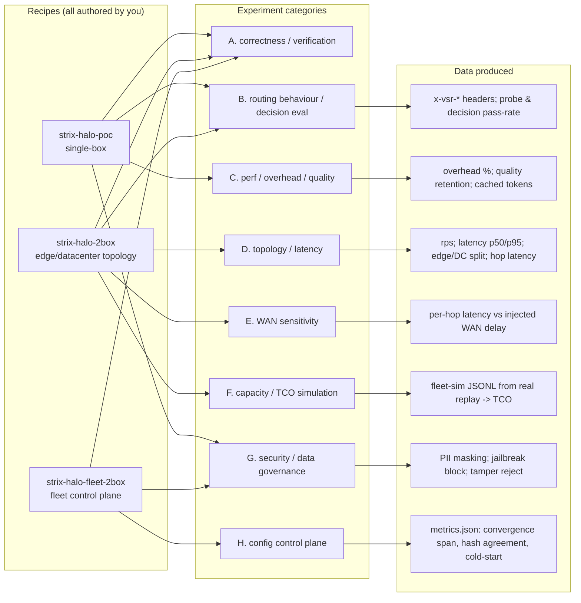

# Contributions — Strix Halo Semantic-Router PoC (tests, experiments, data)

A consolidated, report-ready record of **my** contribution across the three
Strix Halo recipes, with an emphasis on the **tests I implemented** and the
**experiments + data** I produced. Everything below is git-attributed and
excludes upstream (the base `vllm-sr` router).

## Attribution (git-verified)

- **52 commits across the three recipes, single author — `Jason YY, Lin
  <iiyyll01lin@gmail.com>`. Zero upstream contributors in these folders.**
- **~17,200 tracked lines**, all mine. Upstream provided only the base router's
  per-node primitives (fsnotify config hot-reload + `GET /config/hash`); every
  recipe, test, experiment harness, and the entire control plane below is my work.

| Recipe | Lines (tracked) | Role in the arc | Mine? |
| --- | ---: | --- | :---: |
| `strix-halo-poc` | 6,871 | Single-box PoC: routing correctness, security, eval | ✅ |
| `strix-halo-2box` | 7,525 | 2-box edge/datacenter topology + performance/TCO study | ✅ |
| `strix-halo-fleet-2box` | 2,769 | **Fleet config control plane (original core)** | ✅ |
| **Total** | **17,165** | one coherent research line | ✅ |

The three recipes are a deliberate progression: **prove routing on one box →
quantify the edge/datacenter topology on two boxes → govern a fleet of gateways
with a signed, audited control plane.** The first two are the foundation and the
measurement methodology for the third.

## 1. Tests I implemented

| Recipe | Test | What it asserts |
| --- | --- | --- |
| poc | `smoke_test.py` (202) | 4 representative prompts with `model: auto` → reads `x-vsr-*` (selected model, decision, cost/savings); verifies the security lane (PII/jailbreak → `security_guard` `fast_response` HTTP 200; `response_jailbreak` HTTP 403 on flagged output) |
| poc | `validate_poc_config.py` (264) + `test_validate_poc_config.py` (73) | Offline config validator + pytest: PASS on the real config, **FAIL on a broken config** (a decision referencing a model absent from `providers.models`) |
| poc | `cpu-smoke.sh` (85) | Full **CPU-only** end-to-end (llm-katan echo backend, no GPU): classify → decide → route → security |
| poc | `pii_mask_demo.py` (120) | PII masking via `POST /api/v1/classify/pii` (the data-governance path) |
| 2box | `smoke_test.py` (382) | **Cross-box routing assertions**: easy request → EDGE model on Halo-A (0 network hops), hard request → DATACENTER model on Halo-B (1 hop), no double-hops |
| fleet | `verify_local.py` (195) | Offline in-process **8/8**: baseline converge, edit-once via **hot-reload (not restart)**, drift self-heal, rollback, **signed-bundle tamper rejection**, central audit, **inode preservation** |
| fleet | `verify-fleet.sh` (83) | Headless PASS/FAIL against a live fleet (converge / drift / rollback / audit) |
| fleet | `perf/verify_perf_local.py` (7/7) | Offline: tok/s probe (Ollama+OpenAI dialects), resource summarize, in-place backend rewrite (**inode preserved**), fleet perf aggregation — no ROCm/Docker |

## 2. Experiments I ran, classified (+ the data each produces)

| # | Category | Harness (lines) | Data / metrics | Acceptance |
| --- | --- | --- | --- | --- |
| A | Correctness / verification | `smoke_test.py` ×2, `cpu-smoke.sh`, `validate_poc_config.py`+pytest, `verify_local.py`, `verify-fleet.sh` | pass/fail per check; router `x-vsr-*` outcomes | verify_local 8/8; validator PASS/FAIL both proven |
| B | Routing behaviour / decision robustness | `poc-probes.yaml` (303) eval probes; `run-bench.sh` routing step | **probe pass-rate, decision pass-rate** over multiple prompt variants; 13 calibrated balance lanes + security lane | `min_probe_pass_rate: 100`, `min_decision_pass_rate: 100` |
| C | Performance / overhead / quality | `run-bench.sh` (180) | router-vs-direct A/B: **routing overhead %**, **quality retention**, cached-token reporting, local-served ratio | GA-style evidence |
| D | Topology / latency / throughput | `topology-bench.sh` (292) | **rps, latency p50/p95, pure network-hop latency (edge vs datacenter), edge/DC request split** → `topology-comparison.md` | side-by-side topology report |
| E | WAN sensitivity | `wan-latency-experiment.sh` (171) | per-hop latency vs injected delay {0, 20, 50} ms (`tc netem` on Halo-B); shows escalation cost grows under WAN while edge traffic (0 hops) is flat | monotonic hop-cost curve |
| F | Capacity / TCO simulation | `export-replay-trace.sh` (98) | **real** router-replay decisions → fleet-sim JSONL → capacity/TCO simulation (real workload, not synthetic) | fleet-sim-loadable trace |
| G | Security / data governance | `pii_mask_demo.py`, smoke/probes security lane, fleet tamper test | PII masking placeholders; jailbreak/PII → `security_guard`; **untrusted bundle rejected, config unchanged** | deny + mask + tamper-reject |
| H | Fleet config control plane (original) | `fleet_metrics.py` (257) + `run-all-2box.sh` | `metrics.json`: **cross-box convergence span, hash agreement, router cold-start (565 s), config bytes, audit counts** | both boxes same signed hash |
| P | Perf: co-location overhead + inference-server compare | `perf/overhead-bench.sh`, `perf/server-bench.sh`, `perf/perf_metrics.py` | **stack RAM/CPU footprint, throughput drop % (contention + end-to-end), max-usable model / OOM boundary, per-server tok/s / TTFT / router-overhead** → `perf-metrics.json` + `perf-summary.md` | offline-verified 7/7; HW run supplies numbers |



## 3. Hardware evidence (verified runs)

- **Dual real gateway** (`run-20260701-154843`): a real `vllm-sr` ROCm router on
  **both** Strix Halo boxes converged to one signed hash `a78aebc5fd5f`;
  `verify-fleet` + demo passed (edit-once / rollback / audit); metrics captured.
- **Mixed fleet** (`run-20260701-114428`): first proved real↔mock convergence
  (hash `76c08a3e…`).
- **Offline CI-grade**: `verify_local.py` 8/8 (incl. tamper rejection + inode
  preservation), no hardware.

## 4. Contribution highlights (novelty)

1. **Original core** — a pull-mode, HMAC-signed, centrally-audited **fleet config
   control plane** for bare edge ROCm gateways (`ccp_server`, `fleet_agent`,
   `fleet_lib`, `fleetctl`, `verify_local`), proven on two real boxes with a
   **byte-exact hash convergence contract** across a Python control plane and Go
   routers, applied via **in-place single-file hot-reload (no restart)**.
2. **Measurement methodology** — not just a system but a **reproducible experiment
   + data pipeline**: decision-level eval probes, topology/WAN benchmarks, a
   real-trace → TCO simulation bridge, and a per-run `metrics.json`. Every
   experiment has an explicit metric and acceptance bar — the "data-backed" basis
   for a paper.
3. **A coherent arc** — single-box correctness → 2-box topology/latency/TCO
   quantification → fleet-level governance, each building on the last.

## Appendix — reproduce the attribution

```bash
# author breakdown across the three recipes (expect: only Jason YY, Lin)
git log --format='%an' -- \
  deploy/recipes/strix-halo-poc \
  deploy/recipes/strix-halo-2box \
  deploy/recipes/strix-halo-fleet-2box | sort | uniq -c

# per-file line counts (excludes bundled models / .vllm-sr runtime data)
git ls-files deploy/recipes/strix-halo-fleet-2box | xargs wc -l
```
