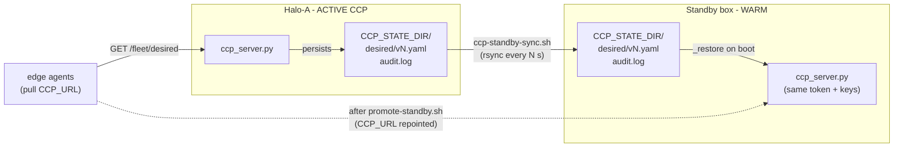

# CCP Warm Standby + Replication (R6)

This documents the **warm-standby** half of R6 for the pull-mode control plane.
CCP *durability* already landed (`ccp_server.CCPState._restore()` reloads the
latest persisted `desired/<vN>.yaml` + version counter and replays `audit.log`
on boot — see [`docs/security-hardening.md`](security-hardening.md)). Warm standby
builds on exactly that: **replicate the active CCP's state dir to a second box**,
run an **identical `ccp_server.py`** there that `_restore()`s the replicated
state, and provide a **scripted promotion** that repoints the fleet's agents.

> **Opt-in and additive.** With none of this running, the recipe behaves exactly
> as before (one CCP on Halo-A). The two scripts only *read* the active CCP's
> state dir and *rewrite `CCP_URL`* in `fleet.env`; they never touch
> `ccp_server.py`, the agents, or the default single-CCP deploy. No new
> dependencies: stdlib Python + `ssh`/`rsync` (with an `scp`/`cp` fallback).
>
> **Out of scope (future work):** automatic failover with a floating/virtual IP,
> a health-checked witness, or quorum. Promotion here is a deliberate **operator
> action** (or a thin external health check that calls `promote-standby.sh`). See
> [Out of scope](#out-of-scope) below.

---

## Architecture



- **Active** CCP runs on Halo-A as today (`ccp-bring-up.sh`), persisting to
  `CCP_STATE_DIR` (`${FLEET_STATE_DIR}/ccp`).
- **`ccp-standby-sync.sh`** copies `desired/` + `audit.log` to the standby box on
  an interval (idempotent; reuses the shared SSH ControlMaster if present).
- **Standby** CCP runs the *same* `ccp_server.py` against the replicated
  `CCP_STATE_DIR`; on boot it `_restore()`s desired + version + audit. It is
  effectively read-only until promotion because no agent is pointed at it yet.
- **`promote-standby.sh`** waits for the standby to serve the restored config,
  measures recovery time + zero audit loss, and rewrites `CCP_URL` in
  `fleet.env`; agents are then restarted to pull from the standby.

### Why replicating two paths is sufficient

`CCPState` keeps **all** durable state in the state dir: `set_desired()` writes
`desired/<vN>.yaml` (the config *and*, through the max-`vN` filename, the version
counter), and `record_status()` appends one JSON line per report to `audit.log`.
`_restore()` reconstructs everything from just those on boot (latest desired,
version counter, audit running total, last-status-per-box, apply-outcome
counters). So replicating `desired/` + `audit.log` byte-for-byte is enough for a
standby to become an exact continuation of the active CCP — no database, no
in-memory state to serialize.

`audit.log` is append-only and `_restore()` skips any unparseable trailing line
(`json.loads` failure → `continue`), so a copy taken mid-append is safe: the
standby simply ignores a torn final record.

---

## Components

| File | Role |
| --- | --- |
| `ccp-standby-sync.sh` | Interval-driven, idempotent replication of `desired/` + `audit.log` from the active `CCP_STATE_DIR` to the standby (SSH+rsync, or local copy). |
| `promote-standby.sh` | Waits for the standby, measures recovery time + zero audit loss, rewrites `CCP_URL` in `fleet.env`, prints/optionally runs the agent re-broadcast. |
| `ccp_server.py` (existing, unchanged) | The standby runs this as-is; `_restore()` loads the replicated state on boot. |

### `ccp-standby-sync.sh` env

| Var | Default | Meaning |
| --- | --- | --- |
| `CCP_STATE_DIR` | `${FLEET_STATE_DIR}/ccp` | Source state dir (matches `ccp-bring-up.sh`). |
| `STANDBY_HOST` | *(empty)* | SSH target `user@host` of the standby; empty ⇒ **local** copy to `STANDBY_STATE_DIR`. |
| `STANDBY_STATE_DIR` | same path as `CCP_STATE_DIR` | Destination state dir on the standby. |
| `STANDBY_SSH_PORT` / `STANDBY_SSH_KEY` | *(none)* | SSH port / identity file. |
| `FLEET_SSH_CONTROL_PATH` | *(none)* | Reuse a shared SSH ControlMaster socket (R10). |
| `SYNC_INTERVAL` | `15` | Seconds between passes. |
| `SYNC_ONCE` | *(unset)* | `1` ⇒ one pass then exit (cron / systemd timer / final pre-promotion sync). |
| `SYNC_RSYNC_OPTS` | *(none)* | Extra rsync flags. |
| `SYNC_STATUS_FILE` | `${FLEET_STATE_DIR}/ccp-standby-sync.status` | Per-pass stamp (ts, dest, version, approx count). Lives outside the state dir so it never reaches `_restore()`. |

### `promote-standby.sh` env

| Var | Default | Meaning |
| --- | --- | --- |
| `STANDBY_HOST` | **required** | Host/IP the agents will reach the standby CCP on. |
| `STANDBY_CCP_PORT` | `${CCP_PORT}` (else `9300`) | Standby CCP port. |
| `STANDBY_SCHEME` | scheme of current `CCP_URL` | `http` or `https`. |
| `FLEET_TOKEN` | from `fleet.env` | Bearer token (same on both CCPs). |
| `ACTIVE_CCP_URL` | current `fleet.env` `CCP_URL` | Old active URL, used for the audit diff if still reachable. |
| `EXPECT_AUDIT_COUNT` | *(unset)* | Cross-check the standby count when the active is down (capture it before stopping the active). |
| `PROMOTE_SINCE` | now | Epoch seconds when the outage/drill began (for an end-to-end RTO). |
| `PROMOTE_WAIT` | `60` | Seconds to wait for the standby to serve a version. |
| `PROMOTE_APPLY` | *(unset)* | `1` ⇒ also restart the **local** halo-a agent at the new URL (remotes are printed, never auto-SSH'd). |
| `DRY_RUN` | *(unset)* | `1` ⇒ show the `fleet.env` change without applying it. |
| `FLEET_TLS_CA` / `FLEET_TLS_INSECURE` | *(none)* | Passed through for an https standby. |

---

## Sync cadence & RPO

Replication is **asynchronous** on a fixed interval (`SYNC_INTERVAL`, default 15s):

- **Recovery Point Objective (RPO):** worst-case audit loss on an *unplanned*
  active failure is the records written in the last interval (bounded by
  `SYNC_INTERVAL`). Shrink it by lowering the interval; drive it to **zero** for a
  *planned* promotion by running one final `SYNC_ONCE=1 bash ccp-standby-sync.sh`
  before stopping the active.
- **desired/** files are immutable per version and only accumulate, so no
  deletion is ever needed (the sync never deletes on the destination).
- **audit.log** is append-only; rsync ships only the appended tail each pass.

Run the syncer as a long-lived process next to the active CCP (or as a cron /
systemd timer with `SYNC_ONCE=1`):

```bash
# continuous, reusing the deploy's shared SSH socket if it is exported
STANDBY_HOST=ubuntu@10.0.0.3 bash ccp-standby-sync.sh
```

---

## Standby bring-up (run the EXISTING ccp_server.py)

The standby is the **same** `ccp_server.py`, pointed at the replicated
`CCP_STATE_DIR`, with the **same `FLEET_TOKEN` and signing keys/TLS material** as
the active CCP (agents must accept its bundles and token identically). On boot it
`_restore()`s the replicated desired + version + audit.

Minimal HMAC example (mirror the active CCP's env), on the **standby box**:

```bash
# state replicated here by ccp-standby-sync.sh (STANDBY_STATE_DIR)
export CCP_STATE_DIR=${TMPDIR:-/tmp}/vllm-sr-fleet/ccp
export FLEET_TOKEN=<same token as the active CCP>       # from fleet.env
export FLEET_SIGNING_KEY=<same signing key>             # HMAC mode
export CCP_HOST=0.0.0.0 CCP_PORT=9300                   # reachable by the agents
# IMPORTANT: do NOT set CCP_INIT_CONFIG here -- _restore() already loaded the
# replicated desired; an init file is only a seed when nothing was restored.
python3 ccp_server.py
```

Ed25519 + TLS standby (match the active CCP exactly):

```bash
export FLEET_SIGN_MODE=ed25519 FLEET_ED25519_SECRET_FILE=./keys/ccp_ed25519.seed
export CCP_TLS_CERT=ccp-cert.pem CCP_TLS_KEY=ccp-key.pem   # (+ CCP_TLS_CLIENT_CA for mTLS)
python3 ccp_server.py
```

> **Refreshing a running standby.** A `ccp_server` process `_restore()`s **only at
> boot** — it does not watch the replicated files. So a long-running warm standby
> holds the state from *its* start time. To serve the latest replicated state,
> **(re)start the standby `ccp_server` at promotion time** (a graceful drill runs
> one final `SYNC_ONCE=1` sync first, then starts/restarts the standby, so its
> in-memory audit count equals the active's). "Warm" here means the box, keys, TLS
> trust, and continuously-replicated state are all staged; the process is
> (re)launched to load the newest state on takeover — a sub-second start.
>
> Making a *running* standby hot-reload the synced files without a restart (e.g.
> a `SIGHUP` handler or a periodic re-`_restore()` in `ccp_server.py`) is a
> natural follow-up **hook in `ccp_server.py`** — intentionally not done here so
> this change stays new-files-only and leaves the default flow byte-identical.

---

## Promotion runbook

### A. Planned / graceful drill (zero RPO)

1. **Final sync**, then confirm the stamp:

   ```bash
   STANDBY_HOST=ubuntu@10.0.0.3 SYNC_ONCE=1 bash ccp-standby-sync.sh
   cat "${FLEET_STATE_DIR:-/tmp/vllm-sr-fleet}/ccp-standby-sync.status"
   ```

2. **Capture the baseline count** (optional cross-check) and stop the active CCP:

   ```bash
   source "${FLEET_STATE_DIR:-/tmp/vllm-sr-fleet}/fleet.env"
   EXPECT=$(python3 fleetctl.py status | sed -n 's/.*audit_count=\([0-9]*\).*/\1/p')
   fleet_stop_pidfile "${FLEET_STATE_DIR:-/tmp/vllm-sr-fleet}/ccp.pid"   # or your stop path
   ```

3. **Start the standby** `ccp_server.py` (see [Standby bring-up](#standby-bring-up-run-the-existing-ccp_serverpy)).
4. **Promote** (measures recovery + zero audit loss, rewrites `CCP_URL`):

   ```bash
   STANDBY_HOST=10.0.0.3 EXPECT_AUDIT_COUNT="${EXPECT}" \
     PROMOTE_SINCE=$(date +%s) bash promote-standby.sh
   ```

5. **Re-broadcast** — restart each agent at the new `CCP_URL` (the command is
   printed by the promote script; `PROMOTE_APPLY=1` also restarts the local
   halo-a agent). Then confirm convergence:

   ```bash
   source "${FLEET_STATE_DIR:-/tmp/vllm-sr-fleet}/fleet.env"   # now has the new CCP_URL
   python3 fleetctl.py wait-converged --boxes "${FLEET_BOXES}" --timeout 120
   ```

### B. Unplanned failover (active is down)

Same as above but skip steps 1–2 (you cannot reach the dead active). Set
`PROMOTE_SINCE` to when the outage started for a true RTO; the audit diff falls
back to `EXPECT_AUDIT_COUNT` (if you captured one earlier) or the last
`ccp-standby-sync.status` count. Expect up to one `SYNC_INTERVAL` of RPO.

---

## Measuring recovery time & zero audit loss

`promote-standby.sh` reports both automatically:

- **Recovery time (RTO):** seconds from `PROMOTE_SINCE` (or the promotion start)
  until the standby answers `GET /healthz` **and** serves a desired version via
  `GET /fleet/desired`. Set `PROMOTE_SINCE=<epoch of the failure>` for an
  end-to-end number that includes detection + standby (re)start.
- **Zero audit loss (RPO):** it compares the CCP's authoritative
  `audit_count` (from `GET /fleet/status`) on the active vs the standby. `PASS`
  when the standby has **≥** the active's records; when the active is unreachable
  it compares against `EXPECT_AUDIT_COUNT`. This directly answers the R6 metric
  ("zero audit loss across restart/takeover").

Example tail of a successful drill:

```
==> [1/4] waiting up to 60s for the standby CCP to serve a version
    standby is serving desired v7
    recovery time: 3s (since PROMOTE_SINCE)
==> [2/4] confirming zero audit loss (audit record counts active vs standby)
    active audit_count=42  standby audit_count=42
    ZERO AUDIT LOSS: PASS (standby has all 42 active records)
```

The local dry-run in this change set (temp active state dir → drive
`CCPState.set_desired`/`record_status` → replicate via `ccp-standby-sync.sh`
local mode → fresh `CCPState` on the copy) asserts exactly this: the standby
restores the latest version, config bytes, and full audit total.

---

## Out of scope

Deliberately **not** implemented here (documented as future work, consistent with
the plan and `docs/research-roadmap.md` R6):

- **Automatic failover.** No floating/virtual IP, no VRRP/keepalived, no witness
  or quorum. Promotion is an explicit operator action (or an external health
  check that calls `promote-standby.sh`).
- **Synchronous replication.** Replication is periodic/async (bounded RPO), not a
  synchronous commit to two nodes.
- **In-place hot refresh of a running standby.** Would need a small `ccp_server.py`
  hook (`SIGHUP`/periodic re-`_restore()`); see the note above.
- **Split-brain protection.** If the old active returns, agents already repointed
  will stay on the standby (their `CCP_URL` changed); fence or decommission the
  old active before restarting its agents.

---

## Suggested hardware-check scenarios (for the verifier worker)

Candidates for `verify-hardening.sh` / the runbook once this runs on the 2-box
fleet (owned by the A/R1 verifier worker, not implemented here):

1. **Planned promotion, zero RPO:** final `SYNC_ONCE=1`, stop active, start
   standby, `promote-standby.sh` → assert `ZERO AUDIT LOSS: PASS` and record RTO.
2. **Unplanned failover:** `kill -9` the active mid-load; assert the standby (with
   `EXPECT_AUDIT_COUNT`) loses ≤ one `SYNC_INTERVAL` of records.
3. **Torn-append safety:** copy `audit.log` during a burst of `record_status`;
   assert the standby `_restore()`s and drops only a partial trailing line.
4. **Agent repoint:** after promotion + re-broadcast, `fleetctl wait-converged`
   shows every box pulling the standby's desired version.
5. **Ed25519 + TLS/mTLS standby:** standby with the same keys/cert; agents accept
   its signed bundles and reject a forged/HMAC one.
6. **N-box:** with a 3-entry `fleet.hosts`, promotion repoints all boxes.
