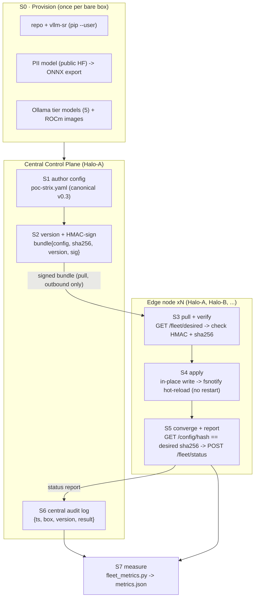

# Edge-Fleet Config Control Plane — Research Pipeline, Data & Metrics

Paper-oriented record for the **2-box Strix Halo edge-fleet config control plane**
(runnable counterpart of [PL-0036](../../../../docs/agent/plans/pl-0036-edge-fleet-config-control-plane.md)).
It documents the end-to-end pipeline, the data at each stage (format + scale), the
efficiency metrics we measure, and the novelty + feasibility argument. Every
hardware run emits a machine-readable `metrics.json` ([`fleet_metrics.py`](../fleet_metrics.py))
so the claims below are backed by data, not assertion.

> **Hardware-verified (2026-07-01, `run-20260701-154843`).** A real `vllm-sr` ROCm
> gateway on **both** Strix Halo boxes converged to one signed hash `a78aebc5fd5f`;
> `verify-fleet` + demo passed (edit-once / rollback / audit). See the recipe
> [README → What this proves](../README.md).

## 1. Uniqueness (why this is a distinct contribution)

1. **A pull-mode, signed, centrally-audited config control plane for _bare_ edge
   AIPC gateways** — not Kubernetes-managed nodes. It reuses the router's existing
   per-node primitives (fsnotify hot-reload + `GET /config/hash`) and adds _only_
   the central distribution + signing + audit layer. Prior art (the operator)
   centralizes config _inside a K8s cluster_; a fleet of bare ROCm gateways had no
   central, audited way to receive one rule change.
2. **A hash-equality convergence contract that holds across _heterogeneous_
   implementations** — a Python control plane signs `sha256(config_bytes)`, and an
   independent Go router returns the identical value from `GET /config/hash` over
   its bind-mounted source file. Proven both mock↔real and **real↔real** on ROCm
   hardware. Correctness is a _byte-exact hash equality_, not a fuzzy diff.
3. **In-place single-file hot-reload as the apply primitive.** The router
   bind-mounts config as one file and watches it with fsnotify; the agent
   truncate-writes the new bytes **in place (same inode)**, so a real router
   hot-reloads with no restart and no atomic-rename inode swap.
4. **Zero-touch onboarding** of a bare box (no `vllm-sr`, no models, stale schema)
   to a real gateway in one command.
5. **NAT-friendly by construction** — agents only dial _outbound_ (to the CCP and
   to localhost), so a firewalled edge box needs no inbound exposure.

## 2. The pipeline



## 3. Data at each stage (format + scale)

| Stage | Data | Format | Scale / order of magnitude |
| --- | --- | --- | --- |
| S0 provision | vllm-sr CLI; ModernBERT PII model; 5 Ollama tier models; ROCm/Envoy/dashboard images | pip wheel; HF safetensors → ONNX; GGUF; OCI images | PII ≈ 0.6 GB; Ollama tiers ≈ **44 GB** (3B/7B/14B/14B/32B); images ≈ few GB |
| S1 author | `poc-strix.yaml` | canonical v0.3 YAML | ≈ 2,400 lines (exact bytes → `metrics.json:desired_config.config_bytes`) |
| S2 sign | `bundle = {config, sha256, version, sig}` | JSON over HTTP | config bytes + 64-hex sha256 + HMAC-SHA256 tag |
| S3 pull/verify | desired bundle | JSON | one config payload per poll (poll interval default 3 s) |
| S4 apply | config bytes → bind-mounted source file | YAML file (same inode) | = config bytes |
| S5 converge | `GET /config/hash` (hex sha256) ↔ desired sha256; status report | 64-hex string; JSON | 32-byte digest per box per poll |
| S6 audit | append-only `{ts, box_id, version, result}` | JSON log | 1 record per box per applied edit (2/edit for 2 boxes) |
| S7 measure | `metrics.json` | JSON | < 4 KB per run |

## 4. Efficiency metrics (what we measure and how)

Captured automatically per run by [`fleet_metrics.py`](../fleet_metrics.py) into
`metrics.json` + `metrics.txt` in the run bundle.

| Metric | Definition | Unit | Source | This run |
| --- | --- | --- | --- | --- |
| `hash_agreement` | all boxes report the SAME final `/config/hash` (the core correctness signal) | bool | `fleet-status.txt` | **true** (`a78aebc5fd5f`) |
| cross-box convergence span | per version, `max(apply_ts) − min(apply_ts)` across boxes | s | `fleet-audit.txt` | 0–3 s (bounded by poll interval) |
| converged versions | # desired versions every box reached | count | audit | 5 (`v1`→`v5`) |
| router cold-start | real `vllm-sr` ROCm serve → ready | s | `halo-a-router.log` | 565 s (Halo-A) |
| desired config size | bytes of the distributed config | bytes | CCP `/fleet/desired` | captured in `metrics.json` |
| signing cost | HMAC-SHA256 over config bytes | µs | (negligible; O(config size)) | — |
| model footprint | on-box model bytes to stand up a gateway | GB | provisioning | ≈ 44 GB Ollama + 0.6 GB PII |
| network per poll | bytes moved per agent poll (pull-only) | bytes | payload = config size | one config / poll |
| audit growth | audit records per fleet edit | records | audit | 2 / edit (1 per box) |

**Metrics that need finer instrumentation** (roadmap R1/R9): true _hot-reload
latency_ (config-write → router serving new config) is currently bounded by the
1 s audit-timestamp granularity + the 3 s poll interval; sub-second measurement
needs the agent to emit a write→converge timer. See
[research-roadmap.md](research-roadmap.md).

### 4a. Co-location overhead & inference-server metrics (perf harnesses)

Beyond the control-plane metrics above, the [`perf/`](../perf/README.md) harnesses
quantify what it _costs_ to run vllm-sr on a Strix Halo box and how backends
compare. Each gateway box emits `overhead-<box>.json` (Test 1) and
`server-<box>.json` (Test 2); [`perf_metrics.py`](../perf/perf_metrics.py) rolls
them fleet-wide into `perf-metrics.json` + `perf-summary.md` (same run bundle as
`metrics.json`).

| Metric | Definition | Unit | Source |
| --- | --- | --- | --- |
| stack footprint | router+Envoy+dashboard+Grafana container RAM (and host-mem delta stack-down→up) | GiB | `overhead-*.json:stack_footprint` |
| throughput drop (contention) | `(baseline − colocated_direct) / baseline` decode tok/s, same direct path | % | `overhead-*.json:tiers[].throughput_drop_pct_contention` |
| throughput drop (end-to-end) | same vs the through-router path (adds routing + classification) | % | `…throughput_drop_pct_end_to_end` |
| max usable model | largest tier/tag that still serves with the stack up (hard-fail or GTT-spill cliff) | tag | `overhead-*.json:max_usable_tag`; fleet-safe = worst box |
| server decode tok/s | direct decode rate per inference server (bundled context) | tok/s | `server-*.json:servers[].direct_decode_tps` |
| router overhead per server | `(direct − through-router) / direct` decode tok/s | % | `server-*.json:servers[].router_overhead_pct` |
| peak VRAM / GTT | unified-memory allocation during load (GTT = spill signal) | bytes | `resource_sampler.py` summaries |

Unlike the byte-exact convergence contract, these are **empirical performance
numbers**: report them with the box + quant + load shape they were measured under
(the JSON carries `shape` and, for servers, per-row `quant`).

## 5. Feasibility (evidence)

- **Runs on real hardware.** Two physical Strix Halo boxes (Halo-A = HP Z2 Mini
  G1a; Halo-B = a bare box, auto-provisioned), both real ROCm gateways, converged +
  verified + demoed (`run-20260701-154843`). An earlier mixed run
  (`run-20260701-114428`) first proved real↔mock convergence.
- **CI-grade offline proof.** [`verify_local.py`](../verify_local.py) stands up the
  CCP + two routers + two agents in-process and asserts baseline converge,
  edit-once via hot-reload (not restart), drift self-heal, rollback, **signed-bundle
  tamper rejection**, and central audit — **8/8**, no hardware.
- **Perf harness offline proof.** [`perf/verify_perf_local.py`](../perf/verify_perf_local.py)
  stands up mock backends and exercises the _real_ tok/s probe (Ollama + OpenAI
  dialects), the in-place backend rewrite, and the fleet perf aggregation —
  **7/7**, no ROCm/Docker. So the overhead/server harnesses are validated before a
  hardware run supplies the actual numbers.
- **Cost to stand up** is dominated by the one-time model pull (≈ 44 GB) and the
  real router cold-start (≈ 9 min here); the control-plane steady state is tiny
  (one small signed config per poll, outbound only).

## 6. Reproducibility

```bash
# one command on Halo-A; auto-provisions a bare Halo-B over SSH
HALO_A_MODE=gateway HALO_B_MODE=gateway \
HALO_B_SSH=user@halo-b HALO_B_REPO=~/yy/workspace/semantic-router \
  bash run-all-2box.sh
# -> run bundle incl. metrics.json (this doc's metrics), logs, audit
```

Pin the router image to defeat `:latest` drift (see roadmap R3):
`VLLM_SR_ROUTER_IMAGE=ghcr.io/.../vllm-sr-rocm@sha256:...` (forwarded to Halo-B).
