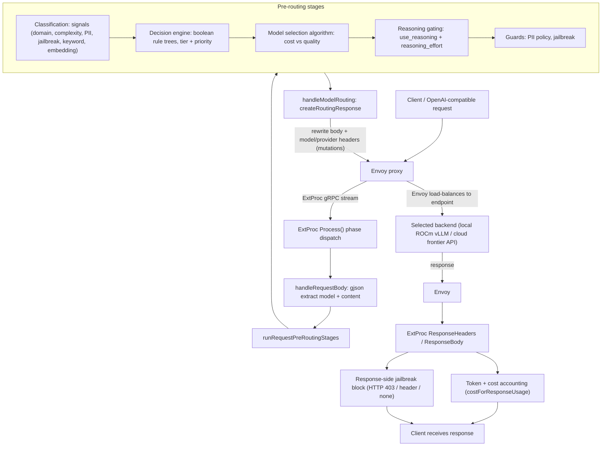

# vLLM Semantic Router 技術研究 / Technology Study

> 雙語技術研究文件，為 Jason 準備 AMD PoC kickoff。
> Bilingual (Traditional Chinese + English) technology study to prepare Jason for the AMD PoC kickoff.

本文件聚焦於「這項技術是什麼、如何運作、為何切合客戶需求」。實際的 PoC 執行步驟、時程與硬體規劃請見另一份文件 `02-poc-plan.md`。

This document focuses on what the technology is, how it works, and why it fits the customer ask. The concrete PoC execution steps, timeline, and hardware plan live in the companion file `02-poc-plan.md`.

> 與 AMD 策略對齊 / AMD strategy alignment：這套 router 對應的正是 AMD CIO 簡報的 `Intelligent Token Routing` 與 `LLM Gateway`。逐 slide 對照（tokenomics / OpenClaw / Agent Gateway / Orion-Sentinel）與 router 的誠實邊界見 [05-amd-strategy-alignment.md](05-amd-strategy-alignment.md)。
> This router corresponds to the `Intelligent Token Routing` and `LLM Gateway` in the AMD CIO deck. For the slide-by-slide mapping (tokenomics / OpenClaw / Agent Gateway / Orion-Sentinel) and the router's honest boundaries, see [05-amd-strategy-alignment.md](05-amd-strategy-alignment.md).

---

## 1. 重點摘要 / Executive Summary

### 客戶問題 / The customer problem

企業正在大量燒掉雲端 LLM token：所有請求（無論簡單或困難）都打到最貴的 frontier 模型，成本失控，且機敏資料（PII）與 prompt 攻擊（jailbreak）難以治理。客戶要的是「降本」與「安全」兩件事同時成立。

Enterprises are burning cloud LLM tokens: every request (easy or hard) is sent to the most expensive frontier model, so cost spirals while sensitive data (PII) and prompt attacks (jailbreak) are hard to govern. The customer wants two things at once: cost reduction and security.

vLLM Semantic Router 的核心主張是：**不是每個請求都需要最強的模型**。先用輕量分類器理解請求的語意特徵（領域、難度、是否含 PII、是否為攻擊），再依政策把「常規請求」導向便宜或本地模型，只把「真正困難的請求」升級到 frontier 雲端模型。

The core thesis of vLLM Semantic Router is that not every request needs the strongest model. A lightweight classifier first understands the semantic features of a request (domain, difficulty, PII presence, attack intent), then policy routes routine requests to cheap or local models and escalates only genuinely hard requests to frontier cloud models.

### 三大價值支柱 / The three value pillars

1. **Token 經濟 / Token economics** — 分層路由 + 語意快取（semantic cache）+ prompt 壓縮 + reasoning gating，直接削減 token 花費，並可量測「相對於全用最貴模型的基準」省了多少。
   Tiered routing plus semantic cache, prompt compression, and reasoning gating cut token spend directly, with measurable savings against an all-most-expensive baseline.
2. **LLM 安全 / LLM safety** — PII 偵測／遮罩／政策、jailbreak 輸入訊號與回應端封鎖（HTTP 403），並可讓安全偵測直接改變路由決策。
   PII detect/mask/policy, jailbreak input signals plus response-side blocking (HTTP 403), and security detections can directly change routing decisions.
3. **可觀測性 / Observability** — Prometheus 指標（token／成本／快取）、OpenTelemetry tracing、自動產生的 Grafana 儀表板，以及一個 React 儀表板 UI。
   Prometheus metrics (tokens/cost/cache), OpenTelemetry tracing, auto-generated Grafana dashboards, and a React dashboard UI.

### 為何選 AMD 硬體 / Why AMD hardware

這套架構天生適合「邊緣本地 + 雲端 frontier」的混合佈署：常規流量留在本地的 **Ryzen AI Max+**（APU）上以近乎零邊際成本服務，資料中心級的 **AMD Instinct** GPU（ROCm）可服務較大的本地模型，只有困難或需深度推理的請求才升級到雲端 frontier 模型。AMD 也是本專案的活躍贊助者與協作者（提供 Instinct GPU 與 ROCm；README 的 "Latest News" 與 Sponsors 區塊）。

This architecture is a natural fit for a hybrid "local edge + frontier cloud" deployment: routine traffic stays on a local Ryzen AI Max+ (APU) at near-zero marginal cost, data-center-class AMD Instinct GPUs (ROCm) can serve larger local models, and only hard or deep-reasoning requests escalate to frontier cloud models. AMD is also an active sponsor and collaborator of this project (providing Instinct GPUs and ROCm; see the "Latest News" and Sponsors sections of [README.md](../../README.md)).

---

## 2. 定位 / What It Is

vLLM Semantic Router 是一個 **Envoy External Processor (ExtProc) gRPC filter**，掛在 Envoy 的請求處理鏈上。它是一個「訊號驅動 (signal-driven) 的路由器」：分析請求語意、做出決策、改寫請求內容（request body），並輸出路由訊號（選定的 model 與 provider headers）。

vLLM Semantic Router is an Envoy External Processor (ExtProc) gRPC filter that hooks into Envoy's request-processing chain. It is a signal-driven router: it analyzes request semantics, makes a decision, rewrites the request body, and emits routing signals (the chosen model plus provider headers).

**關鍵定位（很重要）/ Key positioning (important):** 這個 router **不會自己挑上游 endpoint**。它只是決定「應該用哪個 model」並改寫請求，回傳 mutations；真正把流量負載平衡到實際 endpoint 的是 **Envoy**。這個職責切分讓 router 專注在語意決策，而把連線管理、健康檢查、負載平衡留給成熟的 Envoy 資料面。

The router does not pick an upstream endpoint itself. It only decides which model should be used, rewrites the request, and returns mutations; Envoy is what load-balances traffic to the actual endpoint. This separation of concerns lets the router focus on semantic decisions while leaving connection management, health checks, and load balancing to the mature Envoy data plane. See [processor_req_body_routing.go](../../src/semantic-router/pkg/extproc/processor_req_body_routing.go) (`createRoutingResponse`).

---

## 3. 架構與請求流程 / Architecture and Request Flow

### 元件與職責 / Components and responsibilities

- **ExtProc server** — 註冊 ExtProc 服務，並支援熱抽換 (hot-swap) 線上 router 設定。
  Registers the ExtProc service and hot-swaps the live router config. See [server.go](../../src/semantic-router/pkg/extproc/server.go).
- **Stream 迴圈 / Stream loop** — `Process()` 依階段 (phase) 分派：RequestHeaders / RequestBody / ResponseHeaders / ResponseBody。
  `Process()` dispatches by phase. See [processor_core.go](../../src/semantic-router/pkg/extproc/processor_core.go).
- **中央結構 / Central struct** — `OpenAIRouter` 持有 Config、Classifier、Cache、ModelSelector、ToolsDatabase。
  The `OpenAIRouter` struct holds Config, Classifier, Cache, ModelSelector, and ToolsDatabase. See [router.go](../../src/semantic-router/pkg/extproc/router.go).
- **每請求狀態 / Per-request state** — 攜帶 body、命中的訊號 (VSRMatched*)、選定的 decision/model、reasoning 模式、cache 命中、PII/jailbreak 結果。
  Carries the body, matched signals, selected decision/model, reasoning mode, cache hits, and PII/jailbreak results. See [request_context.go](../../src/semantic-router/pkg/extproc/request_context.go).

### 請求體管線 / Request-body pipeline

`handleRequestBody()` 先用快速的 gjson 解析取出 model 與使用者內容，接著跑 `runRequestPreRoutingStages`（分類 + 決策 + 守門），再進入 `handleModelRouting`。路由分支有三種：指定 model、looper、auto-model routing。

`handleRequestBody()` first uses a fast gjson extract to pull the model and user content, then runs `runRequestPreRoutingStages` (classify + decide + guard), then enters `handleModelRouting`. There are three routing branches: specified model, looper, and auto-model routing. See [processor_req_body.go](../../src/semantic-router/pkg/extproc/processor_req_body.go) and [processor_req_body_prepare.go](../../src/semantic-router/pkg/extproc/processor_req_body_prepare.go).

### 流程圖 / Flow diagram

### 走查 / Walkthrough

1. Client 送出 OpenAI 相容請求，經 Envoy；Envoy 透過 ExtProc gRPC stream 把請求交給 router。
   The client sends an OpenAI-compatible request through Envoy; Envoy hands it to the router over an ExtProc gRPC stream.
2. Router 在 RequestBody 階段解析請求、執行分類、決策、模型選擇、reasoning 與安全守門。
   In the RequestBody phase the router parses the request and runs classification, decision, model selection, reasoning, and security guards.
3. Router 回傳「改寫後的 body + model/provider headers」這些 mutations 給 Envoy，由 **Envoy** 負載平衡到實際後端。
   The router returns mutations (rewritten body plus model/provider headers) to Envoy, and Envoy load-balances to the actual backend.
4. 回應階段做 token/成本記帳與回應端 jailbreak 封鎖。
   The response phase performs token/cost accounting and response-side jailbreak blocking.

---

## 4. 核心概念 / Core Concepts

### 4.1 訊號 / Signals

分類器 [classifier.go](../../src/semantic-router/pkg/classification/classifier.go) 聚合多個子分類器：類別／領域 (category/domain)、jailbreak、PII、keyword、embedding、complexity 等。訊號會平行執行，而且採用「被使用才計算 (used-signal optimization)」：只有被某個 decision 引用的訊號才會真的去算，避免浪費算力。

The classifier [classifier.go](../../src/semantic-router/pkg/classification/classifier.go) aggregates sub-classifiers: category/domain, jailbreak, PII, keyword, embedding, complexity, and more. Signals run in parallel and only those referenced by a decision are actually computed (used-signal optimization), avoiding wasted compute. See [classifier_signal_dispatch.go](../../src/semantic-router/pkg/classification/classifier_signal_dispatch.go).

**Complexity（難度）分類器**特別關鍵：每條規則都有 `hard` 與 `easy` 兩組候選片語庫 (candidate phrase banks)，把查詢 embed 後比較相似度，難度取各 channel 的最大值，輸出像 `complexity: needs_reasoning:hard` 這樣的訊號。這正是「困難升級、簡單下放」路由的語意基礎。

The complexity classifier is especially key: each rule has hard and easy candidate phrase banks, embeds the query and compares similarity, takes difficulty as the max channel, and emits signals like `complexity: needs_reasoning:hard`. This is the semantic basis for "escalate hard, downgrade easy" routing. See [complexity_classifier.go](../../src/semantic-router/pkg/classification/complexity_classifier.go).

### 4.2 決策引擎 / Decision engine

決策引擎 [engine.go](../../src/semantic-router/pkg/decision/engine.go) 中，每個 `Decision` 都有一棵布林 `Rules` 樹（對具名訊號葉節點做 AND/OR/NOT，例如 `{type: domain, name: business}`、`{type: complexity, name: needs_reasoning:hard}`）。`selectBestDecision` 依序以 tier → confidence → priority → name 來排名挑出最佳決策。

In the decision engine [engine.go](../../src/semantic-router/pkg/decision/engine.go), each `Decision` has a boolean `Rules` tree (AND/OR/NOT over named signal leaves, e.g. `{type: domain, name: business}`, `{type: complexity, name: needs_reasoning:hard}`). `selectBestDecision` ranks by tier, then confidence, then priority, then name.

Schema 定義於 [decision_config.go](../../src/semantic-router/pkg/config/decision_config.go)：`Decision{Name, Priority, Tier, Rules, ModelRefs, Algorithm, Plugins}`；`ModelRef{Model, LoRAName, Weight, ModelReasoningControl(UseReasoning, ReasoningEffort)}`。

The schema is defined in [decision_config.go](../../src/semantic-router/pkg/config/decision_config.go): `Decision{Name, Priority, Tier, Rules, ModelRefs, Algorithm, Plugins}` and `ModelRef{Model, LoRAName, Weight, ModelReasoningControl(UseReasoning, ReasoningEffort)}`.

### 4.3 模型選擇演算法 / Model selection algorithms

當一個 decision 命中且有多個候選 model 時，由 `algorithm.type` 決定如何選：static、elo、router_dc、automix、hybrid、rl_driven、gmtrouter、latency_aware、session_aware、knn、kmeans、svm、mlp、multi_factor、confidence。它們透過 `cost_quality_tradeoff` 與每個 model 的 `pricing.prompt_per_1m` 來平衡成本與品質。其中 `confidence` 演算法只有在信心低於門檻時才把小模型升級到大模型。

When a decision matches and has multiple candidate models, `algorithm.type` decides how to choose: static, elo, router_dc, automix, hybrid, rl_driven, gmtrouter, latency_aware, session_aware, knn, kmeans, svm, mlp, multi_factor, confidence. They balance cost vs quality via `cost_quality_tradeoff` and per-model `pricing.prompt_per_1m`. The `confidence` algorithm escalates small to large only when confidence falls below a threshold. Runtime wiring lives in [req_filter_classification_runtime.go](../../src/semantic-router/pkg/extproc/req_filter_classification_runtime.go) and [req_filter_classification.go](../../src/semantic-router/pkg/extproc/req_filter_classification.go).

### 4.4 Reasoning gating（思考預算）/ Reasoning gating ("thinking budget")

每個 `ModelRef` 帶有 `use_reasoning` 與 `reasoning_effort`。[req_filter_reason.go](../../src/semantic-router/pkg/extproc/req_filter_reason.go) 會依 `providers.defaults.reasoning_families` 注入「provider 專屬」的開關（例如 qwen3 的 `enable_thinking`、gpt 的 `reasoning.effort`）。對簡單問題關閉 reasoning，可以省下大量 reasoning token（對應論文 "When to Reason"）。

Each `ModelRef` carries `use_reasoning` and `reasoning_effort`. [req_filter_reason.go](../../src/semantic-router/pkg/extproc/req_filter_reason.go) injects a provider-specific toggle (e.g. qwen3 `enable_thinking`, gpt `reasoning.effort`) from `providers.defaults.reasoning_families`. Turning reasoning off for simple questions saves substantial reasoning tokens (corresponding to the "When to Reason" paper).

### 4.5 分類器模型 / Classifier models

推理由 Rust 透過 CGO FFI 提供。`candle-binding/` 是主引擎（Traditional BERT、ModernBERT、mmBERT 多語、mmBERT-32K YaRN 32K-context；embeddings 用 Qwen3/Gemma；token 級 PII；以及生成式的 Qwen3-Guard，位於 [qwen3_guard_generation.rs](../../candle-binding/src/model_architectures/generative/qwen3_guard/qwen3_guard_generation.rs)）。`ml-binding/` 提供經典 ML（[knn.rs](../../ml-binding/src/knn.rs)、[kmeans.rs](../../ml-binding/src/kmeans.rs)、[svm.rs](../../ml-binding/src/svm.rs)）。Go 端的 FFI 包裝在 [semantic-router.go](../../candle-binding/semantic-router.go)。

Inference is provided by Rust via CGO FFI. `candle-binding/` is the main engine (Traditional BERT, ModernBERT, multilingual mmBERT, mmBERT-32K with YaRN 32K context; Qwen3/Gemma embeddings; token-level PII; and the generative Qwen3-Guard at [qwen3_guard_generation.rs](../../candle-binding/src/model_architectures/generative/qwen3_guard/qwen3_guard_generation.rs)). `ml-binding/` provides classic ML ([knn.rs](../../ml-binding/src/knn.rs), [kmeans.rs](../../ml-binding/src/kmeans.rs), [svm.rs](../../ml-binding/src/svm.rs)). The Go-side FFI wrapper is [semantic-router.go](../../candle-binding/semantic-router.go).

### 4.6 「困難→高階、簡單→便宜/本地」如何組合而成 / How "hard to premium, easy to cheap/local" is composed

這個行為不是單一旋鈕，而是多層組合：

This behavior is not a single knob but a composition of layers:

- (a) complexity 的 AND 規則 / complexity AND rules.
- (b) Decision 的 Tier + Priority / Decision tier plus priority.
- (c) modelCards 的 `quality_score` 與標籤（`[default, fast]` 對比 `[premium, analysis]`）/ modelCards `quality_score` and tags.
- (d) 成本／品質感知的選擇演算法 / cost/quality-aware selection algorithms.
- (e) reasoning 模式 / reasoning mode.
- (f) 知識庫驅動的升級 (KB-driven escalation) / knowledge-base-driven escalation.

### 4.7 設定檔 / Configuration

[config/config.yaml](../../config/config.yaml) 是 v0.3 的標準參考。主要區塊：`version`；`listeners`；`providers.defaults`（`default_model`、`reasoning_families`）與 `providers.models[]`（後端綁定、pricing、api_format、external_model_ids）；`routing.modelCards`（quality_score、context_window、tags、LoRAs）；`routing.signals`；`routing.projections`；`routing.decisions[]`；`global.router`；`global.services`；`global.stores`（semantic_cache、memory、vector_store）；`global.integrations`；`global.model_catalog`（embeddings、系統模型如 prompt_guard/domain_classifier/pii_classifier 的 mmBERT-32K 模型、外部 LLM、知識庫、modules）。Schema 型別定義於 [src/semantic-router/pkg/config/](../../src/semantic-router/pkg/config/)。

[config/config.yaml](../../config/config.yaml) is the canonical v0.3 reference. Main blocks: `version`; `listeners`; `providers.defaults` (`default_model`, `reasoning_families`) and `providers.models[]` (backend bindings, pricing, api_format, external_model_ids); `routing.modelCards` (quality_score, context_window, tags, LoRAs); `routing.signals`; `routing.projections`; `routing.decisions[]`; `global.router`; `global.services`; `global.stores` (semantic_cache, memory, vector_store); `global.integrations`; `global.model_catalog` (embeddings, system models such as the mmBERT-32K prompt_guard/domain_classifier/pii_classifier models, external LLMs, knowledge bases, and modules). Schema types live under [src/semantic-router/pkg/config/](../../src/semantic-router/pkg/config/).

---

## 5. 三大價值詳述 / Value Pillars in Depth

### 5.1 成本經濟 / Cost economics

**語意快取 / Semantic cache** — [src/semantic-router/pkg/cache/](../../src/semantic-router/pkg/cache/) 支援 in-memory + HNSW、milvus、redis、qdrant、valkey；介面 [cache_interface.go](../../src/semantic-router/pkg/cache/cache_interface.go) 的 `FindSimilarWithThreshold` 採每類別 (per-category) 門檻。多租戶安全：以每使用者 HMAC namespace 做隔離（[cache.go](../../src/semantic-router/pkg/cache/cache.go) 的 `SameCacheScope`，secret 來自 `USER_SCOPE_NAMESPACE_SECRET`）。偵測到 PII 時會跳過寫入快取（[cache_metrics.go](../../src/semantic-router/pkg/observability/metrics/cache_metrics.go) 的 `CacheWriteSkipReasonPIIDetected`）。

The semantic cache [src/semantic-router/pkg/cache/](../../src/semantic-router/pkg/cache/) supports in-memory + HNSW, milvus, redis, qdrant, and valkey; the interface [cache_interface.go](../../src/semantic-router/pkg/cache/cache_interface.go) `FindSimilarWithThreshold` uses per-category thresholds. Multi-tenant safety is enforced by per-user HMAC namespace scoping ([cache.go](../../src/semantic-router/pkg/cache/cache.go) `SameCacheScope`, with the secret from `USER_SCOPE_NAMESPACE_SECRET`). Cache writes are skipped when PII is detected ([cache_metrics.go](../../src/semantic-router/pkg/observability/metrics/cache_metrics.go) `CacheWriteSkipReasonPIIDetected`).

**Token／成本記帳 / Token and cost accounting** — [processor_res_usage.go](../../src/semantic-router/pkg/extproc/processor_res_usage.go) 的 `costForResponseUsage` 依 prompt/cached/completion 每 1M 計價。相對於「全用最貴模型」基準的省錢量由 [router_replay_cost.go](../../src/semantic-router/pkg/extproc/router_replay_cost.go) 計算；每 session 成本由 [session_cost.go](../../src/semantic-router/pkg/observability/metrics/session_cost.go) 追蹤。

[processor_res_usage.go](../../src/semantic-router/pkg/extproc/processor_res_usage.go) `costForResponseUsage` prices by prompt/cached/completion per 1M tokens. Savings against an all-most-expensive baseline are computed in [router_replay_cost.go](../../src/semantic-router/pkg/extproc/router_replay_cost.go), and per-session cost is tracked in [session_cost.go](../../src/semantic-router/pkg/observability/metrics/session_cost.go).

**Prompt 壓縮 / Prompt compression** — [src/semantic-router/pkg/promptcompression/](../../src/semantic-router/pkg/promptcompression/)（TextRank/TF-IDF/novelty/position）由 [req_filter_classification_signal.go](../../src/semantic-router/pkg/extproc/req_filter_classification_signal.go) 觸發，縮減輸入 token。**Reasoning gating** 進一步省下 reasoning token（論文 "When to Reason"）。

Prompt compression [src/semantic-router/pkg/promptcompression/](../../src/semantic-router/pkg/promptcompression/) (TextRank/TF-IDF/novelty/position) is triggered via [req_filter_classification_signal.go](../../src/semantic-router/pkg/extproc/req_filter_classification_signal.go), shrinking input tokens. Reasoning gating further saves reasoning tokens (the "When to Reason" paper).

### 5.2 安全 / Security

**PII** — 訊號 [classifier_signal_pii.go](../../src/semantic-router/pkg/classification/classifier_signal_pii.go)；allow/deny 政策 [policy.go](../../src/semantic-router/pkg/utils/pii/policy.go)（會剝除 BIO 標籤 B-/I-）；遮罩服務 [classification_pii.go](../../src/semantic-router/pkg/services/classification_pii.go)。

PII: signal [classifier_signal_pii.go](../../src/semantic-router/pkg/classification/classifier_signal_pii.go); allow/deny policy [policy.go](../../src/semantic-router/pkg/utils/pii/policy.go) (strips BIO tags B-/I-); masking service [classification_pii.go](../../src/semantic-router/pkg/services/classification_pii.go).

**Jailbreak** — 輸入訊號 [classifier_signal_jailbreak.go](../../src/semantic-router/pkg/classification/classifier_signal_jailbreak.go)（BERT 或 contrastive 方法）；回應端封鎖 [res_filter_jailbreak.go](../../src/semantic-router/pkg/extproc/res_filter_jailbreak.go)（action 為 block → HTTP 403、header、或 none）。Rust 端 [security_lora.rs](../../candle-binding/src/classifiers/lora/security_lora.rs)；`PromptGuardConfig` 定義於 [model_config_types.go](../../src/semantic-router/pkg/config/model_config_types.go)。

Jailbreak: input signal [classifier_signal_jailbreak.go](../../src/semantic-router/pkg/classification/classifier_signal_jailbreak.go) (BERT or contrastive method); response-side block [res_filter_jailbreak.go](../../src/semantic-router/pkg/extproc/res_filter_jailbreak.go) (action block to HTTP 403, header, or none). On the Rust side, [security_lora.rs](../../candle-binding/src/classifiers/lora/security_lora.rs); `PromptGuardConfig` is defined in [model_config_types.go](../../src/semantic-router/pkg/config/model_config_types.go).

**安全即路由 / Security as routing** — 決策引擎有 `JailbreakRules` 與 `PIIRules` 訊號類型，因此偵測結果可以直接改變路由（例如導向更嚴格的本地模型或直接拒絕）。指標中的錯誤原因包含 `pii_policy_denied` 與 `jailbreak_block`。

The decision engine has `JailbreakRules` and `PIIRules` signal types, so detections can directly change routing (e.g. route to a stricter local model or deny). Error reasons in metrics include `pii_policy_denied` and `jailbreak_block`.

### 5.3 可觀測性 / Observability

Prometheus 指標位於 [src/semantic-router/pkg/observability/metrics/](../../src/semantic-router/pkg/observability/metrics/)：`llm_model_requests_total`、`llm_request_errors_total`、`llm_model_cost_total`、`llm_model_tokens_total`、`llm_session_turn_cost`、cache hits/misses/entries、`llm_cache_write_skipped_total`。Tracing 用 OpenTelemetry（[tracing.go](../../src/semantic-router/pkg/observability/tracing/tracing.go)）。Grafana 儀表板由 [grafana_dashboard_sections.py](../../src/vllm-sr/cli/templates/grafana_dashboard_sections.py) 自動產生。

Prometheus metrics live under [src/semantic-router/pkg/observability/metrics/](../../src/semantic-router/pkg/observability/metrics/): `llm_model_requests_total`, `llm_request_errors_total`, `llm_model_cost_total`, `llm_model_tokens_total`, `llm_session_turn_cost`, cache hits/misses/entries, and `llm_cache_write_skipped_total`. Tracing uses OpenTelemetry ([tracing.go](../../src/semantic-router/pkg/observability/tracing/tracing.go)). Grafana dashboards are auto-generated by [grafana_dashboard_sections.py](../../src/vllm-sr/cli/templates/grafana_dashboard_sections.py).

儀表板 UI 在 [dashboard/](../../dashboard/)：React 前端（[SecurityPolicyPage.tsx](../../dashboard/frontend/src/pages/SecurityPolicyPage.tsx)、[StatusPage.tsx](../../dashboard/frontend/src/pages/StatusPage.tsx)、[topology/](../../dashboard/frontend/src/pages/topology/)、[BuilderPage.tsx](../../dashboard/frontend/src/pages/BuilderPage.tsx)、[ConfigPage.tsx](../../dashboard/frontend/src/pages/ConfigPage.tsx)）；Go 後端 [dashboard/backend/](../../dashboard/backend/)。

The dashboard UI is in [dashboard/](../../dashboard/): a React frontend ([SecurityPolicyPage.tsx](../../dashboard/frontend/src/pages/SecurityPolicyPage.tsx), [StatusPage.tsx](../../dashboard/frontend/src/pages/StatusPage.tsx), [topology/](../../dashboard/frontend/src/pages/topology/), [BuilderPage.tsx](../../dashboard/frontend/src/pages/BuilderPage.tsx), [ConfigPage.tsx](../../dashboard/frontend/src/pages/ConfigPage.tsx)) plus a Go backend [dashboard/backend/](../../dashboard/backend/).

---

## 6. AMD / ROCm 適配 / AMD and ROCm Fit

### 6.1 建置與執行流程 / Build and run flow

以 `VLLM_SR_PLATFORM=amd` 建置時會換成 ROCm Dockerfile（[Dockerfile.rocm](../../src/vllm-sr/Dockerfile.rocm)，僅 x86_64），切換邏輯在 [docker.mk](../../tools/make/docker.mk)。執行 `vllm-sr serve --platform amd` 時：

A build with `VLLM_SR_PLATFORM=amd` swaps in the ROCm Dockerfile ([Dockerfile.rocm](../../src/vllm-sr/Dockerfile.rocm), x86_64 only) via [docker.mk](../../tools/make/docker.mk). When running `vllm-sr serve --platform amd`:

- 選擇 ROCm 映像檔（[docker_images.py](../../src/vllm-sr/cli/docker_images.py)）。
  It picks the ROCm image ([docker_images.py](../../src/vllm-sr/cli/docker_images.py)).
- 掛載 `/dev/kfd` 與 `/dev/dri`、加上 `--group-add video`（[docker_run_command.py](../../src/vllm-sr/cli/docker_run_command.py)，由 `VLLM_SR_AMD_GPU_PASSTHROUGH` 控制）。
  It mounts `/dev/kfd` and `/dev/dri` with `--group-add video` ([docker_run_command.py](../../src/vllm-sr/cli/docker_run_command.py), gated by `VLLM_SR_AMD_GPU_PASSTHROUGH`).
- 把 classifier modules 的 `use_cpu` 翻成 GPU（[runtime_config_mutation.py](../../src/vllm-sr/cli/commands/runtime_config_mutation.py)，由 `VLLM_SR_AMD_FORCE_GPU` 控制；若無 GPU 餘裕，設 `VLLM_SR_AMD_PRESERVE_CPU=1` 可讓小型 classifier 模型留在 CPU）。
  It flips classifier modules from `use_cpu` to GPU ([runtime_config_mutation.py](../../src/vllm-sr/cli/commands/runtime_config_mutation.py), gated by `VLLM_SR_AMD_FORCE_GPU`; set `VLLM_SR_AMD_PRESERVE_CPU=1` to keep small classifier models on CPU when there is no GPU headroom).

### 6.2 參考 playbook 與路由設定 / Reference playbook and routing profile

參考 playbook [deploy/amd/README.md](../../deploy/amd/README.md)：一個獨立的 ROCm vLLM 後端容器（`vllm/vllm-openai-rocm:v0.17.0`）服務 `Qwen/Qwen3.5-122B-A10B-FP8`，並把這個「單一實體模型」以多個 served-model 別名 (aliases) 暴露出去。參考路由設定為 [deploy/recipes/balance.yaml](../../deploy/recipes/balance.yaml)（搭配 [balance.dsl](../../deploy/recipes/balance.dsl) 與 [balance.probes.yaml](../../deploy/recipes/balance.probes.yaml)）。

The reference playbook [deploy/amd/README.md](../../deploy/amd/README.md) runs a separate ROCm vLLM backend container (`vllm/vllm-openai-rocm:v0.17.0`) serving `Qwen/Qwen3.5-122B-A10B-FP8`, exposing one physical model under multiple served-model aliases. The reference routing profile is [deploy/recipes/balance.yaml](../../deploy/recipes/balance.yaml) (with [balance.dsl](../../deploy/recipes/balance.dsl) and [balance.probes.yaml](../../deploy/recipes/balance.probes.yaml)).

Tier 到別名的對應（pricing 為了 Insights demo 故意誇大）/ Tier-to-alias mapping (pricing is intentionally exaggerated for Insights demos):

| Tier | 別名 / Alias | 備註 / Note |
| --- | --- | --- |
| SIMPLE | `qwen/qwen3.5-rocm` | 自架，$0 / self-hosted, $0 |
| MEDIUM | `google/gemini-2.5-flash-lite` | 雲端 / cloud |
| COMPLEX | `google/gemini-3.1-pro` | 雲端 / cloud |
| REASONING | `openai/gpt5.4` | 雲端 / cloud |
| PREMIUM | `anthropic/claude-opus-4.6` | 雲端 / cloud |

參考設定共有 13 條路由決策。預設埠口：listener `:8899`、api `:8080`、dashboard `:8700`、metrics `:9190`。

The reference profile has 13 routing decisions. Default ports: listener `:8899`, api `:8080`, dashboard `:8700`, metrics `:9190`.

### 6.3 AMD 作為贊助者與協作者 / AMD as sponsor and collaborator

AMD 是本專案的活躍贊助者（提供 Instinct GPU 與 ROCm）與協作者（[README.md](../../README.md) 的 "Latest News" 在 2025/12/16 有 "AMD x vLLM Semantic Router" 部落格，以及 Sponsors 區塊）。

AMD is an active sponsor (providing Instinct GPUs and ROCm) and collaborator of this project (the "Latest News" section of [README.md](../../README.md) has the 2025/12/16 "AMD x vLLM Semantic Router" blog, plus the Sponsors section).

---

## 7. 附錄 / Appendix

### 7.1 詞彙表 / Glossary

| 術語 / Term | 說明 / Description |
| --- | --- |
| ExtProc | Envoy External Processor，一個 gRPC 服務，可在請求／回應流程中檢查並改寫流量 / an Envoy External Processor gRPC service that inspects and mutates traffic in the request/response flow |
| Signal / 訊號 | 從請求語意算出的特徵（domain、complexity、PII、jailbreak 等）/ a feature computed from request semantics |
| Decision / 決策 | 一棵布林規則樹，命中後決定候選 model 與演算法 / a boolean rule tree that, when matched, decides candidate models and algorithm |
| Tier / 分層 | 決策的層級，selectBestDecision 優先比較的維度 / the decision tier, the first dimension compared by selectBestDecision |
| Reasoning gating | 依難度開關「思考預算」以節省 reasoning token / toggling the thinking budget by difficulty to save reasoning tokens |
| Semantic cache / 語意快取 | 以向量相似度命中過往答案，避免重複呼叫模型 / vector-similarity reuse of past answers to avoid redundant model calls |
| ModelRef | 候選模型參考，含 LoRA、權重、reasoning 控制 / a candidate model reference with LoRA, weight, and reasoning control |
| ROCm | AMD 的 GPU 計算平台 / AMD's GPU compute platform |
| Ryzen AI Max+ | AMD APU，適合邊緣本地推理 / an AMD APU suited to local edge inference |
| Instinct | AMD 資料中心級 GPU / AMD data-center-class GPU |
| YaRN | 延伸 context 長度的技術，這裡用於 mmBERT-32K / a context-extension technique, here used for mmBERT-32K |

### 7.2 重點檔案地圖 / Key-file map

| 主題 / Topic | 檔案 / File |
| --- | --- |
| ExtProc 進入點 / ExtProc entry | [server.go](../../src/semantic-router/pkg/extproc/server.go) |
| Stream 階段分派 / Stream phase dispatch | [processor_core.go](../../src/semantic-router/pkg/extproc/processor_core.go) |
| 中央 router 結構 / Central router struct | [router.go](../../src/semantic-router/pkg/extproc/router.go) |
| 每請求狀態 / Per-request state | [request_context.go](../../src/semantic-router/pkg/extproc/request_context.go) |
| 請求體管線 / Request-body pipeline | [processor_req_body.go](../../src/semantic-router/pkg/extproc/processor_req_body.go) |
| 路由回應（mutations）/ Routing response | [processor_req_body_routing.go](../../src/semantic-router/pkg/extproc/processor_req_body_routing.go) |
| 分類聚合 / Classification aggregator | [classifier.go](../../src/semantic-router/pkg/classification/classifier.go) |
| 訊號分派 / Signal dispatch | [classifier_signal_dispatch.go](../../src/semantic-router/pkg/classification/classifier_signal_dispatch.go) |
| 難度分類 / Complexity classifier | [complexity_classifier.go](../../src/semantic-router/pkg/classification/complexity_classifier.go) |
| 決策引擎 / Decision engine | [engine.go](../../src/semantic-router/pkg/decision/engine.go) |
| 決策 schema / Decision schema | [decision_config.go](../../src/semantic-router/pkg/config/decision_config.go) |
| Reasoning 注入 / Reasoning injection | [req_filter_reason.go](../../src/semantic-router/pkg/extproc/req_filter_reason.go) |
| Rust FFI 包裝 / Rust FFI wrapper | [semantic-router.go](../../candle-binding/semantic-router.go) |
| 語意快取介面 / Semantic cache interface | [cache_interface.go](../../src/semantic-router/pkg/cache/cache_interface.go) |
| 快取使用者隔離 / Cache user scoping | [cache.go](../../src/semantic-router/pkg/cache/cache.go) |
| 成本記帳 / Cost accounting | [processor_res_usage.go](../../src/semantic-router/pkg/extproc/processor_res_usage.go) |
| 省錢量計算 / Savings calc | [router_replay_cost.go](../../src/semantic-router/pkg/extproc/router_replay_cost.go) |
| Prompt 壓縮 / Prompt compression | [src/semantic-router/pkg/promptcompression/](../../src/semantic-router/pkg/promptcompression/) |
| PII 政策 / PII policy | [policy.go](../../src/semantic-router/pkg/utils/pii/policy.go) |
| Jailbreak 回應封鎖 / Jailbreak response block | [res_filter_jailbreak.go](../../src/semantic-router/pkg/extproc/res_filter_jailbreak.go) |
| Tracing | [tracing.go](../../src/semantic-router/pkg/observability/tracing/tracing.go) |
| 標準設定 / Canonical config | [config/config.yaml](../../config/config.yaml) |
| AMD playbook | [deploy/amd/README.md](../../deploy/amd/README.md) |
| AMD 路由設定 / AMD routing profile | [deploy/recipes/balance.yaml](../../deploy/recipes/balance.yaml) |
| ROCm Dockerfile | [Dockerfile.rocm](../../src/vllm-sr/Dockerfile.rocm) |
| AMD 執行時切換 / AMD runtime mutation | [runtime_config_mutation.py](../../src/vllm-sr/cli/commands/runtime_config_mutation.py) |

### 7.3 參考連結 / Reference links

- 論文 / Paper: "When to Reason: Semantic Router for vLLM" — [arXiv 2510.08731](https://arxiv.org/abs/2510.08731)
- 論文 / Paper: "Category-Aware Semantic Caching for Heterogeneous LLM Workloads" — [arXiv 2510.26835](https://arxiv.org/abs/2510.26835)
- 文件網站 / Docs site: [vllm-semantic-router.com](https://vllm-semantic-router.com)
- AMD 協作部落格 / AMD collaboration blog: [blog.vllm.ai/2025/12/16/vllm-sr-amd.html](https://blog.vllm.ai/2025/12/16/vllm-sr-amd.html)
- AMD Developer Cloud 文章 / article: [Deploying vLLM Semantic Router on AMD Developer Cloud](https://www.amd.com/en/developer/resources/technical-articles/2026/deploying-vllm-semantic-router-on-amd-developer-cloud.html)（內容對應 in-repo 的 [deploy/amd/README.md](../../deploy/amd/README.md) / mirrors the in-repo [deploy/amd/README.md](../../deploy/amd/README.md)）
