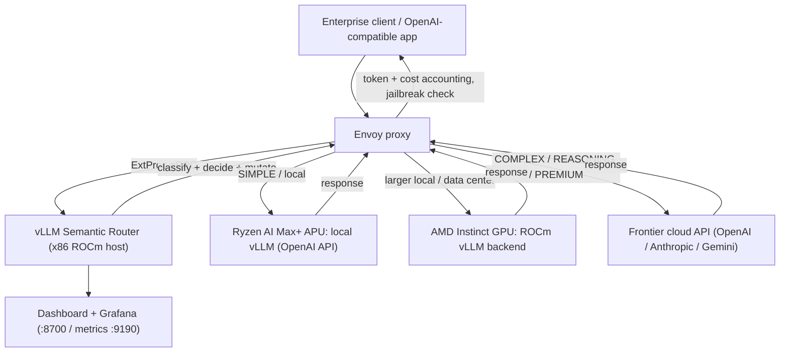
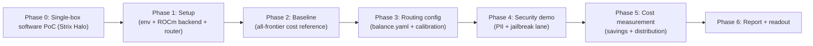
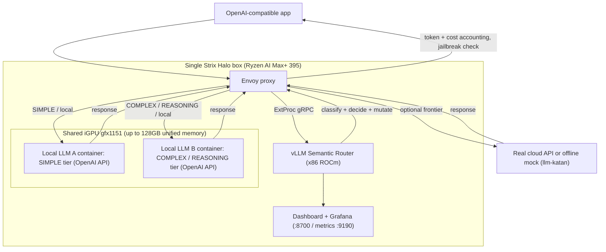
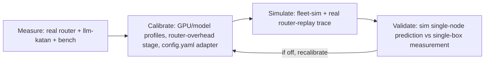
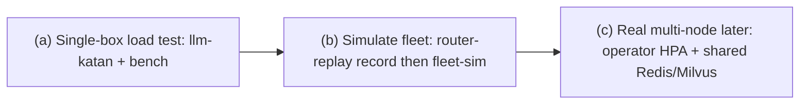

# vLLM Semantic Router PoC 執行計畫 / PoC Execution Plan

> 雙語 PoC 執行計畫，搭配 AMD Instinct 與 Ryzen AI Max+ 硬體，供 Jason 主持 kickoff 使用。
> Bilingual PoC execution plan targeting AMD Instinct and Ryzen AI Max+ hardware, for Jason to lead the kickoff.

本文件聚焦「怎麼做這個 PoC」：目標、場景、架構、硬體、部署步驟、時程、量測、demo 與風險。技術原理請見另一份文件 `01-tech-study.md`。

This document focuses on how to run the PoC: objectives, scenario, architecture, hardware, deployment steps, timeline, measurement, demo, and risks. For the underlying technology, see the companion file `01-tech-study.md`.

---

## 1. 目標與成功標準 / Objectives and Success Criteria

### 商業目標 / Business objective

向企業客戶（例如在 Ryzen AI Max+ pitch 中提出需求的 TSMC）證明：用 vLLM Semantic Router 做「語意分層路由」，可以在**不犧牲關鍵任務品質**的前提下，把多數常規流量留在本地 AMD 硬體、只把困難請求升級到雲端 frontier 模型，藉此大幅降低 token 花費，並同時加上 PII／jailbreak 的安全治理。

Demonstrate to enterprise customers (e.g. TSMC, who raised this during the Ryzen AI Max+ pitch) that semantic tiered routing with vLLM Semantic Router can keep most routine traffic on local AMD hardware and escalate only hard requests to frontier cloud models, substantially cutting token spend without sacrificing quality on the requests that matter, while adding PII/jailbreak security governance.

### 可量測成功標準 / Measurable success criteria

以下為提案目標值，kickoff 時與客戶共同定案。
The following are proposed targets, to be finalized with the customer at kickoff.

| 指標 / Metric | 提案目標 / Proposed target | 如何量測 / How measured |
| --- | --- | --- |
| Token 成本下降 / Token cost reduction | 相對「全部走 frontier」基準下降 50%–80% / 50%–80% vs an all-frontier baseline | 內建 cost-savings（actual vs most-expensive baseline）+ Grafana |
| 本地承載率 / Local-served ratio | 60%–80% 的請求由本地 (SIMPLE/MEDIUM) 服務 / 60%–80% served locally | model distribution 指標 / model distribution metric |
| 路由準確率 / Routing accuracy | 在標註 probe 集上 >= 90% 命中預期決策 / >= 90% on a labeled probe set | calibration loop + `balance.probes.yaml` |
| 安全攔截 / Security blocking | PII 政策與 jailbreak 攔截可即時示範 / live PII policy + jailbreak block demo | `pii_policy_denied` / `jailbreak_block` 指標 |
| 延遲 / Latency | 本地層 TTFT/TPOT 在可接受範圍、路由額外開銷低 / acceptable local-tier TTFT/TPOT, low routing overhead | Grafana P95 TTFT/TPOT 面板 |
| 品質維持 / Quality retention | 升級的困難請求品質不低於全 frontier 基準 / hard requests match the all-frontier baseline | 抽樣人評 + probe 期望 / sampled human eval + probe expectations |

成功定義 / Definition of done：能在 dashboard 上同時展示「成本下降數字」「路由分佈」「安全攔截」三個畫面，並用一份標註 probe 集證明路由準確率。

Done means we can simultaneously show, on the dashboard, the cost-reduction number, the routing distribution, and security blocking, and prove routing accuracy with a labeled probe set.

---

## 2. 場景敘事 / Target Scenario

企業混合佈署 (enterprise hybrid)，三條主要路徑：

An enterprise hybrid deployment with three main paths:

1. **常規流量 → 本地 / Routine traffic to local** — 簡短問答、摘要、改寫、一般程式問題等，導向跑在 **Ryzen AI Max+** 上的本地模型（SIMPLE tier，邊際成本近乎 $0）。
   Short QA, summarization, rewriting, general coding questions go to a local model on Ryzen AI Max+ (SIMPLE tier, near-zero marginal cost).
2. **困難流量 → 雲端 frontier / Hard traffic to frontier** — 深度推理、形式化數學、系統設計、法遵分析等，依難度與領域升級到 frontier 雲端模型（COMPLEX / REASONING / PREMIUM tier）。
   Deep reasoning, formal math, systems design, and legal/compliance analysis escalate by difficulty and domain to frontier cloud models (COMPLEX / REASONING / PREMIUM tiers).
3. **安全治理路徑 / Security governance path** — 含 PII 的請求套用遮罩或政策拒絕；偵測到 jailbreak 的請求或回應被攔截 (HTTP 403)。
   Requests containing PII get masking or policy denial; jailbreak-detected requests or responses are blocked (HTTP 403).

中介層的 router（跑在 x86 ROCm 主機上）負責語意分類與決策；Instinct 可作為資料中心級後端，服務比 APU 更大的本地模型，形成「邊緣 + 資料中心 + 雲端」的全鏈路示範。

The router (running on an x86 ROCm host) handles semantic classification and decisions; Instinct can act as a data-center-class backend serving larger local models than the APU, giving an end-to-end "edge + data center + cloud" demonstration.

---

## 3. 參考架構 / Reference Architecture

> 注意 / Note：ROCm 版 router 映像檔僅支援 x86_64（見 [Dockerfile.rocm](../../src/vllm-sr/Dockerfile.rocm)）。Router 主機需為 x86 ROCm 環境。
> The ROCm router image is x86_64 only (see [Dockerfile.rocm](../../src/vllm-sr/Dockerfile.rocm)). The router host must be an x86 ROCm environment.



架構要點 / Architecture notes：

- Router 只做語意決策與請求改寫，由 **Envoy** 負載平衡到實際後端（見 `01-tech-study.md` 第 2 節）。
  The router only makes semantic decisions and rewrites requests; Envoy load-balances to the real backend (see section 2 of `01-tech-study.md`).
- 後端可同時混用「本地 vLLM endpoint」與「雲端 frontier API」，由 `providers.models[].backend_refs` 設定（見第 5 節）。
  Backends can mix local vLLM endpoints and frontier cloud APIs via `providers.models[].backend_refs` (see section 5).

---

## 4. 硬體與資源規劃 / Hardware and Resource Plan

| 角色 / Role | 硬體 / Hardware | 用途 / Purpose | 備註 / Notes |
| --- | --- | --- | --- |
| 邊緣本地層 / Edge local tier | Ryzen AI Max+ (APU) | 服務 SIMPLE tier 的小型本地模型，承載多數常規流量 / serve a small local model for the SIMPLE tier and most routine traffic | 記憶體有限，需慎選模型大小與量化 / limited memory, choose model size and quantization carefully |
| 資料中心本地層 / Data-center local tier | AMD Instinct (ROCm) | 服務較大的本地模型（如 balance 參考用的 122B FP8），可作 COMPLEX 的本地替代 / serve a larger local model (e.g. the 122B FP8 in the balance reference), an optional local COMPLEX backend | 對應 [deploy/amd/README.md](../../deploy/amd/README.md) 的 `vllm:8000` 後端 |
| Router 主機 / Router host | x86 + ROCm | 跑 router + Envoy + dashboard 與內建 mmBERT 分類器 / run router + Envoy + dashboard and the built-in mmBERT classifiers | ROCm 映像僅 x86_64 |
| 雲端 frontier / Cloud frontier | 外部 API / external API | REASONING / PREMIUM tier 的困難請求 / hard requests for the REASONING / PREMIUM tiers | 需 API key 與用量預算 / needs API keys and budget |

分類器記憶體取捨 / Classifier memory trade-off：在 Ryzen AI Max+ 上，若要把 GPU 留給 LLM 後端，可設 `VLLM_SR_AMD_PRESERVE_CPU=1`，讓內建的 mmBERT/embedding 分類器留在 CPU（見 [runtime_config_mutation.py](../../src/vllm-sr/cli/commands/runtime_config_mutation.py)）。

On the Ryzen AI Max+, if you want to reserve the GPU for the LLM backend, set `VLLM_SR_AMD_PRESERVE_CPU=1` so the built-in mmBERT/embedding classifiers stay on CPU (see [runtime_config_mutation.py](../../src/vllm-sr/cli/commands/runtime_config_mutation.py)).

---

## 5. 部署步驟 / Software and Deployment Steps

以下改寫自參考 playbook [deploy/amd/README.md](../../deploy/amd/README.md)，並標出 PoC 需調整之處。

Adapted from the reference playbook [deploy/amd/README.md](../../deploy/amd/README.md), with PoC-specific adjustments called out.

### 步驟 1：啟動 AMD ROCm vLLM 後端 / Step 1: start the AMD ROCm vLLM backend

在 Instinct（或 Ryzen AI Max+，模型換小）上啟動一個 OpenAI 相容的 ROCm vLLM 容器，並以多個 served-model 別名暴露同一實體模型。

Start an OpenAI-compatible ROCm vLLM container on Instinct (or Ryzen AI Max+ with a smaller model), exposing one physical model under multiple served-model aliases.

```bash
sudo docker network create vllm-sr-network 2>/dev/null || true

sudo docker run -d --name vllm --network=vllm-sr-network --restart unless-stopped \
  -p 8090:8000 \
  -v /mnt/data/huggingface-cache:/root/.cache/huggingface \
  --device=/dev/kfd --device=/dev/dri --group-add=video \
  --ipc=host --cap-add=SYS_PTRACE --security-opt seccomp=unconfined --shm-size 32G \
  -e VLLM_ROCM_USE_AITER=1 \
  --entrypoint python3 \
  vllm/vllm-openai-rocm:v0.17.0 \
  -m vllm.entrypoints.openai.api_server \
    --model <PoC-model> --host 0.0.0.0 --port 8000 \
    --served-model-name qwen/qwen3.5-rocm google/gemini-2.5-flash-lite google/gemini-3.1-pro openai/gpt5.4 anthropic/claude-opus-4.6 \
    --kv-cache-dtype fp8 --gpu-memory-utilization 0.85 --max-model-len 262144
```

PoC 調整 / PoC adjustment：`<PoC-model>` 在 Instinct 上可用較大的模型；在 Ryzen AI Max+ 上請換成適配 APU 記憶體的小模型（並依需要調整 `--max-model-len`、`--gpu-memory-utilization`）。

On Instinct you can use a larger `<PoC-model>`; on Ryzen AI Max+ substitute a smaller model that fits APU memory (and tune `--max-model-len` and `--gpu-memory-utilization`).

### 步驟 2：建置並啟動 router / Step 2: build and serve the router

```bash
# 建置 ROCm 版本 / build the ROCm variant
make vllm-sr-dev VLLM_SR_PLATFORM=amd

# 啟動 / serve (router + envoy + dashboard)
vllm-sr serve --config deploy/recipes/balance.yaml --image-pull-policy never --platform amd
```

或直接安裝官方版本 / or install the official build：`curl -fsSL https://vllm-semantic-router.com/install.sh | bash`。CLI 進入點 [main.py](../../src/vllm-sr/cli/main.py)，serve 實作 [runtime.py](../../src/vllm-sr/cli/commands/runtime.py)。

CLI entry [main.py](../../src/vllm-sr/cli/main.py); the serve implementation is [runtime.py](../../src/vllm-sr/cli/commands/runtime.py).

### 步驟 3：接線本地 + 雲端後端 / Step 3: wire local and frontier backends

在 `providers.models[].backend_refs` 設定（schema 見 [models.py](../../src/vllm-sr/cli/models.py)，雙寫範例見 [config/config.yaml](../../config/config.yaml)）：

Configure in `providers.models[].backend_refs` (schema in [models.py](../../src/vllm-sr/cli/models.py); a side-by-side example is in [config/config.yaml](../../config/config.yaml)):

- 本地 vLLM / local vLLM：`{ endpoint: vllm:8000, protocol: http }` + `api_format: openai`。
- 雲端 frontier / frontier cloud：`{ base_url: https://api.openai.com/v1, provider: openai, api_key_env: OPENAI_API_KEY }` + `api_format: openai`（Claude 用 `anthropic`）。API key 由環境變數讀取。
  Frontier cloud uses `base_url` + `provider` + `api_key_env` (the API key is read from an env var; use `anthropic` for Claude).

### 步驟 4：啟用安全路徑（PoC 設定任務）/ Step 4: enable the security path (a PoC config task)

維護中的 [balance.yaml](../../deploy/recipes/balance.yaml) 為了專注 balance 已把 jailbreak/PII 從路由表面移除；安全 demo 需重新加回 `prompt_guard` 與 PII module，並新增一條安全決策 lane。

The maintained [balance.yaml](../../deploy/recipes/balance.yaml) dropped jailbreak/PII from its routing surface to stay balance-focused; the security demo requires re-adding the `prompt_guard` and PII modules and a dedicated security decision lane.

### 步驟 5：驗證設定 / Step 5: validate config

```bash
cd src/semantic-router && go run ./cmd/dsl validate ../../deploy/recipes/balance.dsl
```

（Kubernetes 佈署可改用 operator，見 [deploy/operator/README.md](../../deploy/operator/README.md)。）
(For Kubernetes, use the operator instead; see [deploy/operator/README.md](../../deploy/operator/README.md).)

---

## 6. 階段時程 / Phased Timeline

提案以週為單位，實際依硬體到位時間調整。
Proposed week-by-week; actual timing depends on hardware availability.



| 階段 / Phase | 內容 / Content | 產出 / Output |
| --- | --- | --- |
| 0. Single-box (Wk 0) | 在單台 Strix Halo 上以容器跑完整軟體 PoC，先驗證軟體價值（見第 11 節，逐步操作見 [03-strix-halo-runbook.md](03-strix-halo-runbook.md)）/ run the full software PoC in containers on one Strix Halo box to validate software value first (see section 11; step-by-step in [03-strix-halo-runbook.md](03-strix-halo-runbook.md)) | 軟體驗證通過、可進入多硬體階段 / software validated, ready for the multi-hardware phases |
| 1. Setup (Wk 1) | 硬體就緒、ROCm vLLM 後端、router 啟動 / hardware ready, ROCm backend, router up | 可運作的 hybrid 堆疊 / a working hybrid stack |
| 2. Baseline (Wk 1–2) | 全部走 frontier 跑代表性流量，建立成本基準 / run representative traffic all-frontier for a cost baseline | 基準成本數字 / baseline cost number |
| 3. Routing (Wk 2–3) | 套用 balance profile，跑 calibration loop 調準 / apply balance profile, calibrate | >= 90% 路由準確率 / routing accuracy |
| 4. Security (Wk 3) | 加回 PII/jailbreak lane 並驗證攔截 / add PII/jailbreak lane and verify blocking | 安全攔截 demo / security demo |
| 5. Cost (Wk 3–4) | 量測成本下降、本地承載率、延遲 / measure savings, local ratio, latency | Grafana 成本／分佈報表 / cost+distribution report |
| 6. Report (Wk 4) | 整理結果與 readout 給客戶 / consolidate and read out to customer | PoC 結案報告 / PoC report |

---

## 7. 量測方法 / Metrics and Measurement Methodology

| 指標 / Metric | 來源 / Source |
| --- | --- |
| 成本下降（actual vs most-expensive baseline）/ cost savings | 內建計算 [router_replay_cost.go](../../src/semantic-router/pkg/extproc/router_replay_cost.go)；每請求成本 [processor_res_usage.go](../../src/semantic-router/pkg/extproc/processor_res_usage.go) |
| Token 用量 / token usage | Prometheus `llm_model_tokens_total`（[metrics/](../../src/semantic-router/pkg/observability/metrics/)） |
| 每模型成本 / per-model cost | Prometheus `llm_model_cost_total` |
| 每 session 成本 / per-session cost | `llm_session_turn_cost`（[session_cost.go](../../src/semantic-router/pkg/observability/metrics/session_cost.go)） |
| 路由分佈 / model distribution | Grafana model distribution 面板 / panel |
| 快取命中率 / cache hit ratio | Prometheus cache hits/misses |
| 延遲 / latency | Grafana TTFT/TPOT P95 面板（auto-gen [grafana_dashboard_sections.py](../../src/vllm-sr/cli/templates/grafana_dashboard_sections.py)） |
| 安全攔截 / security blocks | `pii_policy_denied`、`jailbreak_block` 錯誤原因 / error reasons |
| 路由準確率 / routing accuracy | calibration loop（見下）/ calibration loop (below) |

路由校準迴圈 / Routing calibration loop：

```bash
python3 tools/agent/scripts/router_calibration_loop.py run \
  --router-url http://<host>:8080 \
  --probes deploy/recipes/balance.probes.yaml \
  --yaml deploy/recipes/balance.yaml \
  --dsl deploy/recipes/balance.dsl
```

腳本見 [router_calibration_loop.py](../../tools/agent/scripts/router_calibration_loop.py)；probe 套件 [balance.probes.yaml](../../deploy/recipes/balance.probes.yaml)（55 個變體、涵蓋 13 條決策）。Dashboard 的 Insights/cost 視圖與 [SecurityPolicyPage.tsx](../../dashboard/frontend/src/pages/SecurityPolicyPage.tsx) 可作為 demo 介面。

The script is [router_calibration_loop.py](../../tools/agent/scripts/router_calibration_loop.py); the probe suite [balance.probes.yaml](../../deploy/recipes/balance.probes.yaml) has 55 variants over 13 decisions. The dashboard Insights/cost view and [SecurityPolicyPage.tsx](../../dashboard/frontend/src/pages/SecurityPolicyPage.tsx) serve as demo surfaces.

---

## 8. Demo 腳本 / Kickoff Demo Script

建議現場展示流程 / Suggested live demo flow：

1. 送一個簡單問題（例如短問答）→ 在 dashboard 顯示路由到 **SIMPLE / 本地 Ryzen** 模型，成本 ~$0。
   Send an easy question and show it route to the SIMPLE local Ryzen model at ~$0.
2. 送一個困難推理問題 → 顯示升級到 **COMPLEX/REASONING/PREMIUM** frontier 模型，並開啟 reasoning。
   Send a hard reasoning question and show escalation to a COMPLEX/REASONING/PREMIUM frontier model with reasoning on.
3. 送含 PII 的請求 → 命中 `contains_pii` 訊號，路由到 `security_guard`，由 fast_response 即時拒絕（HTTP 200 + `x-vsr-fast-response: true` + `x-vsr-selected-decision: security_guard`）。
   Send a request with PII; it matches the `contains_pii` signal, routes to `security_guard`, and fast_response refuses immediately (HTTP 200 + `x-vsr-fast-response: true` + `x-vsr-selected-decision: security_guard`).
4. 送 jailbreak 嘗試 → 同樣由 fast_response 即時拒絕（HTTP 200 + `x-vsr-fast-response: true` + `x-vsr-selected-decision: security_guard`）；若仍打到模型，第二層 `response_jailbreak` 對被標記的輸出回 HTTP 403。
   Send a jailbreak attempt; fast_response refuses it the same way (HTTP 200 + `x-vsr-fast-response: true` + `x-vsr-selected-decision: security_guard`); if a model is still hit, the `response_jailbreak` second layer returns HTTP 403 on the flagged output.
5. 打開 Grafana → 展示「成本下降數字、本地承載率、token 用量、延遲」。
   Open Grafana and show the cost-reduction number, local-served ratio, token usage, and latency.
6. （選配）跑一次 calibration loop → 展示路由準確率報表。
   (Optional) run the calibration loop and show the routing-accuracy report.

> 註：`pii` 與 `jailbreak` 是路由**訊號**，只把請求導向 `security_guard` 決策；輸入端的攔截來自該決策上的 `fast_response` plugin，`response_jailbreak` 只在 LLM 輸出被標記時回 HTTP 403。路由路徑中沒有內聯 PII 遮罩，遮罩只在 `/api` 分類服務提供。
> Note: `pii` and `jailbreak` are routing signals that only steer a request to the `security_guard` decision; the input-side block comes from the `fast_response` plugin on that decision, and `response_jailbreak` returns HTTP 403 only when the LLM output is flagged. There is no inline PII masking in the routing path; masking is available only via the `/api` classification service.

---

## 9. 風險與待確認 / Risks and Open Questions

| 項目 / Item | 說明與緩解 / Note and mitigation |
| --- | --- |
| ROCm router 僅 x86_64 / ROCm router x86_64 only | Router 主機需 x86 ROCm；確認主機環境 / ensure an x86 ROCm router host |
| APU 記憶體 / APU memory | Ryzen AI Max+ 記憶體有限，選小模型 + 量化，必要時 `VLLM_SR_AMD_PRESERVE_CPU=1` / pick small model + quantization, set the env if needed |
| 各 tier 本地模型選擇 / local model choice per tier | 需決定每層用哪個模型（品質 vs 記憶體）/ decide which model per tier (quality vs memory) |
| Frontier API 金鑰與預算 / frontier API keys and budget | 需取得 OpenAI/Anthropic/Gemini key 與用量預算 / obtain keys and budget |
| 硬體取得 / hardware availability | 需確認 Instinct 與 Ryzen AI Max+ 的存取與時程 / confirm access and schedule for both |
| 佈署形態 / deployment form | Docker 單機 demo vs Kubernetes operator（[deploy/operator/README.md](../../deploy/operator/README.md)）/ Docker single-host vs k8s operator |
| 資料隱私 / data privacy | 使用類客戶 prompt 時的資料治理 / governance for customer-like prompts |
| 安全 lane 設定工作量 / security lane config effort | balance.yaml 預設未含 PII/jailbreak，需額外設定 / not enabled by default, needs config |

---

## 10. 啟動會議議程與需求 / Kickoff Agenda and Asks

### 議程 / Agenda

1. 技術概覽（10 分）/ Technology overview (10 min) — 以 `01-tech-study.md` 為底。
2. PoC 範圍與成功標準對齊（15 分）/ Align PoC scope and success criteria (15 min) — 第 1 節。
3. 架構與硬體規劃（15 分）/ Architecture and hardware plan (15 min) — 第 3、4 節。
4. 時程與責任分工（10 分）/ Timeline and ownership (10 min) — 第 6 節。
5. 風險與待確認事項（10 分）/ Risks and open questions (10 min) — 第 9 節。

### 需求清單 / Asks

| 需求 / Ask | 負責方 / Owner（待定 / TBD） |
| --- | --- |
| AMD Instinct 機器存取（ROCm）/ Instinct access (ROCm) | AMD / infra |
| Ryzen AI Max+ 機器存取 / Ryzen AI Max+ access | AMD / infra |
| x86 ROCm router 主機 / x86 ROCm router host | infra |
| Frontier API 金鑰與預算 / frontier API keys and budget | 客戶 / customer |
| 代表性流量／probe 集 / representative traffic and probe set | 客戶 + 我方 / customer + us |
| 成功標準最終確認 / final success criteria sign-off | 客戶 + 我方 / customer + us |

---

## 11. 單機 / Strix Halo 軟體 PoC 變體 / Single-box Strix Halo Software PoC Variant

### 可行性 / Feasibility

一台 Strix Halo（Ryzen AI Max+ 395，x86 CPU + RDNA 3.5 iGPU gfx1151，最高 128GB 統一記憶體）就足以用 Docker 容器跑完整的軟體 PoC。其形態對應 [deploy/amd/README.md](../../deploy/amd/README.md) 的 AMD 參考設計（單一後端、多個 served-model 別名）。成本節省來自設定檔的 `pricing`，因此即使全部都在本地服務，dashboard 仍會顯示「相對全 frontier 基準」的省錢數字。

A single Strix Halo box (Ryzen AI Max+ 395, x86 CPU + RDNA 3.5 iGPU gfx1151, up to 128GB unified memory) is enough to run the full software PoC in Docker containers. This mirrors the AMD reference design in [deploy/amd/README.md](../../deploy/amd/README.md) (one backend, multiple served-model aliases). Cost savings come from the config `pricing`, so the dashboard still shows savings against an all-frontier baseline even when everything is served locally.

### 單機容器拓樸（採用方法 C）/ Single-box container topology (approach C)

router、Envoy、dashboard 與兩個以上的本地 LLM 後端容器全部跑在同一台機器上；frontier 為選配（真實雲端 API 或離線 mock）。

The router, Envoy, dashboard, and two or more local LLM backend containers all run on the same box; the frontier is optional (a real cloud API or an offline mock).



### 三種分層方法比較 / Three tiering approaches

| 方法 / Approach | 說明 / Description | 真實模型差異 / Real model differentiation | 可完全離線 / Fully offline | 本 PoC 採用 / Selected here |
| --- | --- | --- | --- | --- |
| A：單後端 + 多別名 / single backend + aliases | 一個本地後端，用多個 served-model 別名假裝成不同模型（對應 [deploy/amd/README.md](../../deploy/amd/README.md)）/ one local backend exposing one physical model under several served-model aliases | 無，所有別名背後是同一個模型 / none, all aliases share one model | 是 / yes | 否 / no |
| B：本地 + 真實雲端 / local + real cloud | 本地後端服務常規流量，困難請求升級到真實 frontier API / local backend for routine traffic, escalate hard requests to a real frontier API | 有，但需網路與 API 金鑰 / yes, but needs network and API keys | 否 / no | 否 / no |
| C：多個本地容器 / multiple local containers | 在同一顆 iGPU 上跑 2 個以上的服務容器，各自切一塊 GPU 記憶體、暴露不同的 OpenAI 相容 endpoint / 2+ serving containers on the same iGPU, each with its own GPU memory slice and a distinct OpenAI-compatible endpoint | 有，各層是真正不同的模型 / yes, each tier is a genuinely different model | 是 / yes | 是（主要）/ yes (primary) |

本 PoC 以**方法 C** 為主：在同一顆 iGPU 上啟動 2 個以上的 vLLM／serving 容器，各自以 `--gpu-memory-utilization` 切一塊記憶體，並暴露不同的 OpenAI 相容 endpoint，再以 `backend_refs` 接線（schema 見 [models.py](../../src/vllm-sr/cli/models.py)）。如此可在**完全離線**的單機上展示「不同 tier 走真正不同模型」的分層路由。若 VRAM 吃緊，可錯開容器啟動順序或調低各容器的記憶體比例。

This PoC uses **approach C** as the primary path: start 2+ vLLM/serving containers on the same iGPU, each taking a memory slice via `--gpu-memory-utilization` and exposing a distinct OpenAI-compatible endpoint, wired through `backend_refs` (schema in [models.py](../../src/vllm-sr/cli/models.py)). This demonstrates tiered routing with genuinely different models per tier on a fully offline single box. If VRAM is tight, stagger container startup or lower each container's memory fraction.

### Strix Halo 注意事項 / Strix Halo specifics

- gfx1151（RDNA 3.5）不是 `vllm/vllm-openai-rocm` 鎖定的 CDNA/Instinct 目標，因此在 Strix Halo 上請改用對 gfx1151 友善、且暴露 OpenAI 相容 API 的服務堆疊（llama.cpp ROCm、Ollama 或 AMD Lemonade Server）。router 本身是後端無關的，任何 OpenAI 相容 endpoint 都能透過 `backend_refs` 接上。
  gfx1151 (RDNA 3.5) is not the CDNA/Instinct target of `vllm/vllm-openai-rocm`, so on Strix Halo prefer a gfx1151-friendly serving stack that exposes an OpenAI-compatible API (llama.cpp ROCm, Ollama, or AMD Lemonade Server). The router is backend-agnostic, so any OpenAI-compatible endpoint connects via `backend_refs`.
- 最高 128GB 統一記憶體是一大優勢，但會被同時運作的多個容器共享，需規劃每個容器的記憶體切片。
  Up to 128GB of unified memory is an asset, but it is shared across the concurrent containers, so plan each container's memory slice.
- 讓內建 mmBERT/embedding 分類器留在 CPU，把 iGPU 留給 LLM 後端：設 `VLLM_SR_AMD_PRESERVE_CPU=1`（見 [runtime_config_mutation.py](../../src/vllm-sr/cli/commands/runtime_config_mutation.py)）。
  Keep the built-in mmBERT/embedding classifiers on CPU to reserve the iGPU for the LLM backends: set `VLLM_SR_AMD_PRESERVE_CPU=1` (see [runtime_config_mutation.py](../../src/vllm-sr/cli/commands/runtime_config_mutation.py)).
- ROCm router 映像僅支援 x86_64（見 [Dockerfile.rocm](../../src/vllm-sr/Dockerfile.rocm)）；Strix Halo 為 x86 CPU，可在同機跑 router。預設拓樸為 split（router + envoy + dashboard 各自獨立容器，見 [consts.py](../../src/vllm-sr/cli/consts.py)）。
  The ROCm router image is x86_64 only (see [Dockerfile.rocm](../../src/vllm-sr/Dockerfile.rocm)); Strix Halo is an x86 CPU, so the router runs on the same box. The default topology is split (router + envoy + dashboard as separate containers, see [consts.py](../../src/vllm-sr/cli/consts.py)).
- 若要完全離線示範 frontier 升級，可用 mock 伺服器 `llm-katan` 取代真實雲端 API（見 [e2e/testing/llm-katan/README.md](../../e2e/testing/llm-katan/README.md)）。
  For a fully offline demo of frontier escalation, replace the real cloud API with the mock server `llm-katan` (see [e2e/testing/llm-katan/README.md](../../e2e/testing/llm-katan/README.md)).

### 證明什麼 / 不證明什麼 / What it proves and does not prove

- 證明（軟體價值）/ Proves (software value)：路由準確率、分層決策、PII／jailbreak 攔截、語意快取、成本計算、可觀測性、校準迴圈。
  Routing accuracy, tiered decisions, PII/jailbreak blocking, semantic cache, cost accounting, observability, and the calibration loop.
- 不證明 / Does not prove：真實 Instinct 的吞吐／延遲、邊緣 vs 資料中心的效能對比、多節點規模（見第 12 節）。
  Real Instinct throughput/latency, edge-vs-data-center performance contrast, and multi-node scale (see section 12).

### Phase 0 定位 / Phase 0 positioning

先把這個單機變體當作軟體驗證的 **Phase 0** 跑（見第 6 節時程），確認軟體價值後，待 Instinct／Ryzen 硬體到位再進入多硬體計畫（第 3–6 節）。

Run this single-box variant first as **Phase 0**, a software-validation phase (see the timeline in section 6); once the software value is confirmed and Instinct/Ryzen hardware is available, move on to the multi-hardware plan (sections 3-6).

逐步操作手冊見 [03-strix-halo-runbook.md](03-strix-halo-runbook.md)（Ollama/ROCm 為主，含 config、安全 lane、驗證與 demo）。

The hands-on, step-by-step runbook is [03-strix-halo-runbook.md](03-strix-halo-runbook.md) (Ollama/ROCm primary, with config, the security lane, validation, and the demo).

---

## 12. 多節點規模驗證（模擬）/ Multi-node Scale Validation (Simulation)

### 什麼是「多節點規模」、為何單機看不到 / What multi-node scale means and why the single box can't show it

「多節點規模」指的是把多個 router 副本放在負載平衡器後方水平擴展，並回答下列只有在叢集層級才會出現的問題：

"Multi-node scale" means horizontally scaling multiple router replicas behind a load balancer, and answering questions that only appear at the cluster level:

- 高 QPS 下的吞吐天花板與 P99 延遲 / throughput ceiling and P99 latency at high QPS。
- 跨節點共享狀態：語意快取一致性、router-replay 紀錄、記憶體儲存後端 / cross-node shared state: semantic cache coherence, router-replay records, and the memory store backend。
- 高可用、故障切換與自動擴縮 / high availability, failover, and autoscaling。
- 整個機群的容量規劃與成本／功耗 / fleet-wide capacity planning plus cost and power。

這些都無法在一台機器上呈現：單機 PoC（第 11 節）刻意把所有元件放在同一個盒子裡，因此第 11 節的「不證明」清單明確把「多節點規模」列為單機無法證明的項目。

None of this is observable on one box: the single-box PoC (section 11) deliberately co-locates every component on one box, which is exactly why section 11's "does not prove" list calls out multi-node scale.

### 可以用模擬證明嗎？可以（用內建工具）/ Can simulation prove it? Yes (with built-in tools)

倉庫內已附三類工具，足以在拿到實體機群前，用模擬與單機壓測回答上述問題。

The repo already ships three categories of tools that can answer those questions through simulation and single-box load testing before any physical fleet exists.

- fleet-sim（`vllm-sr-sim`）/ fleet-sim (`vllm-sr-sim`)：離散事件模擬器加機群容量／成本規劃器，也是 `vllm-sr serve` 啟動的 `simulator` sidecar。它建模 N 個 GPU pool（各有 n_gpus、KV-slot 的 M/G/c 佇列）、Poisson 或 trace 回放負載（λ = QPS）、異質 GPU（A10G..H100/Blackwell），並比較不同路由演算法。輸出 P99 TTFT/TPOT、吞吐、使用率、GPU／節點數、$/yr、tokens-per-watt、SLO 達成率，以及節點可用度造成的故障切換膨脹。
  fleet-sim is a discrete-event simulator plus fleet capacity/cost planner, and it is the `simulator` sidecar started by `vllm-sr serve`. It models N GPU pools (each with n_gpus and KV-slot M/G/c queues), Poisson or trace-replay load (λ = QPS), heterogeneous GPUs (A10G..H100/Blackwell), and compares routing algorithms. Outputs include P99 TTFT/TPOT, throughput, utilization, GPU/node counts, $/yr, tokens-per-watt, SLO compliance, and node-availability failover inflation.
  路徑 / Paths：[src/fleet-sim/](../../src/fleet-sim/)、CLI [src/fleet-sim/run_sim.py](../../src/fleet-sim/run_sim.py)（子指令 optimize/simulate/simulate-fleet/whatif/compare-routers/serve）；文件 [website/docs/fleet-sim/overview.md](../../website/docs/fleet-sim/overview.md)、[website/docs/fleet-sim/use-cases.md](../../website/docs/fleet-sim/use-cases.md)。
- router-replay / router-replay：記錄 router 真實的每請求決策（`selected_model` / `x_vsr_selected_model`），再把這份 trace 餵給 fleet-sim（ModelRouter），用你 PoC 的實際路由決策反推機群規模。
  router-replay records the router's real per-request decisions (`selected_model` / `x_vsr_selected_model`); that trace is then replayed inside fleet-sim (ModelRouter) to size a fleet from your actual PoC routing decisions.
  路徑 / Paths：[router_replay_cost.go](../../src/semantic-router/pkg/extproc/router_replay_cost.go)、plugin 範例 [config/plugin/router-replay/debug.yaml](../../config/plugin/router-replay/debug.yaml)、以及 [config/config.yaml](../../config/config.yaml) 內的 `global.services.router_replay` 區塊（`store_backend` 可為 memory/redis/postgres/milvus/qdrant）。
- 單機壓測 / single-box load testing：用 [e2e/testing/llm-katan/README.md](../../e2e/testing/llm-katan/README.md) 的 mock OpenAI 相容後端，搭配 [bench/agentic_routing_live_benchmark.py](../../bench/agentic_routing_live_benchmark.py)（旗標 `--concurrency`、`--sessions`、`--turns`，見 [bench/README.md](../../bench/README.md)）打併發 QPS／session 負載，產生可供 router-replay 記錄的真實流量。
  Use the mock OpenAI-compatible backends from [e2e/testing/llm-katan/README.md](../../e2e/testing/llm-katan/README.md) together with [bench/agentic_routing_live_benchmark.py](../../bench/agentic_routing_live_benchmark.py) (flags `--concurrency`, `--sessions`, `--turns`; see [bench/README.md](../../bench/README.md)) to drive concurrent QPS/session load and generate real traffic that router-replay can record.

範例指令 / Example command：

```bash
vllm-sr-sim optimize --cdf data/azure_cdf.json --lam 200 --slo 500
```

### 模擬的邊界 / Honest boundaries

fleet-sim 建模的是後端服務／佇列層與路由經濟學，而**不是** Envoy/ExtProc 的網路開銷，也不是分類器本身的延遲——請手動把分類器延遲從 SLO 預算中扣除。它也**不會**讀取 router 的 `config.yaml`（它有自己的 GPU／模型型錄），因此與真實 router 的耦合是透過「概念」加「trace 回放」，而非直接共用設定。

fleet-sim models the backend serving/queue layer and routing economics, NOT Envoy/ExtProc network overhead or the classifier's own latency — subtract classifier latency from the SLO budget manually. It also does not import the router `config.yaml` (it has its own GPU/model catalogs), so its coupling to the real router is via concept plus trace replay, not shared configuration.

### 如何突破模擬邊界（calibrated hybrid）/ Pushing Past the Simulation Boundaries

上面的邊界並非死路：它們可以用「先量測、再模擬」（calibrated hybrid，校準式混合）來逐一突破，而不是純模擬。核心原則是**永遠標註哪些數字是量測來的、哪些是外推來的**：在單機上能量測的就量測，量測不到的（如 N 節點的聚合吞吐）才用模擬外推，並把量測值回填校準模擬。

These boundaries are not dead ends: each can be pushed back with "measure-then-simulate" (a calibrated hybrid), not pure simulation. The guiding rule is to **always label which numbers are measured and which are extrapolated**: measure whatever the single box can measure, extrapolate by simulation only what it cannot (such as an N-node fleet's aggregate throughput), and feed the measured values back to calibrate the simulation.

#### 邊界 A — 路由器自身開銷（Envoy/ExtProc + 分類器延遲）/ Boundary A — router overhead (Envoy/ExtProc + classifier latency)

- 量測（單機可測）/ Measure (single box can measure)：用**真實 router** 搭配 llm-katan 的 `echo` 後端（後端時間近乎為零，把總延遲幾乎等同路由開銷），跑一次 live benchmark 取得 P50/P99；再用 candle-binding 微基準把分類器延遲單獨隔離出來。
  Use the **real router** with llm-katan's `echo` backend (near-zero backend time, so end-to-end latency is almost entirely router overhead) and a live benchmark for P50/P99; then isolate classifier latency on its own with the candle-binding micro-benchmark.
  路徑 / Paths：[e2e/testing/llm-katan/README.md](../../e2e/testing/llm-katan/README.md)、[bench/agentic_routing_live_benchmark.py](../../bench/agentic_routing_live_benchmark.py)（見 [bench/README.md](../../bench/README.md)）、candle-binding 微基準 [bench/scripts/rust/candle-binding/](../../bench/scripts/rust/candle-binding/)（如 [continuous_batch_bench.rs](../../bench/scripts/rust/candle-binding/continuous_batch_bench.rs)、[pure_batch_inference_bench.rs](../../bench/scripts/rust/candle-binding/pure_batch_inference_bench.rs)）。
- 回填校準（餵回模擬）/ Feed back (calibrate the sim)：把量到的開銷放回 fleet-sim（[src/fleet-sim/](../../src/fleet-sim/)、CLI [src/fleet-sim/run_sim.py](../../src/fleet-sim/run_sim.py)）——加一個每請求的「router 開銷」階段（固定值 + jitter，或一條 router-tier 佇列），或最簡單：直接把量到的 P99 開銷從傳給 fleet-sim 的 SLO 預算中扣除。分類器是 CPU-bound，因此用量到的「每副本 QPS 上限」把 router 副本建模成一個資源池。
  Put the measured overhead back into fleet-sim ([src/fleet-sim/](../../src/fleet-sim/), CLI [src/fleet-sim/run_sim.py](../../src/fleet-sim/run_sim.py)) — add a per-request router-overhead stage (fixed value + jitter, or a router-tier queue), or simplest, subtract the measured P99 overhead from the SLO budget you pass to fleet-sim. Because the classifier is CPU-bound, model the router replicas as a pool sized by the measured per-replica QPS ceiling.

#### 邊界 B — 設定耦合（config.yaml）/ Boundary B — config coupling (config.yaml)

- 設定轉接器（消除概念耦合）/ Config adapter (remove the conceptual coupling)：寫一個轉接器，從 [config/config.yaml](../../config/config.yaml) 解析 `providers.models`（pricing）、`routing.modelCards`、`routing.decisions`，自動產生 fleet-sim 的模型／GPU 型錄與 FleetConfig，讓模擬直接吃 router 的真實設定，而不是各自維護一份。
  Write an adapter that parses `providers.models` (pricing), `routing.modelCards`, and `routing.decisions` from [config/config.yaml](../../config/config.yaml) to generate fleet-sim's model/GPU catalog plus FleetConfig, so the sim consumes the router's real configuration instead of a separately maintained one.
- 校準後端 profile（讓模型差異是量測來的）/ Calibrate backend profiles (make model differences measured)：在 Strix Halo iGPU 上量每個本地模型的 tok/s 與延遲、量 frontier API 的延遲，據此建出與真實後端對齊的 GPU／模型 profile。
  Measure tok/s and latency per local model on the Strix Halo iGPU and the frontier API latency, and build GPU/model profiles aligned to the real backends.
- 強化 trace 回放 / Strengthen trace replay：把 router-replay 紀錄裡的每個 `selected_model`（[router_replay_cost.go](../../src/semantic-router/pkg/extproc/router_replay_cost.go)）對映到上面校準好的 profile，讓回放出來的機群規模建立在真實量測的後端行為上。
  Map each `selected_model` from the router-replay record ([router_replay_cost.go](../../src/semantic-router/pkg/extproc/router_replay_cost.go)) to a calibrated profile, so the replayed fleet sizing rests on measured backend behavior.

#### 即使全用軟體仍殘留的限制 / Residual limits even with all the software

- 單台實體機**無法**產生 N 節點機群的聚合吞吐：跨節點的數字仍是外推，且外推假設近似線性擴展，需明確標示。
  A single physical box **cannot** produce an N-node fleet's aggregate throughput: cross-node numbers remain extrapolation, and that extrapolation assumes near-linear scaling, which must be labeled as such.
- 共享後端（Redis/Milvus）的競爭只有在**真的把那些後端拉起來並施壓**時才會被捕捉到（[src/semantic-router/pkg/cache/](../../src/semantic-router/pkg/cache/)）。
  Shared-backend (Redis/Milvus) contention is only captured if those backends are actually run under load ([src/semantic-router/pkg/cache/](../../src/semantic-router/pkg/cache/)).
- 真實的網路拓樸、負載平衡器與 NIC 效應無法在單機上重現。
  Real network topology, load-balancer, and NIC effects are not reproduced on one box.
- GIGO（垃圾進、垃圾出）：永遠用單機實測點去驗證模擬的單節點預測；若兩者對不上，先修校準再相信外推。
  GIGO (garbage in, garbage out): always validate the sim's single-node prediction against the measured single-box point; if they disagree, fix calibration before trusting any extrapolation.

#### 實作提醒 / Implementation caveat

llm-katan 目前**沒有**延遲注入旗標——它的串流延遲是寫死的 `asyncio.sleep(0.05)`（見 [e2e/testing/llm-katan/llm_katan/model.py](../../e2e/testing/llm-katan/llm_katan/model.py)）；而 [bench/openai_fault_proxy.py](../../bench/openai_fault_proxy.py) 只注入錯誤、不注入延遲。因此若要在單機上模擬不同 GPU 速度，需自行替 llm-katan 加一個可設定的延遲，或在它前面擺一個延遲 proxy。

llm-katan currently has **no** latency-injection flag — its streaming delay is hardcoded as `asyncio.sleep(0.05)` (see [e2e/testing/llm-katan/llm_katan/model.py](../../e2e/testing/llm-katan/llm_katan/model.py)) — and [bench/openai_fault_proxy.py](../../bench/openai_fault_proxy.py) injects only errors, not latency. So to emulate different GPU speeds on one box, add a configurable delay to llm-katan or place a delay proxy in front of it.

#### 校準式混合迴圈 / The calibrated-hybrid loop



### 推薦的三層管線 / Recommended three-layer pipeline



| 工具 / Tool | 層 / Layer | 角色 / Role |
| --- | --- | --- |
| [e2e/testing/llm-katan/README.md](../../e2e/testing/llm-katan/README.md) | (a) | mock 後端供單機壓測 / mock backends for single-box load |
| [bench/agentic_routing_live_benchmark.py](../../bench/agentic_routing_live_benchmark.py) | (a) | 併發 QPS／session 負載 / concurrent QPS and session load |
| [router_replay_cost.go](../../src/semantic-router/pkg/extproc/router_replay_cost.go) | (a)→(b) | 記錄真實路由決策成 trace / record real routing decisions into a trace |
| [src/fleet-sim/](../../src/fleet-sim/) | (b) | 模擬機群規模、容量、成本／功耗 / simulate fleet scale, capacity, cost and power |
| [deploy/operator/](../../deploy/operator/) | (c) | 副本 + HPA 自動擴縮 / replicas plus HPA autoscaling |
| [src/semantic-router/pkg/cache/](../../src/semantic-router/pkg/cache/) | (c) | 跨節點共享快取／replay 狀態後端 / cross-node shared cache and replay state backend |

真實多節點（後期階段）/ Real multi-node (later phase)：用 Kubernetes operator 跑多副本加 HPA 自動擴縮（[deploy/operator/](../../deploy/operator/)），並以共享的 cache/replay 狀態後端達成跨節點一致性——Redis/Milvus/Qdrant/Valkey（[src/semantic-router/pkg/cache/](../../src/semantic-router/pkg/cache/)）。你也可以先在單機上以容器啟動 redis/milvus，預演這個共享後端的拓樸。

For real multi-node use the Kubernetes operator with replicas plus HPA autoscaling ([deploy/operator/](../../deploy/operator/)), and shared cache/replay state backends for cross-node coherence — Redis/Milvus/Qdrant/Valkey ([src/semantic-router/pkg/cache/](../../src/semantic-router/pkg/cache/)). You can also rehearse the shared-backend topology on one box by first starting redis/milvus as containers.

### 給客戶的話術 / Customer framing

單機證明的是**軟體價值**；由真實 PoC trace 餵養的 fleet-sim，在部署機群**之前**就先證明機群的經濟性／TCO；真正的效能數字則留到 Instinct 機群階段再量測。

The single box proves software value; fleet-sim (fed by real PoC traces) proves fleet economics/TCO before deploying the fleet; real performance numbers wait for the Instinct fleet phase.

---

## 參考連結 / Reference links

- AMD Developer Cloud 文章 / article: [Deploying vLLM Semantic Router on AMD Developer Cloud](https://www.amd.com/en/developer/resources/technical-articles/2026/deploying-vllm-semantic-router-on-amd-developer-cloud.html)（內容對應 in-repo 的 [deploy/amd/README.md](../../deploy/amd/README.md) / mirrors the in-repo [deploy/amd/README.md](../../deploy/amd/README.md)）
- AMD 協作部落格 / AMD collaboration blog: [blog.vllm.ai/2025/12/16/vllm-sr-amd.html](https://blog.vllm.ai/2025/12/16/vllm-sr-amd.html)
- 文件網站 / Docs site: [vllm-semantic-router.com](https://vllm-semantic-router.com)
