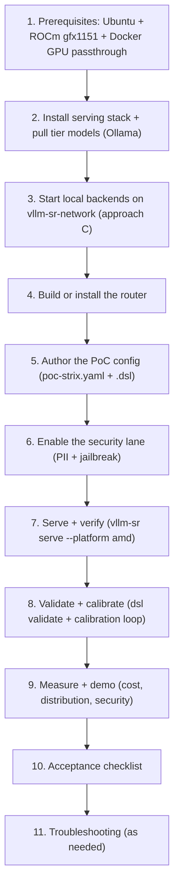

# 單機 Strix Halo PoC 操作手冊 / Single-box Strix Halo PoC Runbook

> 可照抄的雙語操作手冊：在一台 Ubuntu Strix Halo（Ryzen AI Max+ 395，gfx1151）上端到端跑起完整軟體 PoC。
> A copy-pasteable bilingual runbook to bring up the full software PoC end to end on a single Ubuntu Strix Halo box (Ryzen AI Max+ 395, gfx1151).

本文件是 [02-poc-plan.md](02-poc-plan.md) 第 11 節「單機 / Strix Halo 軟體 PoC 變體」的執行步驟，採用該節選定的**方法 C**（同機跑多個本地後端、每個 tier 用真正不同的模型、完全離線）。技術原理見 [01-tech-study.md](01-tech-study.md)。

This document is the execution counterpart to section 11 ("Single-box Strix Halo Software PoC Variant") of [02-poc-plan.md](02-poc-plan.md), using that section's selected **approach C** (multiple local backends on one box, a genuinely different model per tier, fully offline). For the underlying technology, see [01-tech-study.md](01-tech-study.md).

主要 serving stack 為 **Ollama（ROCm）**：一個 server 同時掛多個模型（每個 tier 一個），對外提供 OpenAI 相容 `/v1` API，並自動管理共用的統一記憶體。另提供 **AMD Lemonade Server** 與 **llama.cpp ROCm** 兩種替代方案。

The primary serving stack is **Ollama (ROCm)**: one server hosts multiple models (one per tier), exposes an OpenAI-compatible `/v1` API, and auto-manages the shared unified memory. Two alternatives are also covered: **AMD Lemonade Server** and **llama.cpp ROCm**.

---

## 0. 啟動順序總覽 / Bring-up Order Overview

下圖為建議的端到端啟動順序。每一步完成後再進入下一步。

The diagram below is the recommended end-to-end bring-up order. Finish each step before moving to the next.



接線模型 / Wiring model：router 只做語意決策並改寫請求，由 **Envoy** 負載平衡到實際後端。所有容器（router、Envoy、dashboard、各本地後端）都掛在同一個 Docker network `vllm-sr-network` 上，後端以「容器名稱:埠號」被引用（例如 `ollama:11434`）。

Wiring model: the router only makes semantic decisions and rewrites requests; **Envoy** load-balances to the real backend. All containers (router, Envoy, dashboard, and each local backend) sit on the same Docker network `vllm-sr-network`, and backends are referenced by `container-name:port` (e.g. `ollama:11434`).

### 已驗證的接線事實 / Verified wiring facts

下列事實已從 CLI 原始碼確認，據此撰寫本手冊的設定與啟動步驟。

The following facts were confirmed from the CLI source and drive this runbook's config and startup steps.

| 項目 / Item | 確認結果 / Confirmed value | 來源 / Source |
| --- | --- | --- |
| 預設 Docker network 名稱 / default Docker network name | `vllm-sr-network`（預設 stack；自訂 stack 名稱時為 `<stack>-vllm-sr-network`）/ `vllm-sr-network` (default stack; `<stack>-vllm-sr-network` for a custom stack name) | [runtime_stack.py](../../src/vllm-sr/cli/runtime_stack.py) |
| 後端可達性 / backend reachability | 同網路上的具名容器（`ollama:11434`），或主機閘道 `host.docker.internal:<port>`（router/Envoy 容器會自動加上 `--add-host=host.docker.internal:host-gateway`）/ named container on the shared network (`ollama:11434`), or the host gateway `host.docker.internal:<port>` (router/Envoy containers get `--add-host=host.docker.internal:host-gateway`) | [docker_run_command.py](../../src/vllm-sr/cli/docker_run_command.py), [docker_start.py](../../src/vllm-sr/cli/docker_start.py) |
| router 送往本地 endpoint 的 OpenAI 路徑 / OpenAI path the router emits to a local endpoint | 預設 `/v1/chat/completions`，可用 `backend_refs[].chat_path` 覆寫 / defaults to `/v1/chat/completions`, overridable via `backend_refs[].chat_path` | [chat_client.py](../../src/vllm-sr/cli/chat_client.py), [models.py](../../src/vllm-sr/cli/models.py) |
| AMD GPU passthrough | 掛載 `/dev/kfd` + `/dev/dri`、加上 `--group-add video`（由 `VLLM_SR_AMD_GPU_PASSTHROUGH` 控制）/ mounts `/dev/kfd` + `/dev/dri` with `--group-add video` (gated by `VLLM_SR_AMD_GPU_PASSTHROUGH`) | [docker_run_command.py](../../src/vllm-sr/cli/docker_run_command.py) |

因為 Ollama 的 OpenAI 相容 endpoint 就在 `/v1`，預設 `chat_path`（`/v1/chat/completions`）即可直接對上，無需覆寫。本手冊的假設是：把 Ollama 當成名為 `ollama` 的容器跑在 `vllm-sr-network` 上，因此 `endpoint: ollama:11434`。若你改用 host gateway 模式（serving stack 直接跑在主機而非容器），請把 `endpoint` 改成 `host.docker.internal:11434`。

Because Ollama's OpenAI-compatible endpoint lives at `/v1`, the default `chat_path` (`/v1/chat/completions`) lines up directly with no override needed. This runbook assumes Ollama runs as a container named `ollama` on `vllm-sr-network`, hence `endpoint: ollama:11434`. If instead you run the serving stack directly on the host (not as a container), change `endpoint` to `host.docker.internal:11434`.

---

## 1. 前置需求 / Prerequisites

| 需求 / Requirement | 說明 / Note |
| --- | --- |
| 作業系統 / OS | Ubuntu（x86_64）。ROCm router 映像僅支援 x86_64（見 [Dockerfile.rocm](../../src/vllm-sr/Dockerfile.rocm)），Strix Halo 為 x86 CPU 故同機即可跑 router / Ubuntu (x86_64). The ROCm router image is x86_64 only (see [Dockerfile.rocm](../../src/vllm-sr/Dockerfile.rocm)); Strix Halo is x86 CPU so the router runs on the same box |
| GPU / iGPU | RDNA 3.5 iGPU gfx1151；安裝對 gfx1151 友善的 ROCm 驅動與 runtime / RDNA 3.5 iGPU gfx1151; install a ROCm driver and runtime that support gfx1151 |
| 記憶體 / Memory | 最高 128GB 統一記憶體，由所有並行容器共用，需規劃每個後端的切片 / up to 128GB unified memory shared across all concurrent containers; plan each backend's slice |
| Docker | 可使用 GPU passthrough：`/dev/kfd`、`/dev/dri`，使用者在 `video`/`render` 群組 / Docker with GPU passthrough: `/dev/kfd`, `/dev/dri`, and the user in the `video`/`render` groups |
| 磁碟 / Disk | 模型快取空間（每個 tier 模型數 GB 到數十 GB）/ disk for the model cache (several GB to tens of GB per tier model) |

確認 GPU 與群組 / Verify the GPU and groups：

```bash
rocminfo | grep -i gfx
ls -l /dev/kfd /dev/dri
groups | tr ' ' '\n' | grep -E 'video|render'
```

統一記憶體（GTT）備註 / Unified-memory (GTT) note：Strix Halo 把系統 RAM 當成 GPU 可用的統一記憶體；多個後端同時載入時，請依各模型量化後大小規劃總量，避免超出可用 GTT。

Unified-memory (GTT) note: Strix Halo exposes system RAM as GPU-usable unified memory; when several backends load at once, budget the total against each model's quantized size to avoid exceeding available GTT.

---

## 2. 安裝 serving stack 並下載各 tier 模型 / Install the Serving Stack and Pull Tier Models

主要路徑使用 Ollama（ROCm）。先安裝，再下載每個 tier 的模型。

The primary path uses Ollama (ROCm). Install it first, then pull one model per tier.

### 2.1 安裝 Ollama / Install Ollama

```bash
curl -fsSL https://ollama.com/install.sh | sh
```

Ollama 官方網站 / official site: https://ollama.com 。在支援 ROCm 的主機上，Ollama 會自動偵測 AMD GPU；本手冊改以容器方式啟動（見第 3 節），以便和 router 共用同一個 Docker network。

Ollama official site: https://ollama.com . On a ROCm-capable host Ollama auto-detects the AMD GPU; this runbook runs it as a container (see section 3) so it shares the Docker network with the router.

### 2.2 目前自動路由的 provisioning set / Current auto-routed provisioning set

下列模型與目前 [`poc-strix.yaml`](../../deploy/recipes/strix-halo-poc/poc-strix.yaml) 的自動路由決策一致。`local/gemma4-26b-q8` 是一般／agentic 預設，`local/gemma4-26b-q4` 是 fast lane；QAT、31B 與 120B profile 僅供 explicit-by-name 使用，不由預設 bring-up 意外下載。

The models below match the auto-routed decisions in the current [`poc-strix.yaml`](../../deploy/recipes/strix-halo-poc/poc-strix.yaml). `local/gemma4-26b-q8` is the general/agentic default and `local/gemma4-26b-q4` is the fast lane. QAT, 31B, and 120B profiles are explicit-by-name only and are not unexpectedly downloaded by default bring-up.

| Route | 角色 / Role | Router model name | Ollama 標籤 / Ollama tag |
| --- | --- | --- | --- |
| DEFAULT | 一般與 agentic 流量 / general and agentic traffic | `local/gemma4-26b-q8` | `gemma4:26b-a4b-it-q8_0` |
| FAST | 短問答 throughput lane / short-QA throughput lane | `local/gemma4-26b-q4` | `gemma4:26b` |
| MEDIUM | 低成本驗證／解釋 / low-cost verified/explainer | `google/gemini-2.5-flash-lite` | `qwen2.5:7b` |
| COMPLEX | 系統設計、硬 STEM、健康 / systems design, hard STEM, health | `google/gemini-3.1-pro` | `qwen2.5:14b` |
| REASONING | 形式化推理、證明 / formal reasoning, proofs | `openai/gpt5.4` | `qwen3:14b` |

下載模型 / Pull the models：

```bash
for tag in gemma4:26b-a4b-it-q8_0 gemma4:26b qwen2.5:7b qwen2.5:14b qwen3:14b; do
  ollama pull "$tag"
done
```

記憶體取捨 / Memory trade-off：所有 tier 都載入時會共用 128GB 統一記憶體。若吃緊，請(1) 減少 tier 數量、(2) 改用較小或量化更激進的標籤、或(3) 讓 Ollama 依需求載入／卸載（見 `OLLAMA_KEEP_ALIVE` 與 `OLLAMA_MAX_LOADED_MODELS`）。

Memory trade-off: loading every tier shares the 128GB unified memory. If it is tight, (1) reduce the number of tiers, (2) use smaller or more aggressively quantized tags, or (3) let Ollama load/unload on demand (see `OLLAMA_KEEP_ALIVE` and `OLLAMA_MAX_LOADED_MODELS`).

---

## 3. 啟動本地後端（方法 C）/ Start Local Backends (Approach C)

### 3.1 主要：Ollama 容器 / Primary: the Ollama container

先建立共用 Docker network（名稱須與 router 預設一致），再以 ROCm passthrough 啟動 Ollama 容器，命名為 `ollama`。

Create the shared Docker network first (the name must match the router default), then start the Ollama container with ROCm passthrough, named `ollama`.

```bash
sudo docker network create vllm-sr-network 2>/dev/null || true

sudo docker run -d \
  --name ollama \
  --network=vllm-sr-network \
  --restart unless-stopped \
  -p 11434:11434 \
  -v ollama:/root/.ollama \
  --device=/dev/kfd \
  --device=/dev/dri \
  --group-add=video \
  --cap-add=SYS_PTRACE \
  --security-opt seccomp=unconfined \
  -e HSA_OVERRIDE_GFX_VERSION=11.5.1 \
  -e OLLAMA_CONTEXT_LENGTH=65536 \
  -e OLLAMA_NUM_PARALLEL=1 \
  -e OLLAMA_MAX_LOADED_MODELS=1 \
  -e OLLAMA_KEEP_ALIVE=10m \
  ollama/ollama:rocm@sha256:4a22dbbce24e7425861020987adb99851282b5af8e433028d1c72c453eed8f75
```

備註 / Notes：

- `HSA_OVERRIDE_GFX_VERSION` 對 gfx1151 有時需要設定；若 Ollama 已正確偵測 GPU 可省略。實際值依你的 ROCm 版本而定。
  `HSA_OVERRIDE_GFX_VERSION` is sometimes needed for gfx1151; omit it if Ollama already detects the GPU correctly. The exact value depends on your ROCm version.
- 容器使用 named volume `ollama` 保存已下載模型。若你在第 2.2 節已於主機下載，請改掛主機路徑或在容器內重新 `ollama pull`。
  The container uses a named volume `ollama` to persist pulled models. If you pulled on the host in 2.2, mount the host path instead or re-run `ollama pull` inside the container.

在容器內下載（若使用 named volume）/ Pull inside the container (if using the named volume)：

```bash
for tag in gemma4:26b-a4b-it-q8_0 gemma4:26b qwen2.5:7b qwen2.5:14b qwen3:14b; do
  sudo docker exec ollama ollama pull "$tag"
done
```

實際操作請優先使用 fail-closed wrapper：先跑 `bash deploy/recipes/strix-halo-poc/bring-up.sh --runtime-preflight` 做唯讀檢查，再用 `--runtime-only` provisioning；它不會自動重啟／重建不相符或使用中的 container。完成後跑 `--runtime-proof`，以一個不傳 `num_ctx` 的 1-token request 載入 Gemma，要求 `ollama ps` 實際顯示 `CONTEXT 65536`，並把 image/model hash、quant、ROCm、processor/offload 與 runtime version 寫入 gitignored provenance JSON。

Prefer the fail-closed wrapper in actual operation: run `bash deploy/recipes/strix-halo-poc/bring-up.sh --runtime-preflight` for read-only inspection, then `--runtime-only` for provisioning. It never automatically restarts or recreates a mismatched/in-use container. Afterwards, `--runtime-proof` loads Gemma with one 1-token request that omits `num_ctx`, requires `ollama ps` to actually report `CONTEXT 65536`, and writes image/model hash, quant, ROCm, processor/offload, and runtime version to a gitignored provenance JSON.

64K 是此階段的**顯式 serving allocation**，不是 exact-token capacity 或品質證明。128K（131,072）在完成後續 capacity/quality/reliability acceptance 前維持 experimental，不得用模型架構 metadata 當成已驗證服務能力。

64K is this phase's **explicit serving allocation**, not exact-token capacity or quality proof. 128K (131,072) remains experimental until later capacity/quality/reliability acceptance passes; architecture metadata must not be presented as verified serving capability.

驗證每個模型都能在 OpenAI 相容 endpoint 回應 / Verify each model answers on the OpenAI-compatible endpoint：

```bash
curl -s http://localhost:11434/v1/chat/completions \
  -H "Content-Type: application/json" \
  -d '{
        "model": "gemma4:26b-a4b-it-q8_0",
        "messages": [{"role": "user", "content": "ping"}]
      }' | head
```

方法 C 的關鍵 / The key to approach C：一個 Ollama server 同時提供多個模型，但每個 route 用**真正不同**的模型名稱（`gemma4:26b-a4b-it-q8_0`、`gemma4:26b`、`qwen2.5:14b`…），因此分層路由展示的是真實模型差異，而非單一模型的別名。

The key to approach C: one Ollama server serves multiple models, but each route uses a genuinely different model name (`gemma4:26b-a4b-it-q8_0`, `gemma4:26b`, `qwen2.5:14b`, ...), so tiered routing demonstrates real model differentiation rather than aliases over one model.

### 3.2 替代方案 A：AMD Lemonade Server / Alternative A: AMD Lemonade Server

Lemonade 是 AMD 官方掛牌的本地推理 server，對客戶故事特別有說服力，並提供 OpenAI 相容 API。

Lemonade is the AMD-branded local inference server, which is especially compelling for the customer story, and it exposes an OpenAI-compatible API.

- 官方網站 / official site: https://lemonade-server.ai
- 啟動後同樣以「容器名稱:埠號」或 `host.docker.internal:<port>` 在設定中引用其 OpenAI 相容 endpoint；其餘設定與 Ollama 路徑相同。
  Once running, reference its OpenAI-compatible endpoint the same way (by `container-name:port` or `host.docker.internal:<port>`) in config; everything else matches the Ollama path.
- 與 Ollama 相同，多個模型由同一 server 提供，各 tier 指向不同模型名稱即可滿足方法 C。
  As with Ollama, one server hosts multiple models, and pointing each tier at a different model name satisfies approach C.

### 3.3 替代方案 B：llama.cpp ROCm（每 tier 嚴格切 VRAM）/ Alternative B: llama.cpp ROCm (strict per-tier VRAM slices)

若需要**每個 tier 嚴格切一塊 VRAM**，可為每個 tier 跑一個獨立的 `llama-server`，各自綁不同埠號。

If you need a strict VRAM slice per tier, run one `llama-server` per tier, each bound to a different port.

- 官方專案 / official project: https://github.com/ggml-org/llama.cpp （以 `GGML_HIP`/ROCm 建置）/ (build with `GGML_HIP`/ROCm)
- 每個 tier 一個容器、一個埠號（例如 SIMPLE `:8001`、MEDIUM `:8002`、COMPLEX `:8003`…），全部掛在 `vllm-sr-network` 上。
  One container and one port per tier (e.g. SIMPLE `:8001`, MEDIUM `:8002`, COMPLEX `:8003`, ...), all on `vllm-sr-network`.
- 在設定中，各 tier 的 `backend_refs.endpoint` 指向各自的「容器名稱:埠號」（而非像 Ollama 那樣共用同一個 endpoint）。
  In config, each tier's `backend_refs.endpoint` points at its own `container-name:port` (rather than sharing one endpoint as with Ollama).

範例（單一 tier 容器）/ Example (a single tier container)：

```bash
sudo docker run -d \
  --name llamacpp-simple \
  --network=vllm-sr-network \
  -p 8001:8001 \
  -v "$HOME/models:/models" \
  --device=/dev/kfd --device=/dev/dri --group-add=video \
  --cap-add=SYS_PTRACE --security-opt seccomp=unconfined \
  ghcr.io/ggml-org/llama.cpp:server-rocm \
  -m /models/simple.gguf --host 0.0.0.0 --port 8001 --n-gpu-layers 99
```

三種 serving stack 比較 / Comparison of the three serving stacks：

| Serving stack | 多模型方式 / Multi-model approach | 每 tier 記憶體控制 / Per-tier memory control | 在設定中的 endpoint / Endpoint in config |
| --- | --- | --- | --- |
| Ollama（主要）/ Ollama (primary) | 一個 server 多模型 / one server, many models | 由 Ollama 自動管理 / Ollama auto-manages | 全 tier 共用 `ollama:11434`，模型名稱不同 / all tiers share `ollama:11434`, different model names |
| AMD Lemonade | 一個 server 多模型 / one server, many models | 由 Lemonade 管理 / managed by Lemonade | 共用單一 endpoint，模型名稱不同 / one shared endpoint, different model names |
| llama.cpp ROCm | 每 tier 一個 server / one server per tier | 每容器嚴格切 VRAM / strict per-container VRAM slice | 每 tier 不同埠號 / different port per tier |

> Ollama、Lemonade、llama.cpp 為通用 AMD 生態工具，非本 repo 的檔案。
> Ollama, Lemonade, and llama.cpp are general AMD ecosystem tools, not files in this repo.

---

## 4. 取得並建置 router / Build or Install the Router

兩種方式擇一 / Pick one of two ways：

```bash
# 方式 A：自建 ROCm 版本 / Option A: build the ROCm variant locally
make vllm-sr-dev VLLM_SR_PLATFORM=amd

# 方式 B：安裝官方版本 / Option B: install the official build
curl -fsSL https://vllm-semantic-router.com/install.sh | bash
```

CLI 進入點為 [main.py](../../src/vllm-sr/cli/main.py)，serve 實作為 [runtime.py](../../src/vllm-sr/cli/commands/runtime.py)。預設拓樸為 split（router + Envoy + dashboard 各自獨立容器，見 [consts.py](../../src/vllm-sr/cli/consts.py)）。

The CLI entry is [main.py](../../src/vllm-sr/cli/main.py) and the serve implementation is [runtime.py](../../src/vllm-sr/cli/commands/runtime.py). The default topology is split (router + Envoy + dashboard as separate containers, see [consts.py](../../src/vllm-sr/cli/consts.py)).

---

## 5. 撰寫 PoC config / Author the PoC Config

本 repo 已提供改寫好的設定：[deploy/recipes/strix-halo-poc/poc-strix.yaml](../../deploy/recipes/strix-halo-poc/poc-strix.yaml)（由參考設定 [balance.yaml](../../deploy/recipes/balance.yaml)（v0.3）改寫）。目前設定保留 balance tier aliases 與 pricing，並加入 Gemma local operating profiles；一般流量預設為 `local/gemma4-26b-q8`，fast lane 為 `local/gemma4-26b-q4`。

The adapted config already lives in this repo: [deploy/recipes/strix-halo-poc/poc-strix.yaml](../../deploy/recipes/strix-halo-poc/poc-strix.yaml) (adapted from the reference profile [balance.yaml](../../deploy/recipes/balance.yaml), v0.3). It retains the balance tier aliases and pricing while adding Gemma local operating profiles. General traffic defaults to `local/gemma4-26b-q8`, with `local/gemma4-26b-q4` as the fast lane.

設定 schema 見 [models.py](../../src/vllm-sr/cli/models.py)（`BackendRef.endpoint` 用於本地 OpenAI 相容後端；`base_url` + `provider` + `api_key_env` 用於遠端 frontier）；完整對照範例見 [config/config.yaml](../../config/config.yaml)。

The config schema is in [models.py](../../src/vllm-sr/cli/models.py) (`BackendRef.endpoint` for a local OpenAI-compatible backend; `base_url` + `provider` + `api_key_env` for a remote frontier); a full reference example is in [config/config.yaml](../../config/config.yaml).

### 5.1 `providers.models[]` 的 backend_refs 片段 / The `providers.models[]` backend_refs snippet

下列片段顯示目前的 default 與 tier aliases。Ollama-backed routes 共用 `ollama:11434`，但使用不同 `provider_model_id`；offline PREMIUM stand-in 仍使用 `llm-katan`。

The snippet below shows the current default and tier aliases. Ollama-backed routes share `ollama:11434` but use different `provider_model_id` values; the offline PREMIUM stand-in still uses `llm-katan`.

```yaml
providers:
  defaults:
    default_model: local/gemma4-26b-q8
    default_reasoning_effort: low
    reasoning_families:
      qwen3:
        parameter: enable_thinking
        type: chat_template_kwargs
  models:
    - name: local/gemma4-26b-q8        # DEFAULT
      provider_model_id: gemma4:26b-a4b-it-q8_0
      backend_refs:
        - endpoint: ollama:11434       # named container on vllm-sr-network
          name: ollama_local
          protocol: http
          weight: 1
      pricing:
        currency: USD
        prompt_per_1m: 0
        cached_input_per_1m: 0
        completion_per_1m: 0
    - name: google/gemini-2.5-flash-lite   # MEDIUM
      provider_model_id: qwen2.5:7b
      reasoning_family: qwen3
      backend_refs:
        - endpoint: ollama:11434
          name: ollama_local
          protocol: http
          weight: 1
      pricing:
        currency: USD
        prompt_per_1m: 0.01
        cached_input_per_1m: 0.002
        completion_per_1m: 0.04
    - name: google/gemini-3.1-pro          # COMPLEX
      provider_model_id: qwen2.5:14b
      reasoning_family: qwen3
      backend_refs:
        - endpoint: ollama:11434
          name: ollama_local
          protocol: http
          weight: 1
      pricing:
        currency: USD
        prompt_per_1m: 0.48
        cached_input_per_1m: 0.12
        completion_per_1m: 1.92
    - name: openai/gpt5.4                   # REASONING
      provider_model_id: qwen3:14b
      reasoning_family: qwen3
      backend_refs:
        - endpoint: ollama:11434
          name: ollama_local
          protocol: http
          weight: 1
      pricing:
        currency: USD
        prompt_per_1m: 1.2
        cached_input_per_1m: 0.3
        completion_per_1m: 4.8
    - name: anthropic/claude-opus-4.6       # offline PREMIUM stand-in
      provider_model_id: test-model
      reasoning_family: qwen3
      backend_refs:
        - endpoint: llm-katan:8000
          name: ollama_local
          protocol: http
          weight: 1
      pricing:
        currency: USD
        prompt_per_1m: 1.8
        cached_input_per_1m: 0.45
        completion_per_1m: 7.2
```

備註 / Notes：

- `provider_model_id` 是真正送給後端 `model` 欄位的值；對 Ollama-backed route，它必須等於已 provisioning 的 Ollama tag（例如 `gemma4:26b-a4b-it-q8_0`）。`name` 是路由內部的邏輯名稱，決策的 `modelRefs[].model` 引用它。
  `provider_model_id` is the value actually sent in the backend `model` field. For an Ollama-backed route it must equal a provisioned Ollama tag (for example `gemma4:26b-a4b-it-q8_0`). `name` is the routing-internal logical name that decisions reference via `modelRefs[].model`.
- `endpoint` 用「容器名稱:埠號」`ollama:11434`，因為後端與 router 同在 `vllm-sr-network`。預設 `chat_path` 為 `/v1/chat/completions`，與 Ollama 的 `/v1` 相容，無需覆寫。
  `endpoint` uses `container-name:port` `ollama:11434` because the backend and router share `vllm-sr-network`. The default `chat_path` (`/v1/chat/completions`) is compatible with Ollama's `/v1`, so no override is needed.
- `reasoning_family: qwen3` 透過 `enable_thinking` chat-template 參數控制思考開關（見 [01-tech-study.md](01-tech-study.md) 4.4 節）。若某 tier 改用非 qwen 模型，請相應調整或移除 reasoning family。
  `reasoning_family: qwen3` toggles thinking via the `enable_thinking` chat-template parameter (see section 4.4 of [01-tech-study.md](01-tech-study.md)). If a tier switches to a non-qwen model, adjust or drop the reasoning family accordingly.
- 替代方案 B（llama.cpp）時，把各 tier 的 `endpoint` 改為各自的「容器名稱:埠號」（如 `llamacpp-simple:8001`），`provider_model_id` 改為各 server 所載入的模型名稱。
  For alternative B (llama.cpp), change each tier's `endpoint` to its own `container-name:port` (e.g. `llamacpp-simple:8001`) and set `provider_model_id` to the model each server loaded.
- 選配真實雲端 PREMIUM / optional real-cloud PREMIUM：把該模型的 `backend_refs` 改成 `{ base_url: https://api.openai.com/v1, provider: openai, api_key_env: OPENAI_API_KEY }`，金鑰由環境變數讀取。
  Optional real-cloud PREMIUM: change that model's `backend_refs` to `{ base_url: https://api.openai.com/v1, provider: openai, api_key_env: OPENAI_API_KEY }`; the key is read from an env var.

### 5.2 一條決策範例 / One decision example

`routing.decisions[]` 透過 routing name 引用 model。`modelCards[].context_window_size` 則明確設為 65,536，與 backend serving context 一致；不再把 131K／262K architecture metadata 當成 runtime 能力。下例為 SIMPLE fallback，引用 Gemma Q8 default。

`routing.decisions[]` references models by routing name. `modelCards[].context_window_size` is explicitly 65,536 to match the backend serving context; 131K/262K architecture metadata is no longer presented as runtime capability. The example below is the SIMPLE fallback referencing the Gemma Q8 default.

```yaml
routing:
  decisions:
    - name: simple_general
      description: Lowest-cost fallback for everyday traffic and non-specialized requests.
      priority: 170
      tier: 13
      modelRefs:
        - model: local/gemma4-26b-q8   # -> gemma4:26b-a4b-it-q8_0 on Ollama
          use_reasoning: false
      rules:
        operator: OR
        conditions:
          - operator: AND
            conditions:
              - type: context
                name: short_context
              - operator: OR
                conditions:
                  - type: projection
                    name: balance_simple
                  - type: projection
                    name: balance_medium
```

> 上述調整已套用於 [deploy/recipes/strix-halo-poc/poc-strix.yaml](../../deploy/recipes/strix-halo-poc/poc-strix.yaml)：保留 balance signals/projections 與 tier aliases，加入 local Gemma profiles、安全 lane，並把 provider model cards 限制在已配置的 64K serving window。
> These changes are already applied in [deploy/recipes/strix-halo-poc/poc-strix.yaml](../../deploy/recipes/strix-halo-poc/poc-strix.yaml): it retains the balance signals/projections and tier aliases, adds the local Gemma profiles and security lane, and limits provider model cards to the configured 64K serving window.

---

## 6. 啟用安全 lane（設定任務）/ Enable the Security Lane (a Config Task)

維護中的 [balance.yaml](../../deploy/recipes/balance.yaml) 為了專注 balance，已把 jailbreak/PII 從路由表面移除。安全 demo 需明確加回三樣東西。

The maintained [balance.yaml](../../deploy/recipes/balance.yaml) dropped jailbreak/PII from its routing surface to stay balance-focused. The security demo requires explicitly adding back three things.

1. 在 `routing.signals` 加回 `jailbreak` 與 `pii` 訊號 / Re-add `jailbreak` and `pii` signals under `routing.signals`：

```yaml
routing:
  signals:
    jailbreak:
      - name: jailbreak_attempt
        threshold: 0.7
        description: Detect prompt-injection / jailbreak attempts.
    pii:
      - name: contains_pii
        threshold: 0.5
        description: Detect personally identifiable information in the request.
```

2. 新增一條高優先序的安全決策 lane / Add a high-priority security decision lane：

```yaml
routing:
  decisions:
    - name: security_guard
      description: Deny or down-route requests that trip jailbreak or PII signals.
      priority: 300            # higher than every balance lane so it wins first
      tier: 0
      modelRefs:
        - model: qwen/qwen3.5-rocm   # keep risky traffic on the local model
          use_reasoning: false
      rules:
        operator: OR
        conditions:
          - type: jailbreak
            name: jailbreak_attempt
          - type: pii
            name: contains_pii
      plugins:
        - type: response_jailbreak
          configuration:
            enabled: true
            action: block          # block -> HTTP 403 on jailbreak in the response
```

3. 在 `global.model_catalog.modules` 設定 `prompt_guard` 與 PII 分類器模型 / Configure the `prompt_guard` and PII classifier models under `global.model_catalog.modules`：

```yaml
global:
  model_catalog:
    modules:
      prompt_guard:
        use_cpu: true            # keep the iGPU for the LLM backends
        # model path / threshold per the canonical config reference
      pii_classifier:
        use_cpu: true
```

`PromptGuardConfig` 的型別定義見 [model_config_types.go](../../src/semantic-router/pkg/config/model_config_types.go)；完整的 `global.model_catalog.modules` 範例（prompt_guard、pii_classifier 的模型路徑與門檻）請參照 [config/config.yaml](../../config/config.yaml)。把分類器設為 `use_cpu: true`，以把 iGPU 留給 LLM 後端（與第 7 節 `VLLM_SR_AMD_PRESERVE_CPU=1` 一致）。

`PromptGuardConfig` types are defined in [model_config_types.go](../../src/semantic-router/pkg/config/model_config_types.go); for the full `global.model_catalog.modules` example (model paths and thresholds for prompt_guard and pii_classifier), follow [config/config.yaml](../../config/config.yaml). Set the classifiers to `use_cpu: true` to reserve the iGPU for the LLM backends (consistent with `VLLM_SR_AMD_PRESERVE_CPU=1` in section 7).

---

## 7. 啟動與驗證 / Serve and Verify

以 [deploy/recipes/strix-halo-poc/poc-strix.yaml](../../deploy/recipes/strix-halo-poc/poc-strix.yaml) 啟動 router，平台為 amd，並設 `VLLM_SR_AMD_PRESERVE_CPU=1` 讓內建分類器留在 CPU。第 3 節的後端啟動與下列 serve 步驟已整合在腳本 [bring-up.sh](../../deploy/recipes/strix-halo-poc/bring-up.sh) 中，可直接 `bash deploy/recipes/strix-halo-poc/bring-up.sh` 一次完成。

Serve the router with [deploy/recipes/strix-halo-poc/poc-strix.yaml](../../deploy/recipes/strix-halo-poc/poc-strix.yaml) on the amd platform, setting `VLLM_SR_AMD_PRESERVE_CPU=1` to keep the built-in classifiers on CPU. The backend bring-up from section 3 and the serve step below are bundled in [bring-up.sh](../../deploy/recipes/strix-halo-poc/bring-up.sh), so you can run `bash deploy/recipes/strix-halo-poc/bring-up.sh` to do it all at once.

```bash
export VLLM_SR_AMD_PRESERVE_CPU=1

vllm-sr serve \
  --config deploy/recipes/strix-halo-poc/poc-strix.yaml \
  --image-pull-policy never \
  --platform amd
```

為何 `VLLM_SR_AMD_PRESERVE_CPU=1` / Why `VLLM_SR_AMD_PRESERVE_CPU=1`：`--platform amd` 預設會把 classifier modules 從 CPU 翻成 GPU；本 PoC 要把 iGPU 全留給 LLM 後端，故設此旗標讓 mmBERT/embedding 分類器留在 CPU（見 [runtime_config_mutation.py](../../src/vllm-sr/cli/commands/runtime_config_mutation.py)）。

Why `VLLM_SR_AMD_PRESERVE_CPU=1`: `--platform amd` by default flips classifier modules from CPU to GPU; this PoC reserves the iGPU entirely for the LLM backends, so the flag keeps the mmBERT/embedding classifiers on CPU (see [runtime_config_mutation.py](../../src/vllm-sr/cli/commands/runtime_config_mutation.py)).

驗證項目 / What to check：

| 檢查 / Check | 方法 / How |
| --- | --- |
| 容器狀態 / container status | `vllm-sr status` |
| Dashboard | 瀏覽 `http://<host>:8700` / browse `http://<host>:8700` |
| Metrics | `curl -s http://<host>:9190/metrics` |
| 端到端請求 / end-to-end request | 對 listener `:8899` 送一個 OpenAI 相容請求（見下）/ send an OpenAI-compatible request to listener `:8899` (below) |

預設埠口 / Default ports：listener `:8899`、api `:8080`、gRPC `:50051`、dashboard `:8700`、metrics `:9190`、Envoy admin `:9901`（見 [consts.py](../../src/vllm-sr/cli/consts.py)）。

Default ports: listener `:8899`, api `:8080`, gRPC `:50051`, dashboard `:8700`, metrics `:9190`, Envoy admin `:9901` (see [consts.py](../../src/vllm-sr/cli/consts.py)).

端到端冒煙測試 / End-to-end smoke test（單一請求如下；4 個示範請求（簡單／推理／PII／jailbreak）可用 [smoke_test.py](../../deploy/recipes/strix-halo-poc/smoke_test.py)：`python deploy/recipes/strix-halo-poc/smoke_test.py`）/ (single request below; for all 4 demo requests (easy / reasoning / PII / jailbreak) use [smoke_test.py](../../deploy/recipes/strix-halo-poc/smoke_test.py): `python deploy/recipes/strix-halo-poc/smoke_test.py`)：

```bash
curl -s http://localhost:8899/v1/chat/completions \
  -H "Content-Type: application/json" \
  -d '{
        "model": "auto",
        "messages": [{"role": "user", "content": "What is the capital of France?"}]
      }' | head
```

---

## 8. 驗證與校準 / Validate and Calibrate

先做本地靜態驗證（無需 GPU／router 即可在任何機器上跑），再對 PoC 的 DSL 做 Go 驗證，最後對運作中的 router 跑校準迴圈。

Run the offline static validation first (no GPU/router needed; runs on any box), then the Go DSL validation for the PoC DSL, and finally the calibration loop against the live router.

```bash
# 0. 離線結構驗證（純 PyYAML）/ offline structural validation (pure PyYAML)
python deploy/recipes/strix-halo-poc/validate_poc_config.py \
  deploy/recipes/strix-halo-poc/poc-strix.yaml

# 1. 由 poc-strix.yaml 產生並驗證 poc-strix.dsl（需要 Go）/ generate and validate
#    poc-strix.dsl from poc-strix.yaml (requires Go)
bash deploy/recipes/strix-halo-poc/gen-dsl.sh
```

`gen-dsl.sh` 會從 `src/semantic-router` 執行 `go run ./cmd/dsl decompile` 由 `poc-strix.yaml` 產生 `poc-strix.dsl`，再執行 `go run ./cmd/dsl validate` 驗證它。`.dsl` 是產生物，不入庫（在有 Go 的 Strix Halo 上即時產生）。DSL 只編碼 `routing.*`，providers/global 仍留在 YAML。DSL CLI 進入點見 [cmd/dsl/main.go](../../src/semantic-router/cmd/dsl/main.go)，腳本見 [gen-dsl.sh](../../deploy/recipes/strix-halo-poc/gen-dsl.sh)。

`gen-dsl.sh` runs `go run ./cmd/dsl decompile` from `src/semantic-router` to generate `poc-strix.dsl` from `poc-strix.yaml`, then `go run ./cmd/dsl validate` to validate it. The `.dsl` is a generated artifact and is not committed (it is produced on the Strix Halo where Go exists). The DSL encodes only `routing.*`; providers/global stay in YAML. The DSL CLI entry is [cmd/dsl/main.go](../../src/semantic-router/cmd/dsl/main.go), and the script is [gen-dsl.sh](../../deploy/recipes/strix-halo-poc/gen-dsl.sh).

If you also maintain a PoC-specific `.dsl`, replace the path above with `poc-strix.dsl`. The DSL CLI entry is [cmd/dsl/main.go](../../src/semantic-router/cmd/dsl/main.go).

路由校準迴圈 / Routing calibration loop：

```bash
python3 tools/agent/scripts/router_calibration_loop.py run \
  --router-url http://<host>:8080 \
  --probes deploy/recipes/strix-halo-poc/poc-probes.yaml \
  --yaml deploy/recipes/strix-halo-poc/poc-strix.yaml \
  --dsl deploy/recipes/strix-halo-poc/poc-strix.dsl
```

腳本見 [router_calibration_loop.py](../../tools/agent/scripts/router_calibration_loop.py)；probe 套件 [poc-probes.yaml](../../deploy/recipes/strix-halo-poc/poc-probes.yaml)（balance 的 13 條決策 probe 加上 PoC 的 `security_guard` 安全 probe）。若你改動了決策，請相應調整 probe 期望。

The script is [router_calibration_loop.py](../../tools/agent/scripts/router_calibration_loop.py); the probe suite [poc-probes.yaml](../../deploy/recipes/strix-halo-poc/poc-probes.yaml) is the balance 13-decision probes plus the PoC `security_guard` security probes. If you changed the decisions, adjust the probe expectations accordingly.

---

## 9. 量測與 demo / Measure and Demo

依 [02-poc-plan.md](02-poc-plan.md) 第 8 節的 demo 腳本，送出代表性請求並在 dashboard/Grafana 上展示。

Follow the demo script in section 8 of [02-poc-plan.md](02-poc-plan.md): send representative requests and show them on the dashboard/Grafana.

| 步驟 / Step | 送出 / Send | 預期觀察 / Expected observation |
| --- | --- | --- |
| 1 | 簡單問答 / an easy question | 路由到 SIMPLE 本地模型、成本 ~$0 / routes to the SIMPLE local model at ~$0 |
| 2 | 困難推理問題 / a hard reasoning question | 升級到 COMPLEX/REASONING/PREMIUM、開啟 reasoning / escalates to COMPLEX/REASONING/PREMIUM with reasoning on |
| 3 | 含 PII 的請求 / a request with PII | 命中 `contains_pii` 訊號，路由到 `security_guard`，由 fast_response 即時拒絕：HTTP 200 + `x-vsr-fast-response: true` + `x-vsr-selected-decision: security_guard`（可另觀察 `x-vsr-matched-pii`）/ matches the `contains_pii` signal, routes to `security_guard`, and fast_response refuses immediately: HTTP 200 + `x-vsr-fast-response: true` + `x-vsr-selected-decision: security_guard` (optionally also `x-vsr-matched-pii`) |
| 4 | jailbreak 嘗試 / a jailbreak attempt | 命中 `jailbreak_attempt` 訊號，路由到 `security_guard`，由 fast_response 即時拒絕（HTTP 200 + `x-vsr-fast-response: true` + `x-vsr-selected-decision: security_guard`，可另觀察 `x-vsr-matched-jailbreak`）；若仍打到模型，第二層 `response_jailbreak` 對被標記的輸出回 HTTP 403 / matches the `jailbreak_attempt` signal, routes to `security_guard`, and fast_response refuses immediately (HTTP 200 + `x-vsr-fast-response: true` + `x-vsr-selected-decision: security_guard`, optionally also `x-vsr-matched-jailbreak`); if a model is still hit, the `response_jailbreak` second layer returns HTTP 403 on the flagged output |
| 5 | 開啟 Grafana / open Grafana | 成本下降數字、本地承載率、token 用量、TTFT/TPOT、快取命中 / cost-reduction number, local-served ratio, token usage, TTFT/TPOT, cache hit |
| 6（選配 / optional）| 跑 calibration loop / run the calibration loop | 路由準確率報表 / a routing-accuracy report |

> 安全攔截的真實機制 / How security blocking actually works：在此訊號驅動的 router 中，`pii` 與 `jailbreak` 是**訊號**，只負責把請求路由到 `security_guard` 決策，本身不會攔截。輸入端的攔截來自該決策上的 `fast_response` plugin（回 HTTP 200 + 制式拒絕訊息 + `x-vsr-fast-response: true`）；`response_jailbreak` 是第二層，只在 LLM **輸出**被標記時回 HTTP 403。路由路徑中**沒有**內聯 PII 遮罩，遮罩只在 `/api` 分類服務提供。
> How security blocking actually works: in this signal-driven router, `pii` and `jailbreak` are signals that only route a request to the `security_guard` decision; they do not block by themselves. The input-side block comes from the `fast_response` plugin on that decision (HTTP 200 + a canned refusal + `x-vsr-fast-response: true`), and `response_jailbreak` is the second layer that returns HTTP 403 only when the LLM output is flagged. There is no inline PII masking in the routing path; masking is available only via the `/api` classification service.

成本節省的來源 / Where savings come from：即使全部都在本地服務，dashboard 仍以設定檔的 `pricing` 對比「全部走最貴模型」基準計算省錢數字。完全離線示範 frontier 升級時，可用 mock 伺服器 `llm-katan` 取代真實雲端 API（見 [e2e/testing/llm-katan/README.md](../../e2e/testing/llm-katan/README.md)）。

Where savings come from: even when everything is served locally, the dashboard computes savings from the config `pricing` against an all-most-expensive-model baseline. For a fully offline demo of frontier escalation, replace the real cloud API with the mock server `llm-katan` (see [e2e/testing/llm-katan/README.md](../../e2e/testing/llm-katan/README.md)).

### Bench 證據一鍵執行 / One-command Bench Evidence

除了上面手動的 demo 動線，[run-bench.sh](../../deploy/recipes/strix-halo-poc/run-bench.sh) 把「尚未在本手冊其他處接線」的 bench 工具一次對運作中的 stack 跑完，並逐步對映 [02-poc-plan.md](02-poc-plan.md) 第 1 節的成功標準。關鍵原因：bench 工具的**預設** port 指向手動 dev 拓樸（直連 `:8000`、Envoy `:8801`、metrics `:9279`），但本 PoC 用 `vllm-sr serve`，listener 在 `:8899`、metrics 在 `:9190`（見 [consts.py](../../src/vllm-sr/cli/consts.py)），所以每次都得覆寫 port；這支 wrapper 已預設正確值。

Beyond the manual demo flow above, [run-bench.sh](../../deploy/recipes/strix-halo-poc/run-bench.sh) runs the bench tools that are not otherwise wired in this runbook in one shot against the live stack, mapping each step onto the section-1 success criteria of [02-poc-plan.md](02-poc-plan.md). Key reason: the bench tools' **defaults** target the manual dev topology (direct `:8000`, Envoy `:8801`, metrics `:9279`), but this PoC uses `vllm-sr serve` with the listener on `:8899` and metrics on `:9190` (see [consts.py](../../src/vllm-sr/cli/consts.py)), so the ports must be overridden every time; this wrapper pre-wires the correct values.

Port 對映 / Port mapping：

| 用途 / Purpose | vllm-sr serve（本 PoC）/ this PoC | bench 預設 / bench default |
| --- | --- | --- |
| router 入口 `--base-url` / router entry | `:8899/v1`（listener）/ listener | `:8000/v1` |
| `--metrics-url` | `:9190/metrics` | `:9279/metrics` |
| 直連 baseline `--baseline-base-url` / direct baseline | 本地 Ollama `:11434/v1` / local Ollama | `:8090` 或 / or `:8000` |

```bash
# GA 證據（probe -> agentic -> cached-token）；baseline 用本地 Ollama 直連後端
# GA evidence (probe -> agentic -> cached-token); baseline = the local Ollama direct backend
BASELINE_BASE_URL=http://localhost:11434/v1 \
  bash deploy/recipes/strix-halo-poc/run-bench.sh

# 加跑「品質維持」：router vs 直連 Ollama 在推理資料集上的準確率（較重，需 bench dataset 依賴）
# add quality retention: router-vs-direct accuracy on reasoning datasets (heavier, needs bench deps)
BASELINE_BASE_URL=http://localhost:11434/v1 \
  bash deploy/recipes/strix-halo-poc/run-bench.sh --with-reasoning
```

每步對映的成功標準 / What each step covers（[02-poc-plan.md](02-poc-plan.md) 第 1 節 / section 1）：

| 步驟 / Step | 工具 / Tool | 成功標準 / Success criterion |
| --- | --- | --- |
| 1 GA 診斷 probe / GA diagnostic probe | [session_routing_branch_image_probe.py](../../bench/session_routing_branch_image_probe.py) | 路由可觀測性（`x-vsr-*` 標頭齊備）/ routing observability |
| 2 agentic session 路由 / agentic session routing | [agentic_routing_live_benchmark.py](../../bench/agentic_routing_live_benchmark.py) | 本地承載率 + 路由 + 額外開銷 / local ratio + routing + overhead |
| 3 cached-token 上報 / cached-token reporting | [cache_token_probe.py](../../bench/cache_token_probe.py) | 語意快取／cached-token 證據 / semantic-cache evidence |
| 4（選配 / opt-in）品質維持 / quality retention | [router_reason_bench.py](../../bench/router_reason_bench.py) | 升級請求品質不低於直連基準 / hard-request quality vs direct baseline |

進階（wrapper 不自動跑）/ Advanced (not auto-run by the wrapper)：失敗復原需把 [openai_fault_proxy.py](../../bench/openai_fault_proxy.py) 夾在後端與 router 之間並重新 serve（只改 runtime config 會讓 Envoy 仍指向舊 backend cluster，見 [bench/README.md](../../bench/README.md)）；GA 證據包用 [session_routing_branch_image_benchmark.py](../../bench/session_routing_branch_image_benchmark.py) 把上面各步的輸出組成單一 gate。

Advanced (not auto-run by the wrapper): failure recovery needs [openai_fault_proxy.py](../../bench/openai_fault_proxy.py) placed between the backend and the router with a re-serve (changing only the runtime config leaves Envoy on the old backend cluster, see [bench/README.md](../../bench/README.md)); the GA evidence bundle assembles the per-step outputs into one gate via [session_routing_branch_image_benchmark.py](../../bench/session_routing_branch_image_benchmark.py).

### Agentic 多輪 demo 指令 / Agentic Multi-turn Demo Commands

單筆 Playground demo 之後，用 [agentic_routing_live_benchmark.py](../../bench/agentic_routing_live_benchmark.py) 對運作中的 router 打多輪 session 流量，證明 session 內 selected-model 連續性與 tool-loop 治理（對應 [04-dashboard-tour.md](04-dashboard-tour.md) POC Demo 動線第 6 步「Agentic 多輪 + ClawOS」與 [05-amd-strategy-alignment.md](05-amd-strategy-alignment.md) 的 Slide 34 OpenClaw 對齊）。

After the single-shot Playground demo, drive multi-turn session traffic at the live router with [agentic_routing_live_benchmark.py](../../bench/agentic_routing_live_benchmark.py) to prove in-session selected-model continuity and tool-loop governance (this is step 6 "Agentic multi-turn + ClawOS" of the POC Demo Flow in [04-dashboard-tour.md](04-dashboard-tour.md) and the Slide 34 OpenClaw alignment in [05-amd-strategy-alignment.md](05-amd-strategy-alignment.md)).

```bash
# 多 session、多輪、工具迴圈情境，打運作中的 router LISTENER :8899（NOT api :8080）
# multiple sessions, multiple turns, tool-loop scenario, against the live router
# LISTENER :8899 (the Envoy listener that serves /v1/*, NOT the :8080 classification api)
python3 bench/agentic_routing_live_benchmark.py \
  --base-url http://<host>:8899/v1 \
  --metrics-url http://<host>:9190/metrics \
  --model auto \
  --scenario tool-heavy \
  --sessions 8 \
  --turns 12 \
  --concurrency 2 \
  --require-router-diagnostics
```

旗標說明 / Flag notes：`--base-url` 指向 router 的 **listener `:8899`** 的 `/v1`（不是分類 api `:8080`）；`--metrics-url` 指向 metrics `:9190`。`--sessions` / `--turns` / `--concurrency` 控制 session 數、每 session 輪數與併發；`--require-router-diagnostics` 要求每筆成功請求都帶 selected-model / decision / replay-id / confidence / context-token-count 標頭。`--scenario` 可選 `balanced`、`tool-heavy`、`frontier-heavy`、`idle-heavy`、`stateful-heavy`、`drift-heavy`（見 [agentic_routing_live_benchmark.py](../../bench/agentic_routing_live_benchmark.py) 與 [bench/README.md](../../bench/README.md)）。加 `--max-tool-loop-violations 0` 可把工具迴圈違規當作 gate（>0 即失敗）。

Flag notes: `--base-url` points at the `/v1` surface of the router **listener `:8899`** (not the classification api `:8080`); `--metrics-url` points at metrics `:9190`. `--sessions` / `--turns` / `--concurrency` set the session count, turns per session, and concurrency; `--require-router-diagnostics` requires the selected-model / decision / replay-id / confidence / context-token-count headers on every successful request. `--scenario` accepts `balanced`, `tool-heavy`, `frontier-heavy`, `idle-heavy`, `stateful-heavy`, and `drift-heavy` (see [agentic_routing_live_benchmark.py](../../bench/agentic_routing_live_benchmark.py) and [bench/README.md](../../bench/README.md)). Add `--max-tool-loop-violations 0` to treat tool-loop violations as a gate (any > 0 fails).

輸出位置 / Output location：每次執行寫到 `.agent-harness/experiments/live-agentic-routing/<ts>/`（`<ts>` 為 UTC 時戳），內含 `turns.csv` / `turns.jsonl`（逐輪原始資料）與 `summary.json` / `summary.md`（success rate、latency 百分位、selected-model 切換次數、tool-loop 違規數與 `x-vsr-*` 決策標頭彙整）。打完流量後在 dashboard 開 **ClawOS（`/clawos`）** 對映簡報 Slide 34 的 OpenClaw。

Output location: each run writes to `.agent-harness/experiments/live-agentic-routing/<ts>/` (`<ts>` is a UTC timestamp), containing `turns.csv` / `turns.jsonl` (per-turn raw rows) and `summary.json` / `summary.md` (aggregated success rate, latency percentiles, selected-model switches, tool-loop violations, and `x-vsr-*` decision headers). After the traffic, open **ClawOS (`/clawos`)** in the dashboard to map to OpenClaw on deck Slide 34.

> session 連續性 violations 的定位與收斂嘗試（measured-on 2026-06-23）/ What the session-continuity violations mean, and the convergence attempt (measured-on 2026-06-23)：`tool_loop_switch_violations` / `context_portability_violations` 是 benchmark 的**純客戶端計數**，只比對「本輪 `x-vsr-selected-model` 是否與同 session 上一輪相同」。在 `--model auto` 下 router 每輪重新分類，跨 tier 的決策漂移自然會改變 selected-model，所以這些數字衡量的是 **session 黏著度一致性，屬預期、非路由品質 bug**。注意 `--include-previous-response-id` 只在 **Response API（`/v1/responses`）** 路徑生效；本 benchmark 走 `/v1/chat/completions`，該旗標**不會**改變這裡的 context-portability 計數。為治理黏著度，[poc-strix.yaml](../../deploy/recipes/strix-halo-poc/poc-strix.yaml) 已啟用 `global.router.model_selection.method: session_aware`（`base_method: knn`，hard-lock 預設開）。實測：啟用後以相同 8×12 指令重跑，counts **維持 11 tool-loop / 28 context-portability（未下降）**、success **96/96** 不變。原因是本 PoC 每條決策只對應**單一**模型，單候選時 router 直接略過模型選擇演算法（method `single`，見 [req_filter_classification.go](../../src/semantic-router/pkg/extproc/req_filter_classification.go)），`session_aware` / `model_switch_gate` 不會被呼叫，跨輪切換來自決策漂移；`session_aware` 只有在某決策暴露 **≥2 候選模型** 時才生效。完整說明見 [04-dashboard-tour.md](04-dashboard-tour.md) 第 6 步。/ `tool_loop_switch_violations` / `context_portability_violations` are **purely client-side counts**—they only compare whether this turn's `x-vsr-selected-model` matches the previous turn's in the same session. Under `--model auto` the router re-classifies every turn, so cross-tier decision drift naturally changes the selected model; these numbers measure **session-stickiness conformance—expected, not a routing-quality bug**. Note `--include-previous-response-id` only takes effect on the **Response API (`/v1/responses`)** path; this benchmark uses `/v1/chat/completions`, so that flag does **not** change the context-portability counts here. To govern stickiness, [poc-strix.yaml](../../deploy/recipes/strix-halo-poc/poc-strix.yaml) now enables `global.router.model_selection.method: session_aware` (`base_method: knn`, hard-locks default on). Measured: after enabling it, re-running the same 8×12 command kept the counts at **11 tool-loop / 28 context-portability (no drop)**, with success still **96/96**. The reason is that every decision in this PoC maps to a **single** model, so with one candidate the router skips model selection entirely (method `single`, see [req_filter_classification.go](../../src/semantic-router/pkg/extproc/req_filter_classification.go)); `session_aware` / `model_switch_gate` are never invoked and the cross-turn switches come from decision drift—`session_aware` only bites once a decision exposes **≥2 candidate models**. Full explanation in step 6 of [04-dashboard-tour.md](04-dashboard-tour.md).

### Routed vs frontier 成本/延遲對比 / Routed vs Frontier Cost/Latency Comparison

用同一支 [agentic_routing_live_benchmark.py](../../bench/agentic_routing_live_benchmark.py) 的 `--baseline-*` 旗標，把**同一份 session/prompt workload** 同時打「routed（listener `:8899`、`--model auto`）」與「direct baseline backend」，再產出 `comparison.json` / `comparison.md`，作為「本地 routed vs frontier」的成本/延遲故事（對應 [04-dashboard-tour.md](04-dashboard-tour.md) 第 6 步的回填）。

Using the same [agentic_routing_live_benchmark.py](../../bench/agentic_routing_live_benchmark.py) with its `--baseline-*` flags, replay **one session/prompt workload** against both the routed path (listener `:8899`, `--model auto`) and a direct baseline backend, then emit `comparison.json` / `comparison.md` as the local-routed-vs-frontier cost/latency story (this is the backfill referenced in step 6 of [04-dashboard-tour.md](04-dashboard-tour.md)).

frontier 端點二選一 / Two ways to provide the frontier endpoint：

- **預設：完全離線的 frontier stand-in / Default: fully-offline frontier stand-in** — 用 llm-katan 以 transformers 後端載入一個**真會生成**的小模型（真實生成延遲），當作 baseline。它與第 3 節的本地後端一樣掛在 `vllm-sr-network` 上：/ run llm-katan with the transformers backend hosting a small model that **actually generates** (real generation latency) as the baseline, on the same `vllm-sr-network` as the section-3 backends:

```bash
# 起一個會真實生成的離線 frontier stand-in（host :8001 -> 容器 :8000，避開既有 echo katan 的 :8000）
# start a real-generating offline frontier stand-in (host :8001 -> container :8000, avoiding the existing echo katan on :8000)
docker run -d --name frontier-katan --network=vllm-sr-network -p 8001:8000 \
  ghcr.io/vllm-project/semantic-router/llm-katan:latest \
  --model Qwen/Qwen3-0.6B --backend transformers \
  --served-model-name Qwen/Qwen3-0.6B --host 0.0.0.0 --port 8000
```

- **真實雲端（swap）/ Real cloud (swap)** — 把 baseline 指向真實 frontier API，金鑰由環境變數讀取（需預算）：`--baseline-base-url https://api.openai.com/v1 --baseline-model gpt-4o-mini`（先 `export OPENAI_API_KEY=...`）。/ point the baseline at a real frontier API, key read from an env var (needs budget): `--baseline-base-url https://api.openai.com/v1 --baseline-model gpt-4o-mini` (first `export OPENAI_API_KEY=...`).

routed-vs-baseline 指令 / The routed-vs-baseline command：

```bash
python3 bench/agentic_routing_live_benchmark.py \
  --base-url http://localhost:8899/v1 \
  --metrics-url http://localhost:9190/metrics \
  --model auto \
  --scenario tool-heavy \
  --sessions 4 --turns 6 \
  --concurrency 1 \
  --baseline-base-url http://localhost:8001/v1 \
  --baseline-model Qwen/Qwen3-0.6B \
  --baseline-label frontier-qwen3-0.6b \
  --max-overhead-p95-ms 8000
```

旗標說明 / Flag notes：`--concurrency 1` 讓延遲量測公平（避免併發排隊污染 overhead）；`--max-overhead-p95-ms <gate>` 把 p95 路由額外開銷當門檻（超過即 fail，傳 `0` 或省略則停用）。讀 `comparison.md`：`router_overhead_ms` 的 p50/p95/p99 看 routed 相對 direct-frontier 多花多少時間，`router_vs_baseline_ratio`（`requests_per_second` / `prompt_tokens` / `completion_tokens`）看吞吐與 token 比，`success_rate_delta` 看成功率差。/ `--concurrency 1` keeps the latency measurement fair (avoids concurrency queueing polluting the overhead); `--max-overhead-p95-ms <gate>` treats the p95 routing overhead as a gate (fails if exceeded; pass `0` or omit to disable). Read `comparison.md`: `router_overhead_ms` p50/p95/p99 shows how much longer the routed path takes than the direct frontier, `router_vs_baseline_ratio` (`requests_per_second` / `prompt_tokens` / `completion_tokens`) shows throughput and token ratios, and `success_rate_delta` shows the success-rate difference.

> 實測狀態（measured-on 2026-06-23）/ Measurement status (measured-on 2026-06-23)：目前單機上唯一在跑的 llm-katan 是 `--backend echo`（即時回聲、**非真實生成**），只適合**驗證對比管線**而非當 frontier 延遲基準。以它跑 routed-vs-baseline（4×6，concurrency 1）確實產出了 `comparison.json/md`（管線 OK），但其 `router_overhead_ms` p50/p95/p99 ≈ **7.6 / 13.2 / 14.1 s**、`throughput ratio ≈ 0.0002`、`success_rate_delta 0.5`，只反映「routed 真實本地生成 vs echo 即時回聲」，**不是** frontier 成本/延遲故事，故不回填為 frontier 數字。真正的 routed-vs-frontier 數字為 **pending**：請用上面的 transformers stand-in（或雲端 swap）指令重跑，再把 `comparison.md` 的 overhead p50/p95/p99 與 throughput/token 比回填 [04-dashboard-tour.md](04-dashboard-tour.md)。/ The only llm-katan currently up uses `--backend echo` (instant echo, **not real generation**), which is fit only to **validate the comparison pipeline**, not as a frontier latency baseline. Running routed-vs-baseline against it (4×6, concurrency 1) did produce `comparison.json/md` (pipeline OK), but its `router_overhead_ms` p50/p95/p99 ≈ **7.6 / 13.2 / 14.1 s**, `throughput ratio ≈ 0.0002`, and `success_rate_delta 0.5` only reflect "routed real local generation vs echo instant reply"—**not** a frontier cost/latency story—so they are not backfilled as frontier numbers. The real routed-vs-frontier numbers are **pending**: re-run with the transformers stand-in (or cloud swap) command above, then backfill the `comparison.md` overhead p50/p95/p99 and throughput/token ratios into [04-dashboard-tour.md](04-dashboard-tour.md).

### Fleet-sim / TCO：router-replay → fleet-sim 匯出與模擬 / Fleet-sim / TCO: router-replay → fleet-sim export and simulate

「部署機群**之前**先證明機群 TCO」的收尾（對應 [04-dashboard-tour.md](04-dashboard-tour.md) POC Demo 動線第 10 步與簡報 Slide 36 的 future-state tokenomics）。router-replay 已在 [poc-strix.yaml](../../deploy/recipes/strix-halo-poc/poc-strix.yaml) 啟用（`global.services.router_replay`，`store_backend: postgres`），所以可以把 PoC 期間 router 的**真實每請求決策**匯出成 fleet-sim 的輸入 trace，再模擬一個 MI350P 機群的容量與成本，而不是憑空假設流量。

The "prove fleet TCO *before* deploying the fleet" closer (this is step 10 of the POC Demo Flow in [04-dashboard-tour.md](04-dashboard-tour.md) and the Slide 36 future-state tokenomics on the deck). router-replay is already enabled in [poc-strix.yaml](../../deploy/recipes/strix-halo-poc/poc-strix.yaml) (`global.services.router_replay` with `store_backend: postgres`), so you can export the router's **real per-request decisions** from the PoC run as a fleet-sim input trace and then simulate an MI350P fleet's capacity and cost rather than assuming traffic out of thin air.

1. 分頁匯出 router-replay 紀錄 / Page through the router-replay records — 走 listener `:8899` 的唯讀 replay API（每頁上限 100 筆，用 `offset` 往後翻）/ via the read-only replay API on the listener `:8899` (max 100 records per page; advance with `offset`):

```bash
# 單頁 / a single page
curl -s "http://<host>:8899/v1/router_replay?limit=100&offset=0" | jq '.total, (.data | length)'

# 全部分頁存成一個原始 JSON 陣列檔（依 total 調整頁數）
# page everything into one raw JSON file (adjust the page count to .total)
: > replay-raw.jsonl
for off in 0 100 200 300; do
  curl -s "http://<host>:8899/v1/router_replay?limit=100&offset=${off}" \
    | jq -c '.data[]' >> replay-raw.jsonl
done
```

1. 重塑為 fleet-sim 的 `semantic_router` JSONL / Reshape into fleet-sim's `semantic_router` JSONL — **必須**把 `completion_tokens` 改名為 `generated_tokens`（fleet-sim 的 loader 預設把 `l_out` 對到 `generated_tokens`，見 [trace.py](../../src/fleet-sim/fleet_sim/workload/trace.py)）/ you **must** rename `completion_tokens` to `generated_tokens` (fleet-sim's loader defaults `l_out` to `generated_tokens`; see [trace.py](../../src/fleet-sim/fleet_sim/workload/trace.py)):

```bash
# completion_tokens -> generated_tokens（必要的改名）；timestamp 由 RFC3339 轉成 epoch 秒
# completion_tokens -> generated_tokens (the REQUIRED rename); timestamp RFC3339 -> epoch seconds
jq -c 'select(.prompt_tokens != null and .completion_tokens != null)
       | {timestamp: (.timestamp | sub("\\.[0-9]+Z$";"Z") | fromdateiso8601),
          prompt_tokens: .prompt_tokens,
          generated_tokens: .completion_tokens,
          selected_model: .selected_model,
          category: (.category // "prose")}' \
  replay-raw.jsonl > poc-trace.jsonl
```

每筆 record 的欄位定義見 [store.go](../../src/semantic-router/pkg/routerreplay/store/store.go)（`prompt_tokens` / `completion_tokens` 為 `*int`，未計費的快取／串流請求可能缺值，故先 `select` 過濾）。fleet-sim 的 `semantic_router` 格式只需要 `timestamp`（數值秒）、`prompt_tokens`、`generated_tokens`、`selected_model`，`category` / `complexity` 為選配訊號。

Each record's fields are defined in [store.go](../../src/semantic-router/pkg/routerreplay/store/store.go) (`prompt_tokens` / `completion_tokens` are `*int`, so cached/streamed requests without billing may omit them — hence the `select` filter first). fleet-sim's `semantic_router` format only needs `timestamp` (numeric seconds), `prompt_tokens`, `generated_tokens`, and `selected_model`; `category` / `complexity` are optional signals.

1. 回放 trace / Replay the trace — 用 fleet-sim 的範例 replayer，第二個參數是 trace 內的路由決策欄位（此處為 `selected_model`）/ with fleet-sim's example replayer; the second argument is the routing-decision field inside the trace (here `selected_model`):

```bash
cd src/fleet-sim
python3 examples/semantic_router_trace_replay.py ../../poc-trace.jsonl selected_model
```

這會用 `ModelRouter` 完全照 trace 的 `selected_model` 回放，印出 GPU／節點數、`$/yr`、P99 TTFT 與 SLO 達成率（範例見 [semantic_router_trace_replay.py](../../src/fleet-sim/examples/semantic_router_trace_replay.py)）。

This replays exactly the trace's `selected_model` choices via `ModelRouter` and prints GPU/node counts, `$/yr`, P99 TTFT, and SLO compliance (see [semantic_router_trace_replay.py](../../src/fleet-sim/examples/semantic_router_trace_replay.py)).

1. 產出 TCO 報表 / Produce the TCO report — `vllm-sr-sim` 的 `tok-per-watt` / `optimize` 子指令吃的是長度分布 **CDF json**（不是上面的 trace），輸出 `$/yr`、tokens-per-watt、P99 與機群規模 / the `tok-per-watt` / `optimize` subcommands of `vllm-sr-sim` consume a length-distribution **CDF json** (not the trace above) and output `$/yr`, tokens-per-watt, P99, and fleet sizing:

```bash
vllm-sr-sim optimize     --cdf data/azure_cdf.json --lam 200 --slo 500
vllm-sr-sim tok-per-watt --cdf data/azure_cdf.json --lam 100 --slo 500
```

替代路徑（建議 demo 用）/ Alternative path (recommended for the demo)：直接在 dashboard 的 **Fleet Sim → Workloads** 上傳 `poc-trace.jsonl`，UI 會自動辨識 `semantic_router` 格式（見 [04-dashboard-tour.md](04-dashboard-tour.md) 的 Fleet Sim 段與 [fleetSimApi.ts](../../dashboard/frontend/src/utils/fleetSimApi.ts)），再到 **Runs** 建立 optimize / simulate 任務，省去手動 CDF。誠實邊界：fleet-sim 的數字是**模擬**容量與成本，跨節點吞吐為外推、非 Instinct 實測。

Alternative path (recommended for the demo): upload `poc-trace.jsonl` directly under the dashboard's **Fleet Sim → Workloads**, where the UI auto-detects the `semantic_router` format (see the Fleet Sim section of [04-dashboard-tour.md](04-dashboard-tour.md) and [fleetSimApi.ts](../../dashboard/frontend/src/utils/fleetSimApi.ts)), then create an optimize / simulate job under **Runs**, skipping the manual CDF. Honest boundary: fleet-sim's numbers are **simulated** capacity and cost; cross-node throughput is extrapolation, not measured Instinct performance.

---

## 10. 驗收清單 / Acceptance Checklist

對應 [02-poc-plan.md](02-poc-plan.md) 第 1 節的可量測成功標準。

Mapped to the measurable success criteria in section 1 of [02-poc-plan.md](02-poc-plan.md).

| 驗收項目 / Acceptance item | 通過條件 / Pass condition | 證據來源 / Evidence source |
| --- | --- | --- |
| Token 成本下降 / token cost reduction | 相對全 frontier 基準下降 50%–80% / 50%–80% vs an all-frontier baseline | dashboard cost savings + Grafana |
| 本地承載率 / local-served ratio | 60%–80% 由本地 tier 服務 / 60%–80% served by local tiers | model distribution 指標 / metric |
| 路由準確率 / routing accuracy | 標註 probe 集 >= 90% / >= 90% on the labeled probe set | calibration loop + [balance.probes.yaml](../../deploy/recipes/balance.probes.yaml) |
| 安全攔截 / security blocking | PII + jailbreak 可即時示範 / live PII + jailbreak block | 輸入端 fast_response（`x-vsr-fast-response: true` + `x-vsr-selected-decision: security_guard`）+ 輸出端 `response_jailbreak` 回 HTTP 403 / input-side fast_response (`x-vsr-fast-response: true` + `x-vsr-selected-decision: security_guard`) + output-side `response_jailbreak` HTTP 403 |
| 延遲 / latency | 本地 tier TTFT/TPOT 可接受、路由額外開銷低 / acceptable local-tier TTFT/TPOT, low routing overhead | Grafana P95 面板 |
| 品質維持 / quality retention | 困難請求不低於全 frontier 基準 / hard requests match the all-frontier baseline | 抽樣人評 + probe 期望 / sampled human eval + probe expectations |

驗收完成 / Done when：能在 dashboard 上同時展示「成本下降數字」「路由分佈」「安全攔截」三個畫面，並用標註 probe 集證明路由準確率。完成後，這個單機變體即達成 [02-poc-plan.md](02-poc-plan.md) 第 6 節的 **Phase 0** 目標，可進入多硬體階段。

Done when: the dashboard can simultaneously show the cost-reduction number, the routing distribution, and security blocking, and the labeled probe set proves routing accuracy. At that point this single-box variant satisfies the **Phase 0** goal in section 6 of [02-poc-plan.md](02-poc-plan.md), and you can move on to the multi-hardware phases.

---

## 11. 疑難排解 / Troubleshooting

| 症狀 / Symptom | 可能原因與處理 / Likely cause and fix |
| --- | --- |
| ROCm / gfx1151 未偵測到 / ROCm or gfx1151 not detected | 確認 `rocminfo` 看得到 gfx1151；Ollama 容器可試設 `HSA_OVERRIDE_GFX_VERSION`；確認使用者在 `video`/`render` 群組且 `/dev/kfd`、`/dev/dri` 存在 / confirm `rocminfo` shows gfx1151; try `HSA_OVERRIDE_GFX_VERSION` on the Ollama container; ensure the user is in `video`/`render` and `/dev/kfd`, `/dev/dri` exist |
| 統一記憶體 OOM / unified-memory OOM | 多個後端共用 128GB GTT；減少 tier、用更小或量化更激進的模型，或讓 Ollama 依需求載入／卸載（`OLLAMA_MAX_LOADED_MODELS`、`OLLAMA_KEEP_ALIVE`）/ backends share the 128GB GTT; reduce tiers, use smaller or more quantized models, or let Ollama load/unload on demand |
| router 容器連不到後端 / router container cannot reach the backend | 確認後端容器與 router 同在 `vllm-sr-network`、`endpoint` 用「容器名稱:埠號」（`ollama:11434`）；後端跑在主機時改用 `host.docker.internal:<port>`（router/Envoy 容器已自動加 host-gateway，見 [docker_run_command.py](../../src/vllm-sr/cli/docker_run_command.py)）/ ensure the backend container shares `vllm-sr-network` with the router and `endpoint` uses `container-name:port` (`ollama:11434`); for a host-run backend use `host.docker.internal:<port>` (router/Envoy containers add the host-gateway automatically) |
| OpenAI 路徑不符 / OpenAI path mismatch | 預設 `chat_path` 為 `/v1/chat/completions`；若後端用非標準路徑，於該 `backend_refs` 設 `chat_path` 覆寫（見 [models.py](../../src/vllm-sr/cli/models.py)）/ default `chat_path` is `/v1/chat/completions`; if a backend uses a non-standard path, override `chat_path` on that `backend_refs` (see [models.py](../../src/vllm-sr/cli/models.py)) |
| 分類器搶走 GPU / classifiers compete for the GPU | 設 `VLLM_SR_AMD_PRESERVE_CPU=1` 讓 mmBERT/embedding 分類器留在 CPU（見 [runtime_config_mutation.py](../../src/vllm-sr/cli/commands/runtime_config_mutation.py)）/ set `VLLM_SR_AMD_PRESERVE_CPU=1` to keep the mmBERT/embedding classifiers on CPU |
| 校準迴圈 `PUT /config/router` 後 router 崩潰／連線中斷（`Remote end closed connection`、`exit 2`）/ router crashes after the calibration loop's `PUT /config/router` (`Remote end closed connection`, `exit 2`) | `--platform amd` 預設會把分類器翻成 GPU；`PUT` 觸發容器內 runtime sync + fsnotify reload，會並行重建多個 ROCm ONNX session 而 segfault。請務必在 serve 前 `export VLLM_SR_AMD_PRESERVE_CPU=1`（serve 會把此旗標帶進容器，reload 時才會維持 CPU；見 [runtime_support.py](../../src/vllm-sr/cli/commands/runtime_support.py)）/ `--platform amd` flips classifiers to GPU by default; a `PUT` triggers in-container runtime sync + fsnotify reload that concurrently re-creates several ROCm ONNX sessions and segfaults. Always `export VLLM_SR_AMD_PRESERVE_CPU=1` before serving so the flag is propagated into the container and reloads keep classifiers on CPU |
| 校準迴圈 `RUNTIME_SYNC_ERROR: No module named 'cli'` / calibration loop reports `RUNTIME_SYNC_ERROR: No module named 'cli'` | router 容器跑到舊 image（缺 `/app/cli`/venv `jinja2`）。用 `--platform amd` 重新 serve 取用新建的 `vllm-sr-rocm:latest`；確認 `docker exec vllm-sr-router-container ls /app/cli` 存在 / the router container is on a stale image (missing `/app/cli` / venv `jinja2`). Re-serve with `--platform amd` so it uses the freshly built `vllm-sr-rocm:latest`; confirm `docker exec vllm-sr-router-container ls /app/cli` exists |
| `provider_model_id` 後端找不到模型 / backend reports unknown model | `provider_model_id` 必須等於 Ollama 標籤；用 `ollama list` 或 `docker exec ollama ollama list` 確認已下載 / `provider_model_id` must equal the Ollama tag; confirm it is pulled with `ollama list` or `docker exec ollama ollama list` |
| 設定驗證失敗 / config validation fails | 跑 `go run ./cmd/dsl validate` 找出錯誤；確認 `modelRefs[].model` 都對得上 `providers.models[].name` / run `go run ./cmd/dsl validate` to surface errors; ensure every `modelRefs[].model` matches a `providers.models[].name` |

---

## 參考連結 / Reference Links

- PoC 執行計畫 / PoC plan: [02-poc-plan.md](02-poc-plan.md)
- 技術研究 / Technology study: [01-tech-study.md](01-tech-study.md)
- AMD 參考 playbook / AMD reference playbook: [deploy/amd/README.md](../../deploy/amd/README.md)
- 參考路由設定 / reference routing profile: [deploy/recipes/balance.yaml](../../deploy/recipes/balance.yaml)
- Ollama: https://ollama.com
- AMD Lemonade Server: https://lemonade-server.ai
- llama.cpp: https://github.com/ggml-org/llama.cpp
- 文件網站 / docs site: https://vllm-semantic-router.com
