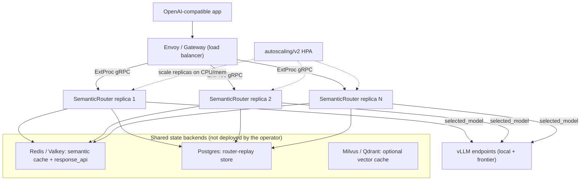

# 多節點與 Operator 擴展 / Multi-node and Operator Scale-out

> 一句話開場：單機 Strix Halo PoC（[01-tech-study.md](01-tech-study.md)–[05-amd-strategy-alignment.md](05-amd-strategy-alignment.md)）證明的是**軟體價值**；這份文件接著說明「同一份路由設定怎麼水平擴展到多節點」——用 Kubernetes operator 的 `SemanticRouter` CRD 跑多副本 + HPA，並以共享狀態後端達成跨節點一致性。哪些事情單機就能預演、哪些只有真叢集才看得到，本文誠實切開。
> One-line opener: the single-box Strix Halo PoC ([01-tech-study.md](01-tech-study.md)–[05-amd-strategy-alignment.md](05-amd-strategy-alignment.md)) proves **software value**; this document explains how that same routing config scales horizontally to multiple nodes—running multiple replicas plus an HPA via the Kubernetes operator's `SemanticRouter` CRD, with shared state backends for cross-node coherence. What the single box can rehearse versus what only a real cluster can show is split honestly here.

本文件接續既有報告系列（[01-tech-study.md](01-tech-study.md)、[02-poc-plan.md](02-poc-plan.md)、[03-strix-halo-runbook.md](03-strix-halo-runbook.md)、[04-dashboard-tour.md](04-dashboard-tour.md)、[05-amd-strategy-alignment.md](05-amd-strategy-alignment.md)），是 [02-poc-plan.md](02-poc-plan.md) 第 12 節「多節點規模驗證（模擬）」的部署面延伸：第 12 節講的是「用模擬與校準補上單機看不到的規模數字」，本文講的是「用 operator 與共享後端把它真的部成多節點」。

This document continues the existing report series ([01-tech-study.md](01-tech-study.md), [02-poc-plan.md](02-poc-plan.md), [03-strix-halo-runbook.md](03-strix-halo-runbook.md), [04-dashboard-tour.md](04-dashboard-tour.md), [05-amd-strategy-alignment.md](05-amd-strategy-alignment.md)). It is the deployment-side extension of section 12 of [02-poc-plan.md](02-poc-plan.md) ("Multi-node Scale Validation (Simulation)"): section 12 covers filling the scale numbers the single box cannot show via simulation and calibration, while this document covers actually deploying it as multiple nodes with the operator and shared backends.

---

## 1. Operator 的 SemanticRouter CRD 能力 / Operator SemanticRouter CRD Capabilities

倉庫附帶一個 Kubernetes operator，只有**一個** CRD：`SemanticRouter`（group/version `vllm.ai/v1alpha1`，shortName `sr`）。型別定義見 [deploy/operator/api/v1alpha1/semanticrouter_types.go](../../deploy/operator/api/v1alpha1/semanticrouter_types.go)，調和器（controllers）見 [deploy/operator/controllers/](../../deploy/operator/controllers/)，使用手冊見 [deploy/operator/README.md](../../deploy/operator/README.md)。它把「跑幾個副本、要不要自動擴縮、設定怎麼送進去、後端在哪」這四件事變成宣告式的 spec 欄位。

The repo ships a Kubernetes operator with exactly **one** CRD: `SemanticRouter` (group/version `vllm.ai/v1alpha1`, shortName `sr`). The type definitions live in [deploy/operator/api/v1alpha1/semanticrouter_types.go](../../deploy/operator/api/v1alpha1/semanticrouter_types.go), the reconcilers in [deploy/operator/controllers/](../../deploy/operator/controllers/), and the usage guide in [deploy/operator/README.md](../../deploy/operator/README.md). It turns four things—how many replicas, whether to autoscale, how config is delivered, and where the backends are—into declarative spec fields.

| 能力 / Capability | spec 欄位 / spec field | 預設與行為 / Default and behavior | 程式參考 / Source ref |
| --- | --- | --- | --- |
| 副本數 / Replicas | `spec.replicas` | 預設 1，調和成 Deployment 的 replica 數 / default 1, reconciled into the Deployment replica count | [semanticrouter_types.go](../../deploy/operator/api/v1alpha1/semanticrouter_types.go)（`Replicas *int32`）|
| 自動擴縮 / Autoscaling (HPA) | `spec.autoscaling` | `enabled`（預設 false）、`minReplicas`（預設 1）、`maxReplicas`（預設 10）、`targetCPUUtilizationPercentage`（預設 80）、`targetMemoryUtilizationPercentage`（選配）→ 產生真實的 `autoscaling/v2` HPA / generates a real `autoscaling/v2` HPA | [semanticrouter_types.go](../../deploy/operator/api/v1alpha1/semanticrouter_types.go)（`AutoscalingSpec`）、[semanticrouter_manifest.go](../../deploy/operator/controllers/semanticrouter_manifest.go)（`generateHPA`）|
| 設定遞送 / Config delivery | `spec.config` | operator 由 spec 產生一個名為 `<cr>-config` 的 ConfigMap 掛載給 pod；`routing` 與每條決策的 `algorithm` 以**不透明 JSON**（`PreserveUnknownFields`）原樣帶過，不被 CRD schema 卡住 / the operator generates a ConfigMap named `<cr>-config` mounted into the pod; `routing` and each decision's `algorithm` pass through as **opaque JSON** (`PreserveUnknownFields`) | [semanticrouter_config_data.go](../../deploy/operator/controllers/semanticrouter_config_data.go)（`reconcileConfigMap`，名稱 `sr.Name + "-config"`）、[semanticrouter_types.go](../../deploy/operator/api/v1alpha1/semanticrouter_types.go)（`ConfigSpec.Routing`、`DecisionConfig.Algorithm`）|
| 後端探索 / Backend discovery | `spec.vllmEndpoints` | 由 K8s 原生條目產生 `config.providers.models[].backend_refs` 與 `config.routing.modelCards`；支援 `kserve`／`llamastack`／`service` 三種 backend 型別 / generates canonical `backend_refs` and `modelCards`; supports `kserve`/`llamastack`/`service` backend types | [semanticrouter_types.go](../../deploy/operator/api/v1alpha1/semanticrouter_types.go)（`VLLMEndpointSpec`、`VLLMBackend`）|

關鍵邊界：**operator 不會替你部署 Redis 或 Milvus**——它只把 `SemanticRouter` 設定成連到你**既有**的服務。要自動拉起這些後端，請改用 Helm chart（見 [deploy/operator/README.md](../../deploy/operator/README.md) 的 "Semantic Cache Backends" 警告框）。

Key boundary: **the operator does not deploy Redis or Milvus for you**—it only configures the `SemanticRouter` to connect to your **existing** services. To auto-provision those backends, use the Helm chart instead (see the "Semantic Cache Backends" warning box in [deploy/operator/README.md](../../deploy/operator/README.md)).

高可用範例 spec（取自 [deploy/operator/README.md](../../deploy/operator/README.md)）/ HA example spec (from [deploy/operator/README.md](../../deploy/operator/README.md)):

```yaml
apiVersion: vllm.ai/v1alpha1
kind: SemanticRouter
metadata:
  name: poc-router
spec:
  replicas: 3
  autoscaling:
    enabled: true
    minReplicas: 3
    maxReplicas: 20
    targetCPUUtilizationPercentage: 70
  vllmEndpoints:
    - name: local-vllm
      model: qwen/qwen3.5-rocm
      backend:
        type: service
        service:
          name: vllm
          namespace: vllm-serving
          port: 8000
      weight: 1
  config:
    semantic_cache:
      enabled: true
      backend_type: redis      # shared across replicas
      redis:
        connection:
          host: redis.default.svc.cluster.local
          port: 6379
```

---

## 2. 跨節點共享狀態後端 / Cross-node Shared State Backends

多副本要表現得像「一個 router」，凡是需要跨副本看到同一份資料的狀態，就必須放到**共享後端**，而不是 pod 內記憶體。下表列出三類有狀態子系統、各自由哪個設定區塊選後端、支援哪些後端，以及本 PoC（[deploy/recipes/strix-halo-poc/poc-strix.yaml](../../deploy/recipes/strix-halo-poc/poc-strix.yaml)）目前的選擇。

For multiple replicas to behave like "one router," any state that must be seen identically across replicas has to live in a **shared backend**, not in per-pod memory. The table lists the three stateful subsystems, which config block selects each backend, the supported backends, and what this PoC ([deploy/recipes/strix-halo-poc/poc-strix.yaml](../../deploy/recipes/strix-halo-poc/poc-strix.yaml)) currently picks.

| 子系統 / Subsystem | 設定區塊 / Config block | 支援後端 / Supported backends | 工廠程式 / Factory | 本 PoC 選擇 / PoC choice |
| --- | --- | --- | --- | --- |
| 語意快取 / Semantic cache | `global.stores.semantic_cache.backend_type` | `memory`、`redis`、`valkey`、`milvus`、`qdrant`、`hybrid` | [cache_factory.go](../../src/semantic-router/pkg/cache/cache_factory.go) | `memory`（**per-pod，未共享**）/ `memory` (**per-pod, not shared**) |
| Router-replay | `global.services.router_replay.store_backend` | `memory`、`redis`、`postgres`、`milvus`、`qdrant` | [factory.go](../../src/semantic-router/pkg/routerreplay/store/factory.go) | `postgres`（共享）/ `postgres` (shared) |
| Response API | `global.services.response_api.store_backend` | `memory`、`redis`（PoC 採用）等 / `memory`, `redis` (PoC), etc. | [config/config.yaml](../../config/config.yaml)（`response_api`，預設 `redis`）| `redis`（共享）/ `redis` (shared) |

PoC 的誠實註記 / Honest note on the PoC：本 PoC 把 router-replay 設為 `postgres`、response_api 設為 `redis`（兩者皆為跨節點共享），但語意快取仍是 `memory`（見 [poc-strix.yaml](../../deploy/recipes/strix-halo-poc/poc-strix.yaml) 的 `stores.semantic_cache.backend_type: memory`）。`memory` 與 HNSW 索引是**每個 pod 各一份**，多副本之間不會共享快取命中。若要在真叢集達成跨節點快取一致性，需把 `semantic_cache.backend_type` 切到 `redis`／`valkey`／`milvus`／`qdrant`／`hybrid`。

The PoC sets router-replay to `postgres` and response_api to `redis` (both cross-node shared), but semantic cache is still `memory` (see `stores.semantic_cache.backend_type: memory` in [poc-strix.yaml](../../deploy/recipes/strix-halo-poc/poc-strix.yaml)). `memory` and the HNSW index are **per-pod**, so replicas do not share cache hits. To get cross-node cache coherence in a real cluster, switch `semantic_cache.backend_type` to `redis`/`valkey`/`milvus`/`qdrant`/`hybrid`.

多副本 + 共享後端拓樸 / Multi-replica plus shared-backend topology：



---

## 3. 單機可預演 vs 只有真叢集才看得到 / Single-box Rehearsable vs Real-cluster-only

把「多節點」拆成兩層很重要：一層是**正確性／拓樸**（設定對不對、共享狀態有沒有真的共享），另一層是**規模特性**（聚合吞吐、HPA、HA／故障切換、網路效應）。前者單機就能預演，後者必須真叢集。

It matters to split "multi-node" into two layers: **correctness/topology** (is the config right, is shared state actually shared) and **scale characteristics** (aggregate throughput, HPA, HA/failover, network effects). The former can be rehearsed on one box; the latter requires a real cluster.

| 面向 / Aspect | 單機可預演？ / Single box can rehearse? | 說明 / Note |
| --- | --- | --- |
| 多副本設定正確性 / Multi-replica config correctness | 是 / Yes | 在一台機器上以容器跑 2 個 router 副本 + 共享 redis/postgres，驗證設定與接線 / run 2 router replica containers + shared redis/postgres on one box to verify config and wiring |
| 共享後端拓樸 / Shared-backend topology | 是 / Yes | 真的把 redis/milvus/postgres 拉起來並讓副本連上去，驗證跨副本讀寫 / actually start redis/milvus/postgres and have replicas connect, verifying cross-replica read/write |
| 聚合吞吐 / 容量 / Aggregate throughput and capacity | 否 / No | 單台實體機無法產生 N 節點機群的聚合吞吐；跨節點數字是外推 / one physical box cannot produce an N-node fleet's aggregate throughput; cross-node numbers are extrapolation |
| HPA 自動擴縮 / HPA autoscaling | 否 / No | HPA 需要 metrics server 與真的多節點調度 / HPA needs a metrics server and real multi-node scheduling |
| HA / 故障切換 / HA and failover | 否 / No | 節點層級的故障切換與可用度需要真叢集 / node-level failover and availability need a real cluster |
| 網路 / 負載平衡器 / NIC 效應 / Network, LB, NIC effects | 否 / No | 真實網路拓樸無法在單機重現 / real network topology is not reproducible on one box |

這與 [02-poc-plan.md](02-poc-plan.md) 第 11 節「不證明」清單、第 12 節「模擬的邊界」與「即使全用軟體仍殘留的限制」完全一致：單機補不上的規模數字，交給 fleet-sim 外推並標註（見第 5 節）。

This aligns exactly with section 11's "does not prove" list and section 12's "honest boundaries" and "residual limits even with all the software" in [02-poc-plan.md](02-poc-plan.md): the scale numbers the single box cannot supply are extrapolated and labeled by fleet-sim (see section 5).

---

## 4. 真實多副本路徑：既有的 Helm kind e2e / The Real Multi-replica Path: the Existing Helm kind e2e

倉庫**已經有**一條真實的多副本路徑：以 Helm chart 部到 kind（Kubernetes-in-Docker）叢集的 e2e harness。注意它走的是 **Helm**，不是 operator。核心 profile 是 production-stack（[e2e/profiles/production-stack/profile.go](../../e2e/profiles/production-stack/profile.go)），它把 `semantic-router` 與示範 vLLM 各擴到 **2 個副本**，部 Prometheus，等堆疊穩定後跑一組 HA／負載平衡／故障切換／吞吐測試。

The repo **already has** a real multi-replica path: an e2e harness that deploys via the Helm chart onto a kind (Kubernetes-in-Docker) cluster. Note it uses **Helm**, not the operator. The core profile is production-stack ([e2e/profiles/production-stack/profile.go](../../e2e/profiles/production-stack/profile.go)), which scales both `semantic-router` and the demo vLLM to **2 replicas**, deploys Prometheus, and after the stack stabilizes runs a set of HA/load-balancing/failover/throughput tests.

| 測試案例 / Test case | 檔案 / File | 驗證 / Verifies |
| --- | --- | --- |
| `multi-replica-health` | [multi_replica_health.go](../../e2e/testcases/multi_replica_health.go) | 多副本皆健康可服務 / all replicas healthy and serving |
| `load-balancing-verification` | [load_balancing_verification.go](../../e2e/testcases/load_balancing_verification.go) | 流量分散到副本 / traffic spread across replicas |
| `failover-during-traffic` | [failover_during_traffic.go](../../e2e/testcases/failover_during_traffic.go) | 流量中殺 pod 仍持續服務 / kill a pod mid-traffic, service continues |
| `performance-throughput` | [performance_throughput.go](../../e2e/testcases/performance_throughput.go) | 多副本下的吞吐量 / throughput under multiple replicas |

相關的共享後端 profile 也存在：response-api-redis-cluster（3 節點 Redis Cluster，[e2e/profiles/response-api-redis-cluster/profile.go](../../e2e/profiles/response-api-redis-cluster/profile.go)）與 router-replay（response_api 用 redis、router_replay 用 postgres，[e2e/profiles/router-replay/profile.go](../../e2e/profiles/router-replay/profile.go)）。全部以 `make e2e-test` 驅動（見第 6 節）。

Related shared-backend profiles also exist: response-api-redis-cluster (3-node Redis Cluster, [e2e/profiles/response-api-redis-cluster/profile.go](../../e2e/profiles/response-api-redis-cluster/profile.go)) and router-replay (response_api on redis, router_replay on postgres, [e2e/profiles/router-replay/profile.go](../../e2e/profiles/router-replay/profile.go)). All are driven by `make e2e-test` (see section 6).

> 缺口 / Gap：目前**沒有以 operator 為基礎的 kind e2e harness**。operator 只有單元測試與 envtest（[deploy/operator/controllers/](../../deploy/operator/controllers/) 內的 `*_test.go`），上述 kind e2e 全部走 Helm chart。因此「operator 在真 kind 叢集上跑多副本 + HPA」這條路徑尚未有自動化端到端覆蓋——這是已知待補項，不是已驗證能力。
> Gap: there is currently **no operator-based kind e2e harness**. The operator has only unit and envtest coverage (`*_test.go` under [deploy/operator/controllers/](../../deploy/operator/controllers/)); the kind e2e above all use the Helm chart. So "operator running multi-replica + HPA on a real kind cluster" has no automated end-to-end coverage yet—this is a known gap, not a validated capability.

---

## 5. 銜接 fleet-sim 的「先量測再模擬」/ Tie-in to fleet-sim "Measure-then-simulate"

真叢集的聚合吞吐／TCO 不需要等硬體到位才有數字：[02-poc-plan.md](02-poc-plan.md) 第 12 節的「先量測再模擬」（calibrated hybrid）就是用來補這一段。流程是：(a) 單機壓測量測 router 自身開銷與每模型 profile；(b) 用 router-replay 把真實路由決策錄成 trace；(c) 把 trace 餵給 fleet-sim 外推 N 節點機群的吞吐、容量與 $/yr，並永遠標註哪些是量測、哪些是外推。

Real-cluster aggregate throughput/TCO does not have to wait for hardware: the "measure-then-simulate" calibrated hybrid in section 12 of [02-poc-plan.md](02-poc-plan.md) fills that gap. The flow: (a) single-box load testing measures router overhead and per-model profiles; (b) router-replay records real routing decisions into a trace; (c) the trace is fed to fleet-sim to extrapolate an N-node fleet's throughput, capacity, and $/yr—always labeling which numbers are measured versus extrapolated.

本文件補上的是該流程的最後一層 `(c) Real multi-node later`（見 [02-poc-plan.md](02-poc-plan.md) 第 12 節「推薦的三層管線」）：當硬體與叢集就緒，就用本文第 1 節的 operator（replicas + HPA）加第 2 節的共享後端，把模擬外推換成實測，並回填校準 fleet-sim。對外話術維持不變：**單機證明軟體價值；fleet-sim 在部署機群前先證明 TCO；真實效能數字留到真叢集／Instinct 機群階段再量測。**

This document supplies the final layer `(c) Real multi-node later` of that pipeline (see "Recommended three-layer pipeline" in section 12 of [02-poc-plan.md](02-poc-plan.md)): once hardware and a cluster are ready, use the operator from section 1 (replicas + HPA) plus the shared backends from section 2 to replace simulated extrapolation with measurement and feed it back to calibrate fleet-sim. The customer framing is unchanged: **the single box proves software value; fleet-sim proves TCO before deploying the fleet; real performance numbers wait for the real-cluster/Instinct-fleet phase.**

---

## 6. 兩條跑法的可複製指令 / Copy-pasteable Commands for Both Paths

> 狀態 / Status：本節為**已記錄、待執行**（documented-pending）。下列兩條路徑都很吃資源（kind 叢集是另一個重型 docker 工作負載，且可能有其他人正在使用同一台 Strix Halo router），因此預設**不**自動拉起；要跑時再依下列指令手動執行。
> Status: this section is **documented-pending**. Both paths below are resource-heavy (a kind cluster is a separate heavy docker workload, and someone else may be using the same Strix Halo router), so they are **not** spun up automatically; run them manually with the commands below when ready.

### 路徑 (a)：kind 上的 production-stack e2e / Path (a): production-stack e2e on kind

這是「真叢集多副本」的自動化路徑（Helm，非 operator）。它會建一個 kind 叢集、用 Helm 部 router、擴到 2 副本、跑第 4 節的 HA／LB／故障切換／吞吐測試。

This is the automated "real-cluster multi-replica" path (Helm, not operator). It creates a kind cluster, deploys the router via Helm, scales to 2 replicas, and runs the HA/LB/failover/throughput tests from section 4.

```bash
# 需求 / Prereqs: docker, kind, kubectl, helm, go
# 預設 kind 叢集名 / default kind cluster name: semantic-router-e2e (E2E_CLUSTER_NAME)
make e2e-test E2E_PROFILE=production-stack

# 只想跑 HA 子集 / run only the HA subset:
make e2e-test E2E_PROFILE=production-stack \
  E2E_TESTS="multi-replica-health,load-balancing-verification,failover-during-traffic,performance-throughput"

# 跑完保留叢集以便檢查 / keep the cluster afterwards for inspection:
make e2e-test E2E_PROFILE=production-stack E2E_KEEP_CLUSTER=true

# 清理 / cleanup:
make e2e-cleanup            # 等同 / equivalent to: kind delete cluster --name semantic-router-e2e
```

相關變數 / Relevant variables（見 [tools/make/e2e.mk](../../tools/make/e2e.mk)）：`E2E_PROFILE`（預設 `kubernetes`，此處設 `production-stack`）、`E2E_CLUSTER_NAME`（預設 `semantic-router-e2e`）、`E2E_KEEP_CLUSTER`、`E2E_TESTS`。共享後端變體可改用 `E2E_PROFILE=response-api-redis-cluster` 或 `E2E_PROFILE=router-replay`。

Relevant variables (see [tools/make/e2e.mk](../../tools/make/e2e.mk)): `E2E_PROFILE` (default `kubernetes`, set to `production-stack` here), `E2E_CLUSTER_NAME` (default `semantic-router-e2e`), `E2E_KEEP_CLUSTER`, `E2E_TESTS`. For shared-backend variants use `E2E_PROFILE=response-api-redis-cluster` or `E2E_PROFILE=router-replay`.

### 路徑 (b)：單機 2 副本 + 共享後端預演 / Path (b): single-box 2-replica + shared-backend rehearsal

這是「不需要 kind、只驗證設定正確性與共享拓樸」的輕量預演：在同一台機器上用容器跑共享 redis/milvus/postgres，再起 2 個 router 副本連到同一組後端。它**不**證明聚合吞吐／HPA／HA（見第 3 節）。

This is the lightweight "no kind, just verify config correctness and shared topology" rehearsal: run shared redis/milvus/postgres as containers on one box, then start 2 router replicas pointing at the same backends. It does **not** prove aggregate throughput/HPA/HA (see section 3).

```bash
# 1) 啟動共享後端容器 / start shared backend containers (repo make targets)
sudo docker network create vllm-sr-network 2>/dev/null || true
make start-redis       # redis-semantic-cache（見 tools/make/redis.mk / see tools/make/redis.mk）
make start-milvus      # 選配向量後端 / optional vector backend（tools/make/milvus.mk）
sudo docker run -d --name pg-replay --network vllm-sr-network \
  -e POSTGRES_PASSWORD=replay -e POSTGRES_DB=router_replay -p 5432:5432 postgres:16

# 2) 用一份把 semantic_cache.backend_type 設成 redis、router_replay 設成 postgres、
#    response_api 設成 redis 的設定檔，啟動第 1 個 router 副本（API 8080 / metrics 9190）
#    Start replica 1 with a config whose semantic_cache.backend_type=redis,
#    router_replay.store_backend=postgres, response_api.store_backend=redis.
vllm-sr serve --config <shared-backends-config>.yaml --image-pull-policy never

# 3) 用不同對外埠啟動第 2 個 router 副本，連到同一組 redis/postgres
#    Start replica 2 on different host ports, pointing at the same redis/postgres.
#    （依 src/vllm-sr/cli 的 serve 旗標調整埠號 / adjust ports via the serve flags in src/vllm-sr/cli）

# 4) 在兩個副本前擺一個負載平衡器（Envoy 或 nginx），用 bench 打併發流量驗證
#    Put a load balancer (Envoy or nginx) in front of both replicas and drive concurrent traffic:
python3 bench/agentic_routing_live_benchmark.py --concurrency 8 --sessions 20 --turns 4
```

驗證重點 / What to check：(1) 兩個副本都能服務；(2) 在副本 A 產生的 response_api 紀錄能在副本 B 讀到（共享 redis 生效）；(3) router-replay 紀錄落在共享 postgres 而非 pod 內。設定旗標與 serve 實作見 [src/vllm-sr/cli/](../../src/vllm-sr/cli/)；mock 後端見 [e2e/testing/llm-katan/README.md](../../e2e/testing/llm-katan/README.md)；bench 旗標見 [bench/README.md](../../bench/README.md)。

What to check: (1) both replicas serve; (2) a response_api record created on replica A is readable on replica B (shared redis works); (3) router-replay records land in shared postgres, not in-pod. Serve flags and implementation are in [src/vllm-sr/cli/](../../src/vllm-sr/cli/); mock backends in [e2e/testing/llm-katan/README.md](../../e2e/testing/llm-katan/README.md); bench flags in [bench/README.md](../../bench/README.md).

> 執行紀錄 / Run record：本次未實際執行任一路徑（避免佔用可能正被使用的 Strix Halo router 與額外的 kind docker 負載）。若日後執行，請把 profile、副本數、通過的測試案例與觀察到的數字補記於此。
> Run record: neither path was actually executed this round (to avoid contending for the possibly-in-use Strix Halo router and the extra kind docker load). When run later, record the profile, replica count, passing test cases, and observed numbers here.

---

## 參考連結 / Reference links

- Operator 使用手冊 / Operator guide: [deploy/operator/README.md](../../deploy/operator/README.md)
- CRD 型別 / CRD types: [deploy/operator/api/v1alpha1/semanticrouter_types.go](../../deploy/operator/api/v1alpha1/semanticrouter_types.go)
- 調和器 / Reconcilers: [deploy/operator/controllers/](../../deploy/operator/controllers/)
- 多副本 e2e / Multi-replica e2e: [e2e/profiles/production-stack/profile.go](../../e2e/profiles/production-stack/profile.go)
- 模擬與校準 / Simulation and calibration: [02-poc-plan.md](02-poc-plan.md) 第 12 節 / section 12
- 文件網站 / Docs site: [vllm-semantic-router.com](https://vllm-semantic-router.com)
