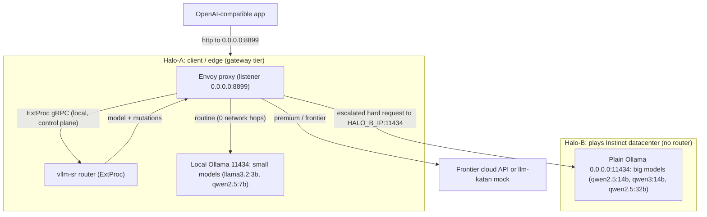

# 主從拓樸與路由器放哪 / Client-Server Topology and Where the Router Lives

> 一句話開場：很多人會問「router 該放在 client 還是 server？」——這問題其實問錯了。router（ExtProc）+ Envoy **合起來就是 LLM Gateway 那一層**，它們必須**同機共置**（走本地 gRPC）；模型只是 `backend_refs[].endpoint` 上的後端。所以真正要決定的不是「client 還是 server」，而是「閘道放在哪條流量路徑上最省往返」——而答案跟模型放哪**無關**，跟流量在地性有關。
> One-line opener: people ask "should the router sit on the client or the server?"—but that framing is wrong. The router (ExtProc) plus Envoy **together are the LLM Gateway tier**, and they must be **co-located** (local gRPC); models are just backends behind `backend_refs[].endpoint`. So the real decision is not "client vs server" but "on which traffic path does placing the gateway minimize round-trips"—and the answer has **nothing** to do with where the models live and everything to do with traffic locality.

本文件接續既有報告系列（[01-tech-study.md](01-tech-study.md)、[02-poc-plan.md](02-poc-plan.md)、[03-strix-halo-runbook.md](03-strix-halo-runbook.md)、[04-dashboard-tour.md](04-dashboard-tour.md)、[05-amd-strategy-alignment.md](05-amd-strategy-alignment.md)、[06-multi-node-and-operator.md](06-multi-node-and-operator.md)）。[06-multi-node-and-operator.md](06-multi-node-and-operator.md) 講的是「同一份路由設定怎麼**垂直疊副本**」；本文講的是它的另一個維度——「在 client/server 兩端之間，閘道**水平放哪**才不會多繞一圈」，並給出 2 台 Strix Halo PoC 的具體推薦拓樸。

This document continues the existing report series ([01-tech-study.md](01-tech-study.md), [02-poc-plan.md](02-poc-plan.md), [03-strix-halo-runbook.md](03-strix-halo-runbook.md), [04-dashboard-tour.md](04-dashboard-tour.md), [05-amd-strategy-alignment.md](05-amd-strategy-alignment.md), [06-multi-node-and-operator.md](06-multi-node-and-operator.md)). Where [06-multi-node-and-operator.md](06-multi-node-and-operator.md) covers how that same routing config **stacks replicas vertically**, this document covers the orthogonal dimension—**where to place the gateway horizontally** between the client and server ends so traffic does not take an extra round-trip—and gives the concrete recommended topology for the 2-box Strix Halo PoC.

---

## 1. 重新定義「client vs server」：router + Envoy 就是閘道層 / Reframing "client vs server": Router plus Envoy Are the Gateway Tier

第一個要打掉的誤解：router 不是「黏在某個模型旁邊的東西」。如 [01-tech-study.md](01-tech-study.md) 第 2 節所述，router **不自己挑上游 endpoint**——它只決定「該用哪個 model」、改寫請求、回傳 mutations，真正把流量負載平衡到實際 endpoint 的是 **Envoy**（見 [processor_req_body_routing.go](../../src/semantic-router/pkg/extproc/processor_req_body_routing.go) 的 `createRoutingResponse`，它只產出 body 與 model/provider header 的 mutations，不開後端連線）。

The first misconception to kill: the router is not "something glued next to a model." As section 2 of [01-tech-study.md](01-tech-study.md) explains, the router **does not pick an upstream endpoint itself**—it only decides which model to use, rewrites the request, and returns mutations; **Envoy** is what load-balances traffic to the actual endpoint (see `createRoutingResponse` in [processor_req_body_routing.go](../../src/semantic-router/pkg/extproc/processor_req_body_routing.go), which emits only body and model/provider-header mutations and opens no backend connections).

因此 router（ExtProc）與 Envoy 是**同一個閘道層的兩半**：Envoy 在資料面攔流量，router 在控制面做語意決策，兩者透過 ExtProc gRPC 緊密耦合，必須**共置在同一台機器**（本地 gRPC，毫秒內、零網路成本）。這正是 [05-amd-strategy-alignment.md](05-amd-strategy-alignment.md) 把「Envoy + ExtProc router」整體對映成 AMD 簡報 `LLM Gateway` 的原因——閘道是一個**層**，不是一個放在某端的盒子。

So the router (ExtProc) and Envoy are **two halves of one gateway tier**: Envoy intercepts traffic on the data plane, the router makes semantic decisions on the control plane, and the two are tightly coupled over ExtProc gRPC and must be **co-located on the same box** (local gRPC, sub-millisecond, zero network cost). This is exactly why [05-amd-strategy-alignment.md](05-amd-strategy-alignment.md) maps "Envoy + the ExtProc router" as a whole onto the AMD deck's `LLM Gateway`—the gateway is a **tier**, not a box pinned to one end.

模型在哪？模型是**後端**，以 `providers.models[].backend_refs[].endpoint` 註冊（見 [poc-strix.yaml](../../deploy/recipes/strix-halo-poc/poc-strix.yaml)，例如 `endpoint: ollama:11434`）。一個後端可以在閘道本機，也可以在網路另一端的一台 `host:port`。關鍵結論：

Where are the models? Models are **backends**, registered as `providers.models[].backend_refs[].endpoint` (see [poc-strix.yaml](../../deploy/recipes/strix-halo-poc/poc-strix.yaml), e.g. `endpoint: ollama:11434`). A backend can be on the gateway's own box or a `host:port` across the network. The key conclusion:

> 閘道的放置位置由**流量在地性**決定，不是由**模型位置**決定。把閘道放在「請求進入、且大部分流量會就地被服務」的那一端，網路往返最少。
> Gateway placement follows **traffic locality**, not **model location**. Put the gateway where requests enter and where most traffic is served locally, and network round-trips are minimized.

---

## 2. 兩平面模型：控制面共置、資料面才需要優化 / The Two-plane Model: Co-locate the Control Plane, Optimize the Data Plane

把閘道內外的連線拆成兩個平面，放置決策就會變得非常清楚。

Split the connections in and around the gateway into two planes, and the placement decision becomes obvious.

| 平面 / Plane | 連線 / Link | 載荷 / Payload | 大小與位置 / Size and location |
| --- | --- | --- | --- |
| 控制面 / Control plane | Envoy ↔ router（ExtProc gRPC）/ Envoy to router (ExtProc gRPC) | 路由決策、header/body mutations / routing decisions, header/body mutations | 極小、每請求多次往返；**永遠在閘道本機** / tiny, multiple round-trips per request; **always local to the gateway** |
| 資料面 / Data plane | Envoy → 後端 / Envoy to backend | 完整 prompt 與 completion（可能很大）/ full prompt and completion (can be large) | 大、攜帶實際 token；**放置就是在優化它** / large, carries the actual tokens; **placement is what optimizes this** |

控制面（Envoy↔router）每個請求要來回好幾次（header 階段、body 階段、response 階段），但載荷只是決策與 mutation，極小——前提是它**永遠是本地 gRPC**。一旦把 router 和 Envoy 分到兩台機器，這些高頻往返就會被網路放大，這也是為什麼第 1 節說它們必須共置。

The control plane (Envoy to router) makes several round-trips per request (header phase, body phase, response phase), but the payload is just decisions and mutations—tiny, **provided it is always local gRPC**. Split the router and Envoy onto two boxes and those high-frequency round-trips get amplified by the network, which is why section 1 insists they be co-located.

資料面（Envoy→後端）才是攜帶實際 prompt/completion token 的那條線，也是唯一隨內容大小變動的成本。因此「閘道放哪」這個決策的全部意義，就是**讓資料面的網路跳數最少**：常規流量若能在閘道本機就被服務，那條最粗的線就根本不出機器。

The data plane (Envoy to backend) is the line that carries the actual prompt/completion tokens and the only cost that scales with content size. So the entire point of "where to place the gateway" is to **minimize the data plane's network hops**: if routine traffic can be served on the gateway's own box, the thickest line never leaves the machine.

---

## 3. 雙跳分析：一個反模式、兩個無雙跳設計 / Double-hop Analysis: One Anti-pattern, Two Double-hop-free Designs

有了兩平面模型，就能把所有拓樸的優劣化約成一個問題：**常規請求要跨網路幾次？**

With the two-plane model, the quality of any topology reduces to one question: **how many network crossings does a routine request take?**

### 3.1 反模式：閘道在 server、模型卻又住在它要回頭路由的 client / The anti-pattern: gateway on the server while models also live on the client it routes back to

唯一真正該避免的拓樸：把閘道放在 server，但**被閘道路由回去的目標模型卻住在 client 端**。請求從 client 出發 → 跨網路到 server 的閘道 → 閘道決定要用 client 上的小模型 → 再跨網路回 client 服務 → 結果再回到 client。這是 **client→gateway→client 的雙重來回**：一個本來該在原地解決的常規請求，平白付了兩趟網路。

The one topology to truly avoid: put the gateway on the server, but **the target models that the gateway routes back to live on the client side**. A request leaves the client, crosses the network to the gateway on the server, the gateway decides to use a small model that lives on the client, then crosses the network back to the client to be served, and the result returns to the client again. This is a **client-to-gateway-to-client double round-trip**: a routine request that should have been solved in place pays for two network trips for nothing.

### 3.2 設計 A（推薦）：邊緣閘道 / Design A (recommended): edge-gateway

閘道放在 client/edge 端，小模型與閘道**共置在本機**；大模型放在 server，frontier 上雲。常規請求（占大多數）由本機小模型服務——**0 個網路跳數**；只有被升級的困難請求才跨網路去 server 或雲端。這是「Ryzen AI Max+ 邊緣 + Instinct 資料中心」故事的忠實落地。

The gateway sits on the client/edge end, with the small models **co-located on the same box**; big models live on the server and frontier goes to cloud. Routine requests (the majority) are served by the local small model—**zero network hops**; only escalated hard requests cross the network to the server or cloud. This is a faithful realization of the "Ryzen AI Max+ edge plus Instinct datacenter" story.

### 3.3 設計 B：集中式 server 閘道 / Design B: centralized server-gateway

閘道放在 server，而 client **完全不放任何模型**（純粹是請求來源 / origin）。每個常規請求都是 client→server 閘道→server 本機後端，**每請求 1 跳**。因為 client 端沒有模型可被「路由回去」，所以**不會**有 3.1 的雙重來回。當你想要集中治理、所有模型都在資料中心、client 只是瘦端點時，這是正確選擇。

The gateway sits on the server, and the client **hosts no models at all** (it is a pure request origin). Every routine request is client to server-gateway to a server-local backend—**one hop per request**. Because the client has no models to be "routed back to," there is **no** double round-trip from section 3.1. This is the right choice when you want centralized governance, all models in the datacenter, and the client as a thin endpoint.

| 拓樸 / Topology | 常規請求網路跳數 / Routine-request hops | 何時採用 / When to use |
| --- | --- | --- |
| 反模式（server 閘道 + client 端模型）/ Anti-pattern (server-gateway + client-side models) | 2（雙重來回）/ 2 (double round-trip) | 永不 / Never |
| 設計 A：邊緣閘道 / Design A: edge-gateway | 0（本機服務）/ 0 (served locally) | client/edge 端就有算力、想把常規 token 留在本地 / the client/edge has compute and you want routine tokens local |
| 設計 B：集中式 server 閘道 / Design B: centralized server-gateway | 1（每請求 1 跳）/ 1 (one hop per request) | client 是瘦端點、所有模型集中在資料中心 / the client is a thin endpoint and all models live in the datacenter |

---

## 4. 2 台 Strix Halo PoC 的推薦：邊緣閘道設計 / Recommendation for the 2-Strix-Halo PoC: the Edge-gateway Design

對手上這套 2 台 Strix Halo 的 PoC，採用**設計 A（邊緣閘道）**：

For the 2-box Strix Halo PoC, adopt **Design A (edge-gateway)**:

- **Halo-A = client/edge（閘道）** — 跑 router（`vllm-sr serve`）+ Envoy，並**共置小模型**（如 `llama3.2:3b`、`qwen2.5:7b`）於本機 Ollama。常規 token 永遠不出機器。
  **Halo-A = client/edge (gateway)** — runs the router (`vllm-sr serve`) plus Envoy and **co-locates the small models** (e.g. `llama3.2:3b`, `qwen2.5:7b`) in a local Ollama. Routine tokens never leave the box.
- **Halo-B = 扮演 Instinct 資料中心** — 只跑一個純 Ollama endpoint（`0.0.0.0:11434`）服務**大模型**（如 `qwen2.5:14b`、`qwen3:14b`、`qwen2.5:32b`），**完全沒有 router**。它就是設計 A 裡那個「被升級請求才會打到」的後端。
  **Halo-B = playing the Instinct datacenter** — runs only a plain Ollama endpoint (`0.0.0.0:11434`) serving the **big models** (e.g. `qwen2.5:14b`, `qwen3:14b`, `qwen2.5:32b`) with **no router at all**. It is simply the backend that escalated requests hit in Design A.

在 [poc-client-edge.yaml](../../deploy/recipes/strix-halo-2box/poc-client-edge.yaml) 裡，這對映成把 `backend_refs[].endpoint` 拆兩半：邊緣層模型指向本機 `ollama:11434`，資料中心層模型指向 `${HALO_B_IP}:11434`；listener 綁 `0.0.0.0:8899` 讓 app 能從網路打進閘道。這份設定與單機版 [poc-strix.yaml](../../deploy/recipes/strix-halo-poc/poc-strix.yaml) 共用同一套 `routing.decisions`，差別只在後端位址。

In [poc-client-edge.yaml](../../deploy/recipes/strix-halo-2box/poc-client-edge.yaml) this maps to splitting `backend_refs[].endpoint` into two halves: edge-tier models point at the local `ollama:11434`, datacenter-tier models point at `${HALO_B_IP}:11434`; the listener binds `0.0.0.0:8899` so the app can reach the gateway over the network. This config reuses the very same `routing.decisions` as the single-box [poc-strix.yaml](../../deploy/recipes/strix-halo-poc/poc-strix.yaml); only the backend addresses differ.

對映回 AMD 簡報（見 [05-amd-strategy-alignment.md](05-amd-strategy-alignment.md)）：Halo-A 的閘道**就是** `LLM Gateway` 與 `Intelligent Token Routing`——`Local Tokens → 本地小模型`（Halo-A 本機，0 跳）、`Premium Tokens → Frontier`（上雲），而升級到 Halo-B 大模型對映 `Local Tokens → MI350P AMD Servers`。整張分流圖原封不動地落在這兩台盒子上。

Mapping back to the AMD deck (see [05-amd-strategy-alignment.md](05-amd-strategy-alignment.md)): the gateway on Halo-A **is** the `LLM Gateway` and `Intelligent Token Routing`—`Local Tokens → local small models` (on Halo-A, 0 hops), `Premium Tokens → Frontier` (to cloud), while escalation to Halo-B's big models maps to `Local Tokens → MI350P AMD Servers`. The entire routing diagram lands unchanged on these two boxes.

### 推薦邊緣閘道拓樸圖 / Recommended edge-gateway topology



---

## 5. 誠實邊界與網路事實 / Honest Caveats and Networking Facts

延續整個系列的誠實切分（[02-poc-plan.md](02-poc-plan.md) 第 12 節、[05-amd-strategy-alignment.md](05-amd-strategy-alignment.md) 第 4 節、[06-multi-node-and-operator.md](06-multi-node-and-operator.md) 第 3 節），這裡明確標出本 PoC **不**證明什麼。

Continuing the series' honest split (section 12 of [02-poc-plan.md](02-poc-plan.md), section 4 of [05-amd-strategy-alignment.md](05-amd-strategy-alignment.md), section 3 of [06-multi-node-and-operator.md](06-multi-node-and-operator.md)), here is what this PoC explicitly does **not** prove.

- **Halo-B 不是真的 Instinct / Halo-B is not a real Instinct** — 兩台都是 gfx1151 APU（Ryzen AI Max+ 等級的 Strix Halo），Halo-B 只是**扮演**資料中心角色。因此本 PoC**不**提出任何效能、吞吐或 TCO 主張；它純粹是**拓樸／路由／成本記帳**的驗證。
  Both boxes are gfx1151 APUs (Strix Halo at the Ryzen AI Max+ class); Halo-B merely **plays** the datacenter role. So this PoC makes **no** performance, throughput, or TCO claims; it is purely a **topology / routing / cost-accounting** validation.
- **真實 Instinct 效能／TCO 用 fleet-sim 外推 / Real Instinct perf and TCO come from fleet-sim** — 跨盒子的聚合吞吐與機群成本仍走 [02-poc-plan.md](02-poc-plan.md) 第 12 節的「先量測再模擬」：單機量測 router 開銷與每模型 profile，再用 router-replay → fleet-sim 外推 N 節點機群，並永遠標註哪些是量測、哪些是外推。本文證明的是**路由會正確跨盒子發生**，不是它在真 Instinct 上有多快。
  Cross-box aggregate throughput and fleet cost still go through the "measure-then-simulate" flow of section 12 in [02-poc-plan.md](02-poc-plan.md): measure router overhead and per-model profiles on one box, then extrapolate an N-node fleet via router-replay → fleet-sim, always labeling measured versus extrapolated. This document proves that **routing happens correctly across the boxes**, not how fast it runs on a real Instinct.

網路事實（會讓設定真的能跨盒子跑起來的細節）/ Networking facts (the details that make cross-box routing actually work):

- **`endpoint` 必須是可路由的 IP/host，不能是 docker-network 的 DNS 名 `ollama` / `endpoint` must be a routable IP/host, not the docker-network DNS name `ollama`** — `ollama` 這個名字只在**同一台機器**的 docker 網路內可解析。要指向 Halo-B，必須寫成 `endpoint: <HALO_B_IP>:11434`（一個跨機器可路由的位址）。
  The name `ollama` only resolves inside the docker network **on the same box**. To point at Halo-B, write `endpoint: <HALO_B_IP>:11434` (an address routable across machines).
- **Listener 綁 `0.0.0.0:8899` / Listener binds `0.0.0.0:8899`** — 閘道要讓網路另一端的 app 連得進來，listener 位址必須是 `0.0.0.0`（見 [poc-strix.yaml](../../deploy/recipes/strix-halo-poc/poc-strix.yaml) 的 `listeners[].address: 0.0.0.0`），不能只綁 loopback。
  For the gateway to accept connections from an app on the other end of the network, the listener address must be `0.0.0.0` (see `listeners[].address: 0.0.0.0` in [poc-strix.yaml](../../deploy/recipes/strix-halo-poc/poc-strix.yaml)), not loopback only.
- **要開的埠 / Ports to open** — Halo-A 的閘道入口 `8899`（OpenAI 相容入站）、Halo-B 的 Ollama `11434`。請確認 Halo-A 容器內的 Envoy 真的能連到 `<HALO_B_IP>:11434`（主機路由／防火牆）。
  Port `8899` on Halo-A (the gateway's OpenAI-compatible inbound) and port `11434` on Halo-B (Ollama). Verify that Envoy inside the Halo-A container can actually reach `<HALO_B_IP>:11434` (host routing and firewall).

---

## 6. 執行紀錄 / Run record (measured-on 2026-06-23)

> 一句話框架：本節把前面五節的拓樸主張**實測落地**——在兩台 gfx1151 Strix Halo APU 上以一行指令部起設計 A（邊緣閘道），量測跨盒子路由是否正確發生、agentic 流量的邊緣／資料中心分流，以及最關鍵的「跨盒子那一跳到底貴不貴」。所有數字明確標註**實測（measured）**或**推導（derived）**。
> One-line framing: this section **grounds the previous five sections' topology claims in measurement**—on two gfx1151 Strix Halo APUs, deploy Design A (edge-gateway) with a single command, then measure whether cross-box routing actually happens, the agentic traffic's edge/datacenter split, and the key question "how expensive is that extra cross-box hop." Every number is labeled **measured** or **derived**.

### 6.1 一行部署 + 冒煙測試 / One-command deploy plus smoke test

從 Halo-A 跑 [deploy-2box.sh](../../deploy/recipes/strix-halo-2box/deploy-2box.sh) 一行就把整套設計 A 拉起來。**實測**：router 在 14 秒內就緒，啟動日誌出現 `required_models_already_present total_models:6` 與 `pii_mapping_loaded count:35`——後者正是 PII 掛載修復（fix 提交 `ba3cd09f`）真的生效的證據。

Running [deploy-2box.sh](../../deploy/recipes/strix-halo-2box/deploy-2box.sh) once from Halo-A brings the whole Design A up. **Measured**: the router was ready in 14 s, and the startup log showed `required_models_already_present total_models:6` and `pii_mapping_loaded count:35`—the latter is the proof that the PII-mount fix (fix commit `ba3cd09f`) is actually working.

[smoke_test.py](../../deploy/recipes/strix-halo-2box/smoke_test.py) **實測**驗證跨盒子路由與安全攔截（其中 `qwen2.5:14b` 這個 response body 模型名就是「請求真的跨到 Halo-B」的鐵證）/ **Measured** cross-box routing and security blocking (the response-body model name `qwen2.5:14b` is the hard proof the request really crossed to Halo-B):

| 輸入 / Input | x-vsr-selected-model | 回應 body 模型 / Response body model | 決策 / Decision | 信心 / Confidence | 服務於 / Served on |
| --- | --- | --- | --- | --- | --- |
| 簡單事實 / Easy factual | `qwen/qwen3.5-rocm` | `llama3.2:3b` | `fast_qa` | 0.905 | Halo-A EDGE（0 跳 / 0 hops） |
| 困難推理 / Hard reasoning | `google/gemini-3.1-pro` | `qwen2.5:14b` | `reasoning_deep` | 0.902 | Halo-B DATACENTER（1 跳 / 1 hop） |
| PII 輸入 / PII input | — | — | `security_guard` | — | `fast_response` 攔截（`x-vsr-fast-response: true`）/ blocked by `fast_response` |
| Jailbreak 輸入 / Jailbreak input | — | — | `security_guard` | — | `fast_response` 攔截（`x-vsr-fast-response: true`）/ blocked by `fast_response` |

### 6.2 即時 agentic 壓測 / Live agentic benchmark

以 [agentic_routing_live_benchmark.py](../../bench/agentic_routing_live_benchmark.py) 打閘道 `:8899/v1`（`--model auto --scenario balanced --sessions 8 --turns 8 --concurrency 2`）。**實測**：64 個請求、success_rate 1.0（全部 200）、0 個 validation failure、x-vsr headers 全部有效（missing=0）——這證明流量真的打進 router，而不是 echo mock。

Using [agentic_routing_live_benchmark.py](../../bench/agentic_routing_live_benchmark.py) against the gateway `:8899/v1` (`--model auto --scenario balanced --sessions 8 --turns 8 --concurrency 2`). **Measured**: 64 requests, success_rate 1.0 (all 200), 0 validation failures, x-vsr headers all valid (missing=0)—this confirms traffic hit the router, not the echo mock.

| 指標 / Metric | 值 / Value（實測 / measured） |
| --- | --- |
| 請求數 / Requests | 64（success_rate 1.0） |
| 延遲 ms / Latency ms | mean 3989.55、p50 3818.42、p95 5331.02、p99 5404.17 |
| 吞吐 / Throughput | ~0.5 rps（wall 128 s） |
| 模型分流 / Model distribution | `google/gemini-3.1-pro` x48（資料中心 / datacenter, Halo-B）、`qwen/qwen3.5-rocm` x16（邊緣 / edge, Halo-A） |
| 邊緣／資料中心比 / Edge vs datacenter（**推導 / derived**） | Edge 16/64 = 25% ／ Datacenter 48/64 = 75% |
| Frontier-mock 路由與 422 / Frontier-mock routes and 422s | 0 ／ 0 |

注意：這些數秒級延遲是**被路由到的模型推論時間**，**不是**網路成本（網路那一跳的真實成本見 6.3）。

Note: these multi-second latencies are the **routed-model inference time**, **not** network cost (the real cost of the network hop is in 6.3).

### 6.3 網路跳數（雙跳）成本 / Network-hop (double-hop) cost

這是直接回答「server-side routing 會不會因為雙跳而很怪」的關鍵量測。把「純網路往返」與「聊天往返」分開量，才不會被模型大小污染結論。

This is the key measurement answering "is server-side routing weird because of double hops." Measuring "pure network round-trip" separately from "chat round-trip" keeps model size from contaminating the conclusion.

| 量測 / Measurement | 本機 Halo-A（0 跳）/ local (0 hops) | 遠端 Halo-B（1 跳）/ remote (1 hop) | 差值 / Delta | 註解 / Note |
| --- | --- | --- | --- | --- |
| 純網路往返（trivial `GET /api/tags`）/ Pure network round-trip | 0.397 ms（中位 / median） | 0.572 ms（中位 / median） | **+0.175 ms**（實測 / measured） | 多 1 跳，亞毫秒、可忽略 / one extra hop, sub-ms, negligible |
| 聊天往返（不同模型大小）/ Chat round-trip (different model sizes) | `llama3.2:3b` 170.42 ms | `qwen2.5:14b` 195.81 ms | +25.39 ms（實測 / measured） | 由**模型大小**驅動，**非**網路 / model-size driven, **not** network |

**結論（實測支撐的判斷）**：邊緣閘道設計讓常規流量維持 0 跳；即使升級請求跨到 Halo-B，多出的網路那一跳也只有 ~0.2 ms——所以本拓樸選擇被量化驗證，先前對「雙跳」的疑慮在這條直連 2-box LAN 上是**可量化地小**。誠實警語：此值會在 WAN 上放大，跨地域部署時這條延遲要重新量測。

**Conclusion (measurement-backed judgment)**: the edge-gateway design keeps routine traffic at 0 hops, and even when an escalated request crosses to Halo-B the extra network hop is only ~0.2 ms—so this topology choice is quantitatively validated, and the earlier double-hop concern is **quantifiably small** on this direct 2-box LAN. Honest caveat: this grows over a WAN, so for cross-region deployments this latency must be re-measured.

### 6.4 可觀測性 / Observability

**實測** `:9190` 指標快照（成本與 token 依模型歸戶，與 6.2 分流一致：流量集中在資料中心層 `google/gemini-3.1-pro`）/ **Measured** `:9190` metrics snapshot (cost and tokens attributed per model, consistent with the 6.2 split—traffic concentrated on the datacenter-tier `google/gemini-3.1-pro`):

```text
llm_model_cost_total{currency="USD",model="google/gemini-3.1-pro"} 0.007293120000000013
llm_model_cost_total{currency="USD",model="qwen/qwen3.5-rocm"} 0
llm_model_tokens_total{model="google/gemini-3.1-pro"} 7154
llm_model_tokens_total{model="qwen/qwen3.5-rocm"} 4869
```

儀表板截圖（`:8700` 的 Status／Monitoring／Tracing）本輪**未**擷取：dashboard 需登入，而本次部署未配置 admin 憑證。要看成本／分流圖與 Jaeger 上 `classify → decide → upstream` 的 span，請走這些路由（`/status`、`/monitoring`、`/tracing`）登入後檢視，作為 demo 的觀測入口。

Dashboard screenshots (Status/Monitoring/Tracing at `:8700`) were **not** captured this round: the dashboard requires login and no admin credentials were provisioned at deploy time. To view the cost/distribution charts and the Jaeger `classify → decide → upstream` span, log in and visit those routes (`/status`, `/monitoring`, `/tracing`) as the demo's observability entry point.

### 6.5 誠實邊界 / Honest boundary

延續第 5 節：本節是兩台 gfx1151 APU 上的**拓樸／路由／成本**證據，**不是** Instinct 效能數字。真實機群效能與 TCO 仍由「先量測再模擬」的 fleet-sim 外推補上（見第 5 節與 [02-poc-plan.md](02-poc-plan.md) 第 12 節）。

Continuing section 5: this section is **topology/routing/cost** evidence on two gfx1151 APUs, **not** Instinct performance numbers. Real fleet performance and TCO still come from the "measure-then-simulate" fleet-sim extrapolation (see section 5 and section 12 of [02-poc-plan.md](02-poc-plan.md)).

---

## 參考連結 / Reference links

- 技術定位（router 不挑 endpoint、Envoy 才挑）/ Tech positioning (router does not pick endpoints, Envoy does): [01-tech-study.md](01-tech-study.md) 第 2–3 節 / sections 2–3
- 先量測再模擬／fleet-sim TCO / Measure-then-simulate, fleet-sim TCO: [02-poc-plan.md](02-poc-plan.md) 第 12 節 / section 12
- AMD 對齊（Intelligent Token Routing / LLM Gateway）與誠實邊界 / AMD alignment and honest boundaries: [05-amd-strategy-alignment.md](05-amd-strategy-alignment.md)
- 多節點與 operator 擴展 / Multi-node and operator scale-out: [06-multi-node-and-operator.md](06-multi-node-and-operator.md)
- 路由回應只產 mutations / Routing response emits only mutations: [processor_req_body_routing.go](../../src/semantic-router/pkg/extproc/processor_req_body_routing.go)（`createRoutingResponse`）
- 單機參考設定（後端綁定範例）/ Single-box reference config (backend-binding example): [poc-strix.yaml](../../deploy/recipes/strix-halo-poc/poc-strix.yaml)
- 2 盒子 PoC recipe（由平行作業建立）/ 2-box PoC recipe (created by a parallel effort): [server-bring-up.sh](../../deploy/recipes/strix-halo-2box/server-bring-up.sh)、[poc-client-edge.yaml](../../deploy/recipes/strix-halo-2box/poc-client-edge.yaml)、[client-bring-up.sh](../../deploy/recipes/strix-halo-2box/client-bring-up.sh)、[smoke_test.py](../../deploy/recipes/strix-halo-2box/smoke_test.py)、[README.md](../../deploy/recipes/strix-halo-2box/README.md)
- 文件網站 / Docs site: [vllm-semantic-router.com](https://vllm-semantic-router.com)
