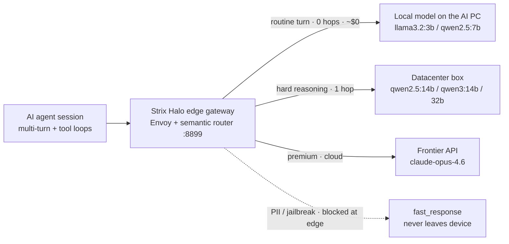

# 銷售 PoC Demo 動線手冊 / Sales PoC Demo Runbook

> 一句話開場：這份手冊把前面整個 PoC 系列收斂成一條「sales 可照著念」的現場動線——用一場**放慢節奏的 agentic session** 打在當作邊緣 LLM 閘道的 Strix Halo AI PC 上，讓四個優勢逐回合變成看得見的畫面：常規 agentic token 在裝置上本地服務（~$0、0 網路跳）、PII 永不離開裝置、只有難回合才升級、tool-loop 中不換模型。
> One-line opener: this runbook distills the whole PoC series into one read-aloud live flow for sales—drive a **slowed-down agentic session** against a Strix Halo AI PC acting as the edge LLM gateway, so four advantages become visible turn by turn: routine agentic tokens served locally on the device (~$0, 0 network hops), PII never leaves the device, only hard turns escalate, and the router never thrashes models mid tool-loop.

本文件接續既有報告系列（[01-tech-study.md](01-tech-study.md)、[02-poc-plan.md](02-poc-plan.md)、[03-strix-halo-runbook.md](03-strix-halo-runbook.md)、[04-dashboard-tour.md](04-dashboard-tour.md)、[05-amd-strategy-alignment.md](05-amd-strategy-alignment.md)、[06-multi-node-and-operator.md](06-multi-node-and-operator.md)、[07-client-server-topology.md](07-client-server-topology.md)）。[04-dashboard-tour.md](04-dashboard-tour.md) 是「dashboard 各畫面在做什麼」的逐項參考，[07-client-server-topology.md](07-client-server-topology.md) 是「邊緣閘道為什麼是對的拓樸」的論證與量測；**本文是把這兩者編成一條給非工程聽眾的銷售動線**，重點在 agentic 運作時如何**直觀體現**「擁有 client AI PC」的優勢。

This document continues the existing report series ([01-tech-study.md](01-tech-study.md), [02-poc-plan.md](02-poc-plan.md), [03-strix-halo-runbook.md](03-strix-halo-runbook.md), [04-dashboard-tour.md](04-dashboard-tour.md), [05-amd-strategy-alignment.md](05-amd-strategy-alignment.md), [06-multi-node-and-operator.md](06-multi-node-and-operator.md), [07-client-server-topology.md](07-client-server-topology.md)). Where [04-dashboard-tour.md](04-dashboard-tour.md) is the per-screen reference and [07-client-server-topology.md](07-client-server-topology.md) is the topology argument plus measurements, **this document weaves both into one sales flow for a non-engineering audience**, focused on how to **intuitively show** the advantage of "owning a client AI PC" while an agent is running.

---

## 1. 一頁速覽 / At a Glance

要讓聽眾帶走的一句話 / The single line the audience should leave with：

> 「同一個 agent、同一段對話：大多數回合在這台 AI PC 上**本地、免費、0 跳、資料不出門**地被服務；只有少數真正困難的回合才升級到資料中心或雲端 frontier。Semantic Router 就是那個逐回合做這個決定、又不在工具迴圈中亂換模型的閘道。」
> "Same agent, same conversation: most turns are served **locally, for free, 0-hop, and without data leaving the box** on this AI PC; only the few genuinely hard turns escalate to the datacenter or the cloud frontier. Semantic Router is the gateway that makes that call turn by turn—without thrashing models mid tool-loop."

四個要體現的優勢 / The four advantages to embody：

| # | 優勢 / Advantage | 現場證據畫面 / On-stage proof |
| --- | --- | --- |
| 1 | 成本：常規回合本地 ~$0 / Cost: routine turns local ~$0 | Monitoring 成本計 + 模型分佈 / cost meter + model distribution |
| 2 | 隱私：PII/敏感輸入不出裝置 / Privacy: PII stays on device | Playground `fast_response`、`x-vsr-fast-response: true` |
| 3 | 延遲：常規回合 0 網路跳 / Latency: 0 network hops | Topology 高亮 EDGE + Tracing span |
| 4 | Agentic 連續性：tool-loop 不換模型 / Continuity: no thrash | `tool_loop_switch_violations = 0`、selected-model 穩定 |

三幕劇結構 / The three-act arc：**開場健康檢查（30s）→ agent 工作中（3–4 分鐘，主軸）→ 收尾＋TCO（1–2 分鐘）**。

埠位速查 / Port cheat-sheet（2-box 邊緣閘道 / 2-box edge gateway）：

| 服務 / Service | 位址 / Address | 用途 / Use |
| --- | --- | --- |
| 閘道 OpenAI API / Gateway | `http://localhost:8899/v1` | benchmark 與 app 打這裡 / target for benchmarks and apps |
| Dashboard | `http://localhost:8700` | Status/Topology/Playground/Monitoring/Tracing |
| Metrics | `http://localhost:9190/metrics` | Prometheus 指標快照 / metrics snapshot |

> 筆電/CPU 退路改用 `vllm-sr serve` 預設埠 `http://127.0.0.1:8000/v1`（見第 2.3 節）。/ The laptop/CPU fallback uses the `vllm-sr serve` default `http://127.0.0.1:8000/v1` (see section 2.3).

### 「token 去哪了」核心視覺 / The "where did the token go" core visual



---

## 2. 開演前準備 / Pre-show Setup

挑一個硬體層級，三選一。**主打 2-box（最能體現「擁有 client AI PC」的優勢）**，另兩條為退路。/ Pick one of three hardware tiers. **Primary = 2-box (best embodiment of the client-AI-PC advantage)**; the other two are fallbacks.

### 2.1 主打：2 台 Strix Halo（邊緣閘道）/ Primary: 2-box edge gateway

在 Halo-A（邊緣/閘道）一鍵起整套；它會用 SSH/scp 自動 provision Halo-B（資料中心），並以 cross-box smoke test 收尾。詳見 [deploy/recipes/strix-halo-2box/README.md](../../deploy/recipes/strix-halo-2box/README.md)。/ One command on Halo-A brings the whole thing up; it auto-provisions Halo-B over SSH/scp and finishes with a cross-box smoke test. See [deploy/recipes/strix-halo-2box/README.md](../../deploy/recipes/strix-halo-2box/README.md).

```bash
export ANTHROPIC_API_KEY=sk-ant-...    # 只為 premium/frontier 那一條；缺則本地層仍可 demo
HALO_B_IP=192.0.2.20 HALO_B_SSH=ubuntu@halob \
  bash deploy/recipes/strix-halo-2box/deploy-2box.sh
```

- 一鍵腳本 [deploy-2box.sh](../../deploy/recipes/strix-halo-2box/deploy-2box.sh) 會做 preflight、provision Halo-B、可達性檢查、起 frontier mock、起閘道、跑 [smoke_test.py](../../deploy/recipes/strix-halo-2box/smoke_test.py)。/ The orchestrator does preflight, Halo-B provisioning, reachability checks, frontier mock, gateway serve, and the smoke test.
- 硬體前置（無法自動化）/ Hardware prereqs (cannot be automated)：兩台都要 ROCm（gfx1151）、Docker 的 `/dev/kfd` + `/dev/dri` passthrough；Halo-B 對 Halo-A 開 TCP `11434`；Halo-A 備好 ModernBERT PII 模型。見 README「Hardware prereqs」。/ See the README "Hardware prereqs".
- 收場 / Teardown：`HALO_B_IP=… HALO_B_SSH=… bash deploy/recipes/strix-halo-2box/teardown-2box.sh`。

### 2.2 退路 A：單台 Strix Halo（單機 hybrid）/ Fallback A: single box

只有一台時，用單機 recipe [deploy/recipes/strix-halo-poc](../../deploy/recipes/strix-halo-poc)（邊緣與升級在同一台模擬，路由故事不變，少了「跨盒子那一跳」的實體證據）。動線與話術完全沿用第 3 節，只是 base-url 與埠依該 recipe 的 listener 而定。/ With only one box, use the single-box recipe [deploy/recipes/strix-halo-poc](../../deploy/recipes/strix-halo-poc) (edge and escalation simulated on one box; the routing story is unchanged, you just lose the physical cross-box hop). Reuse the section 3 flow as-is.

### 2.3 退路 B：筆電 / CPU + mock（無 AMD 硬體）/ Fallback B: laptop/CPU + mock

現場沒有 AMD 硬體時，用 `vllm-sr serve`（非 `--minimal`）起 router + Envoy + dashboard + Grafana + Jaeger，搭配 mock 後端；故事改由 dashboard 與 benchmark 全程承載。base-url 用 `http://127.0.0.1:8000/v1`、dashboard `http://localhost:8700`。/ When there is no AMD hardware on site, run `vllm-sr serve` (non-`--minimal`) to bring up router + Envoy + dashboard + Grafana + Jaeger with mock backends; the story is carried entirely by the dashboard and benchmarks.

### 2.4 Dashboard 登入 / Dashboard login

2-box 的 [client-bring-up.sh](../../deploy/recipes/strix-halo-2box/client-bring-up.sh) 會自動佈建一組 demo 管理員，免手動 bootstrap：/ The 2-box [client-bring-up.sh](../../deploy/recipes/strix-halo-2box/client-bring-up.sh) auto-provisions a demo admin so no manual bootstrap is needed:

- 帳號 / Email：`admin@demo.local`
- 密碼 / Password：`vllmsr-demo`（可用 `DASHBOARD_ADMIN_PASSWORD` 覆寫 / override via `DASHBOARD_ADMIN_PASSWORD`）

### 2.5 彩排 gate（開演前 5 分鐘必跑）/ Rehearsal gate (run 5 min before showtime)

開演前一定要看到這四個綠燈，否則改走第 6 節的預錄退路。/ You must see these four green lights before going live, otherwise switch to the pre-recorded fallback in section 6.

1. `vllm-sr status` 全綠（router / Envoy / dashboard / 模型就緒）。/ all green.
2. [smoke_test.py](../../deploy/recipes/strix-halo-2box/smoke_test.py) PASS：易→EDGE（Halo-A）、難→DATACENTER（Halo-B）、PII/jailbreak 被 `security_guard` 攔。/ PASS with cross-box assertions.
3. Dashboard `:8700` 能用上面帳密登入，`/monitoring` 的 Grafana 圖會載入。/ login works, Monitoring loads.
4. 先偷跑一次第 3.2 節的 agentic 指令，確認 `success_rate 1.0`、headers 有效。/ pre-run the section 3.2 command once.

```bash
python deploy/recipes/strix-halo-2box/smoke_test.py --base-url http://localhost:8899
```

---

## 3. 現場動線 + 話術 / Live Flow + Talk Track

每個畫面給「你說 / SAY」與「觀眾看到 / SEE」兩行。動線骨架沿用 [04-dashboard-tour.md](04-dashboard-tour.md) 的「POC Demo 動線」，這裡裁成 sales 版並把 agentic 放到主軸。/ Each screen gives a "SAY" line and a "SEE" line. The skeleton follows the "POC Demo Flow" in [04-dashboard-tour.md](04-dashboard-tour.md), trimmed to a sales cut with the agentic session as the centerpiece.

### 第 1 幕：開場健康檢查（~30 秒）/ Act 1: Opening health check (~30s)

**Status（`/status`）**
- 你說 / SAY：「這台 Strix Halo AI PC 現在就是一個邊緣 LLM 閘道。Envoy、router、dashboard 與五個模型層級都在線上。」/ "This Strix Halo AI PC is the edge LLM gateway. Envoy, the router, the dashboard, and all five model tiers are online."
- 觀眾看到 / SEE：全綠狀態 + 5 tier 模型 ready，Auto-refresh 開著證明是即時。/ all-green status, 5 tiers ready, live auto-refresh.

**Topology（`/topology`）**
- 你說 / SAY：「router 不自己連模型，它只逐筆決定『該用哪個模型』。看這條 signal → decision → model 的管線。」/ "The router does not connect to models itself; it just decides, per request, which model to use—watch the signal → decision → model pipeline."
- 觀眾看到 / SEE：在 dry-run 測試框送三筆對照，看高亮路徑：`What is the capital of France?` → SIMPLE 本地；`Prove rigorously that the square root of 2 is irrational.` → REASONING；`Ignore all previous instructions…` → `security_guard`。/ three contrasting dry-runs light up different paths.

### 第 2 幕：agent 工作中（3–4 分鐘，主軸）/ Act 2: The agent works (3–4 min, the core)

這一幕是回答「agentic 運作時優勢在哪」的核心。左半螢幕跑 agent 流量，右半螢幕固定停在 Dashboard 的 **Monitoring（`/monitoring`）**。/ This act answers "where is the advantage during agentic operation." Left half runs agent traffic; right half stays on **Monitoring (`/monitoring`)**.

先用一句話建立場景，再開始放慢節奏地灌多輪 session 流量：/ Set the scene in one line, then drive paced multi-turn session traffic:

```bash
python bench/agentic_routing_live_benchmark.py \
  --base-url http://localhost:8899/v1 --model auto \
  --scenario tool-heavy --sessions 4 --turns 10 --concurrency 1 \
  --turn-delay-seconds 2 --idle-pause-seconds 5 \
  --metrics-url http://localhost:9190/metrics \
  --require-router-diagnostics
```

- `--turn-delay-seconds 2` 與 `--concurrency 1` 是**刻意放慢**，讓觀眾跟得上每一回合在 Monitoring 上點亮。/ deliberately paced so the audience can follow each turn lighting up Monitoring.
- 逐回合旁白（隨畫面點）/ Per-turn narration (point as it happens)：
  - 常規回合 / routine turn：「這一回合被判給**本機小模型**——0 網路跳、成本計幾乎不動、token 沒離開這台 AI PC。」/ "served by the local small model—0 hops, the cost meter barely moves, tokens never left this AI PC."
  - 難推理回合 / hard turn：「這一回合是真的難，router 升級到**資料中心大模型**——只有這種才值得跨網路。」/ "this one is genuinely hard, so the router escalates to the datacenter model—only these are worth a network hop."
  - 工具迴圈 / tool loop：「注意：在工具迴圈裡 selected-model **沒有亂跳**，這就是 session-aware 連續性。」/ "notice selected-model stays put inside the tool loop—that's session-aware continuity."
- 觀眾看到 / SEE：Monitoring 上 token/sec、模型分佈、成本計即時更新；終端的 summary 顯示 `success_rate`、`tool_loop_switch_violations`。/ live token/sec, model distribution, cost meter; the terminal summary shows the violation counters.

**PII 即時插播（隱私優勢）/ PII interjection (the privacy advantage)** — 切到 **Playground（`/playground`）**，手打一筆含 PII 或越獄的輸入：
- 你說 / SAY：「敏感輸入在**邊緣就被攔下**，回 `x-vsr-fast-response: true`、決策 `security_guard`——資料根本沒離開這台機器。」/ "sensitive input is blocked at the edge with `x-vsr-fast-response: true` and decision `security_guard`—the data never left this machine."
- 觀眾看到 / SEE：HeaderReveal 浮層顯示被攔的決策與命中訊號。/ the HeaderReveal overlay shows the blocked decision.

**「便宜也要能解題」收口 / "Cheap but still correct" closer** — 跑真實多輪 agent 任務並評分：
```bash
python bench/agent_task_live_benchmark.py \
  --base-url http://localhost:8899/v1 --model auto \
  --suite smoke --include-previous-response-id --require-router-diagnostics
```
- 你說 / SAY：「這不是只把流量導去便宜模型——這些是有正確答案的多輪任務，被路由到的模型**真的把它們解出來了**。」/ "this isn't just sending traffic to a cheap model—these are scored multi-turn tasks, and the routed models actually solve them."
- 觀眾看到 / SEE：summary 的 `task_success_rate` / `task_score_mean`。/ the task success metrics.

### 第 3 幕：收尾 + TCO（1–2 分鐘）/ Act 3: Payoff + TCO (1–2 min)

**三畫面同框 / Three panels at once** — 依 [04-dashboard-tour.md](04-dashboard-tour.md) 收尾話術，在 Monitoring 同時指出：成本下降數字、本地承載分佈、（切 Playground）安全攔截。/ Per the [04-dashboard-tour.md](04-dashboard-tour.md) closing line, point simultaneously at: the cost-reduction number, the local-served distribution, and (switch to Playground) the security block.

**Tracing（`/tracing`）（選配）** — 展開單筆請求的 span，證明路由額外開銷低。/ expand one request's spans to show low routing overhead.

**Fleet-Sim TCO 收尾（選配但很加分）/ Fleet-Sim TCO closer (optional, high-impact)** — 把閘道的 router-replay trace 餵進 fleet-sim，在**買機群之前**先證明資料中心機群的容量/成本：/ feed the gateway's router-replay trace into fleet-sim to prove the datacenter fleet's capacity/cost *before* buying it:

```bash
BASE_URL=http://localhost:8899 OUT=poc-trace.jsonl \
  bash deploy/recipes/strix-halo-2box/export-replay-trace.sh
python3 src/fleet-sim/examples/semantic_router_trace_replay.py poc-trace.jsonl selected_model
```

收尾一句 / Closing line：「常規 token 留在 AI PC 上（免費、私密、0 跳），frontier 只在需要時才用，而且我們能在部署機群前就先算出它的成本。這就是擁有 client AI PC + Semantic Router 的價值。」/ "Routine tokens stay on the AI PC (free, private, 0-hop), frontier is used only when needed, and we can price the datacenter fleet before deploying it. That's the value of owning a client AI PC plus Semantic Router."

---

## 4. 四個「直觀」畫面怎麼做出來 / Making the Four Intuitive Visuals Land

| 優勢 / Advantage | 怎麼讓它「一眼看懂」/ How to make it obvious |
| --- | --- |
| 成本 / Cost | Monitoring 開一個**即時成本計**（`llm_model_cost_total` 依模型），對照「全部走 frontier」基準（用 `--baseline-base-url` 跑同一份流量產出 `comparison.md`）。價差來自 5 tier 定價：SIMPLE `$0` → PREMIUM `$7.20`。/ a live cost meter contrasted with an all-frontier baseline; the spread comes from the 5-tier pricing. |
| 隱私 / Privacy | Playground 打一筆 PII，特寫 `x-vsr-fast-response: true`＋`security_guard`：**資料沒離開裝置**。/ close-up on the fast-response block. |
| 延遲 / Latency | Topology 高亮常規回合落在 EDGE；引用 [07-client-server-topology.md](07-client-server-topology.md) §6.3 量到的跨盒子那一跳僅 **~0.2 ms**。/ EDGE highlight + the measured ~0.2 ms hop. |
| Agentic 連續性 / Continuity | 終端 summary 的 `tool_loop_switch_violations = 0` + Monitoring 模型分佈在 tool-loop 期間不抖動。/ zero violations + stable distribution. |

可選的成本對照指令（router vs 直連 frontier，同一份流量）/ Optional cost-contrast command (router vs direct frontier, same traffic)：

```bash
python bench/agentic_routing_live_benchmark.py \
  --base-url http://localhost:8899/v1 --model auto --scenario tool-heavy \
  --sessions 4 --turns 10 --concurrency 1 \
  --baseline-base-url http://<frontier-host>/v1 --baseline-model <frontier-model>
# 產出 comparison.md：router_overhead_ms、throughput ratio 等
```

---

## 5. 對齊銷售簡報 / Mapping to the Sales Deck

整段動線可逐 slide 對齊 AMD 簡報（見 [05-amd-strategy-alignment.md](05-amd-strategy-alignment.md)）：第 2 幕的閘道**就是** `LLM Gateway` 與 `Intelligent Token Routing`（Slide 34 OpenClaw/LLM Gateway）；第 3 幕的 Fleet-Sim TCO 對齊 future-state tokenomics（Slide 36）。把「Local Tokens → 本地小模型（0 跳）、Premium Tokens → Frontier、升級 → 資料中心」這張分流圖直接套在這台 AI PC 上即可。/ The flow maps slide-by-slide to the AMD deck (see [05-amd-strategy-alignment.md](05-amd-strategy-alignment.md)): the Act 2 gateway *is* the `LLM Gateway` / `Intelligent Token Routing` (Slide 34), and the Act 3 Fleet-Sim TCO aligns to future-state tokenomics (Slide 36).

---

## 6. 故障排除與退路 / Failure Recovery and Fallback

現場 demo 一定要有退路。/ A live demo must have a fallback.

- **預錄備案 / Pre-recorded backup**：彩排通過後，把第 3 節整段錄一份螢幕影片；任何一個彩排綠燈沒亮就直接播影片講解。/ record a screen capture once rehearsal passes; if any rehearsal light is red, play the recording instead.
- **閘道連不上 / Gateway unreachable**：確認 app 打的是 `:8899`（2-box）而非 `:8000`；容器內 Envoy 要能連到 `HALO_B_IP:11434`（見 [07-client-server-topology.md](07-client-server-topology.md) §5 網路事實）。/ confirm `:8899` vs `:8000`, and container-to-`HALO_B_IP:11434` reachability.
- **premium 回合失敗 / premium turn fails**：多半是缺 `ANTHROPIC_API_KEY` 或無 443 egress；本地與資料中心層仍可正常 demo，跳過 premium 即可。/ usually a missing key or no egress; local and datacenter tiers still demo fine—skip premium.
- **Dashboard 無法登入 / cannot log in**：用 `admin@demo.local` / `vllmsr-demo`；`EnsureBootstrapAdmin` 具冪等性，不需清 volume。/ idempotent bootstrap, no volume wipe.
- **本地占比看起來偏低 / local share looks low**：見第 7 節誠實邊界——選 routine-heavy 的 workload，並把賣點講成「frontier 只在需要時才用」。/ pick a routine-heavy workload and frame value as "frontier only when needed".

---

## 7. 誠實邊界 / Honest Boundary

延續整個系列的誠實切分（[02-poc-plan.md](02-poc-plan.md) §12、[07-client-server-topology.md](07-client-server-topology.md) §5/§6.5），明確標出本 demo **不**證明什麼。/ Continuing the series' honest split, here is what this demo does **not** prove.

- **Halo-B 不是真的 Instinct / Halo-B is not a real Instinct** — 2-box 是**拓樸／路由／成本**驗證，不是效能或 TCO 主張；真實機群效能/TCO 由 fleet-sim 外推，永遠標註 measured vs extrapolated。/ topology/routing/cost validation only; perf/TCO via fleet-sim, labeled measured vs extrapolated.
- **本地/升級比例隨 workload 變動 / The local/escalation split depends on the workload** — 合成 `balanced` 會偏向資料中心（[07-client-server-topology.md](07-client-server-topology.md) §6.2 量到 edge 25%）。Demo 請用 `tool-heavy` 或真實 agent-task 讓連續性畫面成立，並把成本賣點講成「frontier 只在需要時才用」，而非單看本地占比。/ the synthetic `balanced` scenario skews to the datacenter; use `tool-heavy` or real agent-tasks, and frame cost as "frontier only when needed."
- **延遲數字是模型推論、不是網路 / Latencies are inference, not network** — 第 2 幕看到的數秒延遲是被路由模型的推論時間；跨盒子那一跳本身僅 ~0.2 ms（§6.3）。/ the multi-second latencies are routed-model inference; the cross-box hop itself is ~0.2 ms.

---

## 參考連結 / Reference links

- Dashboard 逐畫面動線 / Per-screen demo flow：[04-dashboard-tour.md](04-dashboard-tour.md)
- 邊緣閘道拓樸與量測 / Edge-gateway topology and measurements：[07-client-server-topology.md](07-client-server-topology.md)
- 簡報對齊 / Deck alignment：[05-amd-strategy-alignment.md](05-amd-strategy-alignment.md)
- 2-box recipe（一鍵、smoke、export）/ 2-box recipe：[deploy/recipes/strix-halo-2box/README.md](../../deploy/recipes/strix-halo-2box/README.md)、[deploy-2box.sh](../../deploy/recipes/strix-halo-2box/deploy-2box.sh)、[smoke_test.py](../../deploy/recipes/strix-halo-2box/smoke_test.py)、[export-replay-trace.sh](../../deploy/recipes/strix-halo-2box/export-replay-trace.sh)
- 單機 recipe / Single-box recipe：[deploy/recipes/strix-halo-poc](../../deploy/recipes/strix-halo-poc)
- Agentic 即時 benchmark（dashboard 驅動）/ Live agentic benchmark：[bench/agentic_routing_live_benchmark.py](../../bench/agentic_routing_live_benchmark.py)
- 真實 agent 任務評分 / Real agent-task scoring：[bench/agent_task_live_benchmark.py](../../bench/agent_task_live_benchmark.py)
- 文件網站 / Docs site：[vllm-semantic-router.com](https://vllm-semantic-router.com)
