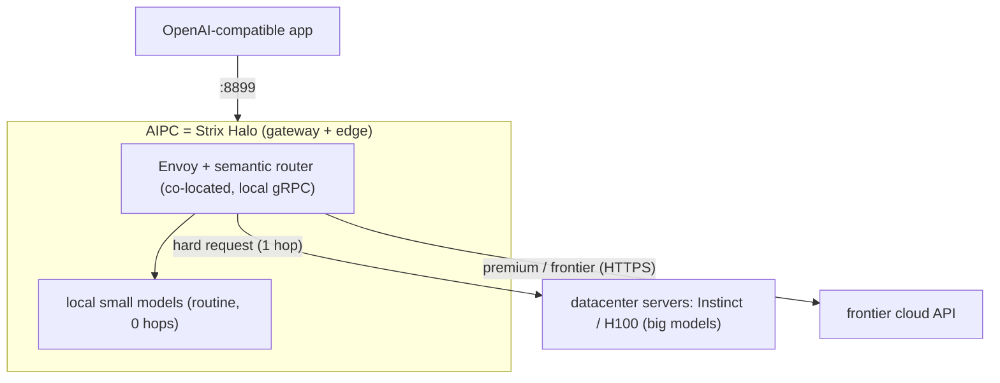

# 該 promote 哪個拓樸：邊緣閘道選型與中心治理缺口 / Which Topology to Promote: Edge-Gateway Selection and the Central-Governance Gap

> 一句話開場：[07-client-server-topology.md](07-client-server-topology.md) 回答「閘道放哪」；本文回答它的下一步決策——當架構要把 **AIPC（如 Strix Halo）** 納入、又要同時滿足 **TSMC 等級企業 IT** 的需求時，**對外該 promote 哪個拓樸、為什麼、有哪些替代**，並誠實切開「哪些主張有 doc 證據、哪些是推論」。結論：promote **Design A（邊緣閘道）**，但必須主動處理一個 doc 尚未解掉的缺口——**邊緣閘道 ↔ 企業中心治理**。
> One-line opener: [07-client-server-topology.md](07-client-server-topology.md) answers "where the gateway lives"; this document answers the next decision—when the architecture must include an **AIPC (e.g. Strix Halo)** and also satisfy **TSMC-class enterprise IT** needs, **which topology to promote, why, and what the alternatives are**—and honestly separates which claims are doc-backed from which are extrapolation. The conclusion: promote **Design A (edge-gateway)**, but proactively handle one gap the docs have not yet closed—**edge-gateway versus enterprise central governance**.

本文件接續既有報告系列（[01-tech-study.md](01-tech-study.md)、[02-poc-plan.md](02-poc-plan.md)、[03-strix-halo-runbook.md](03-strix-halo-runbook.md)、[04-dashboard-tour.md](04-dashboard-tour.md)、[05-amd-strategy-alignment.md](05-amd-strategy-alignment.md)、[06-multi-node-and-operator.md](06-multi-node-and-operator.md)、[07-client-server-topology.md](07-client-server-topology.md)）。[07-client-server-topology.md](07-client-server-topology.md) 證明了拓樸**怎麼擺**最省往返；本文是它的**決策面延伸**——把那些拓樸放進「AIPC + 多台 server + 企業治理」的真實取捨裡，產出一個可對外 promote 的選型與一張誠實的證據盤點。

This document continues the existing report series ([01-tech-study.md](01-tech-study.md), [02-poc-plan.md](02-poc-plan.md), [03-strix-halo-runbook.md](03-strix-halo-runbook.md), [04-dashboard-tour.md](04-dashboard-tour.md), [05-amd-strategy-alignment.md](05-amd-strategy-alignment.md), [06-multi-node-and-operator.md](06-multi-node-and-operator.md), [07-client-server-topology.md](07-client-server-topology.md)). Where [07-client-server-topology.md](07-client-server-topology.md) proves **how to place** the topology to minimize round-trips, this document is its **decision-side extension**—putting those topologies into the real trade-offs of "AIPC + multiple servers + enterprise governance" and producing a promotable selection plus an honest evidence audit.

---

## 1. 問題框架 / Problem Framing

要決策的具體情境：架構同時包含一台 **AIPC（Ryzen AI Max+ / Strix Halo，本身有本地算力）** 與**多台資料中心 server（AMD Instinct、NVIDIA H100 之類）**，而採用方是 **TSMC 等級的企業 IT**——既要降本、又要關鍵任務品質、又要跨組織的安全治理與規則管控。問題不是「Envoy 放 client 還是 server」（[07-client-server-topology.md](07-client-server-topology.md) 第 1 節已證明那是錯問題：Envoy 與 router 是同一個閘道層的兩半、必須同機共置），而是：

The concrete decision context: the architecture includes both an **AIPC (Ryzen AI Max+ / Strix Halo, with local compute of its own)** and **multiple datacenter servers (AMD Instinct, NVIDIA H100, and the like)**, with a **TSMC-class enterprise IT** as the adopter—wanting cost reduction, mission-critical quality, and cross-organization security governance and rule control all at once. The question is not "Envoy on the client or the server" (section 1 of [07-client-server-topology.md](07-client-server-topology.md) already proves that is the wrong question: Envoy and the router are two halves of one gateway tier and must be co-located), but rather:

> 在「AIPC + 多台 server + 企業治理」這組約束下，**對外該 promote 哪一個閘道拓樸**？它的證據有多硬？又有哪個面向是目前 doc 還撐不起來、必須誠實揭露的？
> Under the constraints of "AIPC + multiple servers + enterprise governance," **which gateway topology should be promoted**? How hard is the evidence? And which facet do the docs not yet support, so it must be disclosed honestly?

---

## 2. 證據盤點：哪些有 doc、哪些是推論 / Evidence Audit: Doc-backed versus Extrapolated

在給建議之前，先做一張誠實的盤點——延續 [05-amd-strategy-alignment.md](05-amd-strategy-alignment.md) 第 4 節與 [07-client-server-topology.md](07-client-server-topology.md) 第 5 節的「誠實切分」傳統，把「這個系列文件確實佐證的主張」與「業界常見但本倉庫未示範的推論」分開，避免把推論當成既成能力對外宣稱。

Before the recommendation, an honest audit—continuing the "honest split" tradition of section 4 of [05-amd-strategy-alignment.md](05-amd-strategy-alignment.md) and section 5 of [07-client-server-topology.md](07-client-server-topology.md)—separates "claims this doc series actually backs" from "extrapolations that are common in industry but not demonstrated in this repo," so extrapolation is never promoted as an existing capability.

### 2.1 有 doc 證據（可對外硬 promote）/ Doc-backed (safe to promote firmly)

| 主張 / Claim | 出處 / Source |
| --- | --- |
| Envoy + router 同機共置 = 一個閘道層 / Envoy + router co-located = one gateway tier | [07-client-server-topology.md](07-client-server-topology.md) 第 1–2 節 / sections 1–2 |
| 三種拓樸（反模式 / Design A 邊緣 / Design B 集中）+ 跳數優劣 / three topologies + hop trade-offs | [07-client-server-topology.md](07-client-server-topology.md) 第 3 節 / section 3 |
| Design A（邊緣閘道）為**推薦**拓樸 / Design A is the **recommended** topology | [07-client-server-topology.md](07-client-server-topology.md) 第 3.2 節 / section 3.2 |
| 邊緣常規流量 0 跳、跨盒子僅 ~0.2ms（**實測**）/ routine 0 hops, cross-box ~0.2ms (**measured**) | [07-client-server-topology.md](07-client-server-topology.md) 第 6.3 節 / section 6.3 |
| `deploy-2box.sh` 跑的就是 Design A / `deploy-2box.sh` deploys exactly Design A | [deploy-2box.sh](../../deploy/recipes/strix-halo-2box/deploy-2box.sh)、[strix-halo-2box/README.md](../../deploy/recipes/strix-halo-2box/README.md) |
| 多副本 + operator（`spec.replicas`、HPA、共享狀態後端）/ multi-replica + operator | [06-multi-node-and-operator.md](06-multi-node-and-operator.md) 第 1–2 節、[semanticrouter_types.go](../../deploy/operator/api/v1alpha1/semanticrouter_types.go) |
| Operator 在**叢集內**集中遞送 config（routing 以不透明 JSON 帶過）/ operator centralizes config **within a cluster** | [06-multi-node-and-operator.md](06-multi-node-and-operator.md) 第 1 節 / section 1 |
| **TSMC 即指名客戶**；對映 AMD CIO「Enterprise AI at AMD / TSMC」簡報 / TSMC is the named customer | [02-poc-plan.md](02-poc-plan.md)、[05-amd-strategy-alignment.md](05-amd-strategy-alignment.md) |
| 安全治理（PII/jailbreak → `security_guard` → 403）/ security governance | [02-poc-plan.md](02-poc-plan.md) 路徑 3、[05-amd-strategy-alignment.md](05-amd-strategy-alignment.md) 主線 2 |

### 2.2 推論、本倉庫未示範（promote 時必須標示）/ Extrapolated, not demonstrated here (must be labeled when promoting)

| 推論 / Extrapolation | 真相 / Reality |
| --- | --- |
| 「GitOps」做跨閘道規則中心化 / "GitOps" for cross-gateway rule centralization | poc 文件未提；倉庫記載的中心化機制是 **operator**，非 GitOps。GitOps 業界可行但**此倉庫未示範** / not in the poc docs; the documented mechanism is the operator, not GitOps—valid in industry but undemonstrated here |
| 「每區域閘道」拓樸 / "per-region gateway" topology | 不在 doc；屬延伸設計 / not in the docs; an extension design |
| 「兩層 / 混合閘道」拓樸 / "two-tier / hybrid gateway" topology | 不在 doc（doc 的 "hybrid" 指「本地邊緣 + 雲端 frontier」，非兩層閘道）/ not in the docs ("hybrid" there means local-edge + frontier-cloud) |
| 「Envoy 放便宜 CPU、router 放重節點」硬體切分 / hardware split | 合理工程推論，doc 未明寫 / a reasonable inference, not stated in the docs |

> 誠實更正 / Honest correction：本系列討論早期曾出現「正式環境推薦把 Envoy 與 router 分離到兩端」的說法，這與 [07-client-server-topology.md](07-client-server-topology.md) 第 1 節相牴觸——兩者是同一閘道層、必須同機共置。要分離的是「閘道層 vs 模型後端」，不是「Envoy vs router」。
> Honest correction: an earlier framing in this discussion suggested "in production, separate Envoy and the router onto two ends," which contradicts section 1 of [07-client-server-topology.md](07-client-server-topology.md)—they are one gateway tier and must be co-located. What gets separated is "gateway tier versus model backends," not "Envoy versus router."

---

## 3. 建議拓樸：Design A 邊緣閘道 / Recommended Topology: Design A Edge-gateway

對「AIPC（Strix Halo）+ 多台 server + TSMC 需求」這組約束，**該 promote 的是 Design A（邊緣閘道）**。理由全部有 doc 撐腰：

For the constraints of "AIPC (Strix Halo) + multiple servers + TSMC needs," **the topology to promote is Design A (edge-gateway)**. Every reason is doc-backed:

1. **它就是客戶自家 CIO 已背書的圖。** [05-amd-strategy-alignment.md](05-amd-strategy-alignment.md) 把 AMD「Enterprise AI at AMD / TSMC」簡報的 `Intelligent Token Routing`（`Local Tokens → MI350P / 本地 LLM`、`Premium Tokens → Frontier`）逐 slide 對映成 PoC 元件；Design A 正是這張圖的拓樸。你不是在推銷新概念，而是把客戶 CIO 的投影片變成能跑的系統。
   It is the diagram the customer's own CIO has endorsed. [05-amd-strategy-alignment.md](05-amd-strategy-alignment.md) maps the AMD "Enterprise AI at AMD / TSMC" deck's `Intelligent Token Routing` (`Local Tokens → MI350P / local LLMs`, `Premium Tokens → Frontier`) slide-by-slide onto PoC components; Design A is exactly that diagram's topology. You are not pitching a new idea—you are turning the customer CIO's slide into a runnable system.
2. **它用得到 Strix Halo 的本地算力（降本）。** 常規 token 由 AIPC 本機小模型服務、**0 網路跳數、邊際成本近 $0**（[02-poc-plan.md](02-poc-plan.md) 第 2 節路徑 1）。
   It uses the Strix Halo's local compute (cost reduction): routine tokens are served by the AIPC's local small model—**zero network hops, near-zero marginal cost** (section 2, path 1 of [02-poc-plan.md](02-poc-plan.md)).
3. **品質不犧牲。** 困難 / premium 依難度與領域升級到 frontier 雲端或 Instinct 資料中心（[02-poc-plan.md](02-poc-plan.md) 路徑 2）。
   Quality is preserved: hard/premium requests escalate by difficulty and domain to the frontier cloud or the Instinct datacenter (path 2 of [02-poc-plan.md](02-poc-plan.md)).
4. **閘道層做安全治理。** PII/jailbreak 訊號導向高優先序 `security_guard`、輸出端回 403（[02-poc-plan.md](02-poc-plan.md) 路徑 3、[05-amd-strategy-alignment.md](05-amd-strategy-alignment.md) 主線 2），對映 AMD Orion/Sentinel 與 Agent Gateway 的 Policy Enforcement。
   The gateway tier does security governance: PII/jailbreak signals steer to the high-priority `security_guard` with a 403 on output (path 3 of [02-poc-plan.md](02-poc-plan.md), thread 2 of [05-amd-strategy-alignment.md](05-amd-strategy-alignment.md)), mapping to AMD Orion/Sentinel and the Agent Gateway Policy Enforcement.
5. **已被實測。** [deploy-2box.sh](../../deploy/recipes/strix-halo-2box/deploy-2box.sh) 跑的就是 Design A；常規 0 跳、跨盒子升級僅多 ~0.2ms（[07-client-server-topology.md](07-client-server-topology.md) 第 6.3 節，**實測**）。
   It is measured: [deploy-2box.sh](../../deploy/recipes/strix-halo-2box/deploy-2box.sh) deploys Design A; routine traffic is 0 hops and a cross-box escalation adds only ~0.2ms (section 6.3 of [07-client-server-topology.md](07-client-server-topology.md), **measured**).

### 決策矩陣 / Decision matrix

| 拓樸 / Topology | 常規跳數 / Routine hops | 用到 AIPC 本地算力？ / Uses AIPC local compute? | 中心治理 / Central governance | promote？ / Promote? |
| --- | --- | --- | --- | --- |
| Design A 邊緣閘道 / edge-gateway | 0 | 是，完全 / yes, fully | 叢集內可、邊緣機群是缺口 / in-cluster yes, edge-fleet is a gap | **主推 / primary** |
| Design B 集中 server 閘道 / centralized server-gateway | 1 | 否，AIPC 當瘦端點 / no, AIPC as thin client | 天生集中 / inherently central | 備案 / fallback |
| 反模式 / anti-pattern | 2（雙跳）/ 2 (double) | — | — | 永不 / never |
| 多副本 + operator / multi-replica + operator | 正交 / orthogonal | — | 叢集內 / in-cluster | 疊加於 A/B 之上 / layered on A/B |

---

## 4. 替代方案 / Alternatives

- **Design B（集中式 server 閘道）** — 閘道與所有模型都在資料中心、AIPC 當純請求來源，每請求 1 跳（[07-client-server-topology.md](07-client-server-topology.md) 第 3.3 節）。它**天生集中治理**，但**浪費 Strix Halo 的本地算力**、削弱「把 AIPC 納入架構」的前提與 AMD/TSMC 故事。**何時翻 B**：AIPC 算力不足以服務常規流量，或合規上要求所有推論集中在資料中心。
  Design B (centralized server-gateway)—gateway and all models in the datacenter, the AIPC a pure request origin, one hop per request (section 3.3 of [07-client-server-topology.md](07-client-server-topology.md)). It is inherently central for governance but wastes the Strix Halo's local compute and weakens both the "include the AIPC" premise and the AMD/TSMC story. When to switch to B: the AIPC cannot serve routine traffic, or compliance requires all inference centralized in the datacenter.
- **反模式（server 閘道 + client 端模型）** — 雙跳，永不採用（[07-client-server-topology.md](07-client-server-topology.md) 第 3.1 節）。
  Anti-pattern (server-gateway + client-side models)—double-hop, never adopt (section 3.1 of [07-client-server-topology.md](07-client-server-topology.md)).
- **多副本 + operator** — **不是拓樸的替代品**，而是**正交維度**：把 HA 擴展（`spec.replicas` + HPA）與叢集內中心化 config 疊加在 Design A 或 B 之上（[06-multi-node-and-operator.md](06-multi-node-and-operator.md)）。
  Multi-replica + operator—not a topology alternative but an orthogonal dimension: layer HA scaling (`spec.replicas` + HPA) and in-cluster centralized config on top of Design A or B ([06-multi-node-and-operator.md](06-multi-node-and-operator.md)).

---

## 5. 關鍵缺口：邊緣閘道 ↔ 企業中心治理 / The Key Gap: Edge-gateway versus Enterprise Central Governance

這是 promote 前**必須誠實揭露**的一點，也是本文相對 [07-client-server-topology.md](07-client-server-topology.md) 的新增分析。

This is the point that **must be disclosed honestly** before promoting, and it is this document's new analysis relative to [07-client-server-topology.md](07-client-server-topology.md).

**張力**：Design A 把閘道散在很多台邊緣 AIPC 上；TSMC 等級的 IT 卻要**跨所有閘道一處改規則、稽核、合規**。但 doc 證明的中心化（[06-multi-node-and-operator.md](06-multi-node-and-operator.md) 的 operator）假設一個 **Kubernetes 叢集**，**不是**一群裸機邊緣 AIPC。換言之，doc **沒有示範**「跨 N 台邊緣 AIPC 閘道的中心規則管理」這個組合。

The tension: Design A scatters gateways across many edge AIPCs, while TSMC-class IT wants to **edit rules once, audit, and enforce compliance across all gateways**. But the centralization the docs prove (the operator in [06-multi-node-and-operator.md](06-multi-node-and-operator.md)) assumes a **Kubernetes cluster**, not a fleet of bare-metal edge AIPCs. In other words, the docs **do not demonstrate** the combination of "central rule management across N edge AIPC gateways."

### 三條補法（誠實標示是否有 doc）/ Three closing options (labeled doc-backed or not)

| 選項 / Option | 機制 / Mechanism | doc 狀態 / Doc status | 適合 / Fits |
| --- | --- | --- | --- |
| A. Operator-in-cluster | `SemanticRouter` CRD 一處改 → 全叢集副本 / one CRD edit → all in-cluster replicas | ✅ 有 / yes ([06-multi-node-and-operator.md](06-multi-node-and-operator.md)) | Design B 或「區域叢集」而非裸邊緣 AIPC / Design B or a regional cluster, not bare edge AIPCs |
| B. 邊緣 agent + 中央控制面 / edge agent + central control plane | 每台 AIPC 的 router 從中央拉**簽章設定** / each AIPC's router pulls **signed config** from a central plane | ❌ 未示範 → 待補 PoC / not demonstrated → a PoC to build | 真正的「邊緣 + 中心治理」/ true "edge + central governance" |
| C. GitOps | 規則進 Git → 推送邊緣，天然稽核軌跡 / rules in Git → pushed to the edge, natural audit trail | ❌ 未示範 / not demonstrated | TSMC 合規稽核 / TSMC compliance audit |

### 5.1 現況：單節點原語已就緒，缺的是機群編排層 / Current State: the Per-node Primitives Exist; the Missing Piece Is the Fleet-orchestration Layer

重要澄清：缺口在**機群層**，不在單節點。每個 router 其實**已內建** production-grade 的安全熱更新原語——(1) fsnotify 熱重載（改 config 檔即自動重載、不需重啟，見 [server_config_watch.go](../../src/semantic-router/pkg/extproc/server_config_watch.go)），與 (2) 執行期 config API `PATCH`/`PUT /config/router`（驗證 → 版本化備份 → 寫檔 → 觸發熱重載，並以鎖防併發，見 [route_router_config_update.go](../../src/semantic-router/pkg/apiserver/route_router_config_update.go)）。因此選項 B 不是「從零打造」，而是「在這些既有單節點原語之上，補一個**中央分發 + 跨機群稽核**的編排層」。

Important clarification: the gap is at the **fleet level**, not the single node. Each router **already ships** production-grade safe-update primitives—(1) fsnotify hot-reload (edit the config file and the router reloads live, no restart; see [server_config_watch.go](../../src/semantic-router/pkg/extproc/server_config_watch.go)), and (2) a runtime config API `PATCH`/`PUT /config/router` (validate → versioned backup → write → trigger hot-reload, guarded by a lock; see [route_router_config_update.go](../../src/semantic-router/pkg/apiserver/route_router_config_update.go)). So option B is not "build from scratch" but "add a **central-distribution + cross-fleet-audit** orchestration layer on top of these existing per-node primitives."

真正還缺的（機群層）：(a) router/CLI **無**「從中央拉 config」的路徑（`vllm-sr serve --config` 只吃本地檔，無 `--config-url`／遠端 fetch）；(b) **無**「一次推送到 N 台邊緣 AIPC」的 fan-out；(c) **無**跨機群的中央稽核／聚合（備份／版本是每台本機各一份）；(d) **無**簽章信任機制。

What is genuinely still missing (fleet level): (a) the router/CLI has **no** "pull config from a central plane" path (`vllm-sr serve --config` takes only a local file, no `--config-url`/remote fetch); (b) **no** fan-out to push one change to N edge AIPCs at once; (c) **no** cross-fleet central audit/aggregation (backup/versioning is per-node-local); (d) **no** signed-config trust mechanism.

白話結論：Design A 的「降本 / 低延遲」可以拿**實測**對外硬 promote；「TSMC 規模的中心治理」則可更精準地說「**單節點安全熱更新已內建（fsnotify + 執行期 config API）、叢集內中心化已驗證（operator）；缺的是把這些原語接到中央控制面的機群編排層**」。選項 B 因此是本故事最有價值、且地基已備的補強項。

Plain-language conclusion: Design A's "cost reduction / low latency" can be promoted firmly with **measured** evidence; "central governance at TSMC scale" can now be stated more precisely as "**per-node safe hot-update is built in (fsnotify + the runtime config API), in-cluster centralization is validated (operator); what is missing is the fleet-orchestration layer that wires these primitives to a central control plane**." Option B is therefore the most valuable strengthening item—and its foundation already exists.

---

## 6. 怎麼 promote（對 TSMC 企業 IT）/ How to Promote (to TSMC Enterprise IT)

依 [04-dashboard-tour.md](04-dashboard-tour.md) 的 demo 動線與 [05-amd-strategy-alignment.md](05-amd-strategy-alignment.md) 的 slide 對照，promote 時的三步：

Following the demo flow of [04-dashboard-tour.md](04-dashboard-tour.md) and the slide mapping of [05-amd-strategy-alignment.md](05-amd-strategy-alignment.md), promote in three moves:

1. **用客戶自己的語言開場** — 「這就是貴司 CIO『Enterprise AI at AMD / TSMC』簡報 Slide 35 的 `Intelligent Token Routing`，我們把它做成今天能在 dashboard 點開的系統。」
   Open in the customer's own language: "This is your CIO's `Intelligent Token Routing` from Slide 35 of the 'Enterprise AI at AMD / TSMC' deck—built into a system you can click open in the dashboard today."
2. **三支柱各配一個 demo** — 降本（`/insights` 成本圖）、品質（`/playground` 升級）、安全（`/playground` PII/jailbreak 回 403）。
   One demo per pillar: cost reduction (the cost chart at `/insights`), quality (escalation at `/playground`), security (PII/jailbreak returning 403 at `/playground`).
3. **主動把缺口當賣點** — 「規則中心化在叢集內已用 operator 驗證；跨廠區邊緣 AIPC 的統一治理是建議的第二階段 PoC（第 5 節選項 B）。」延續 [05-amd-strategy-alignment.md](05-amd-strategy-alignment.md) 第 4 節：誠實邊界反而讓對齊更可信。
   Turn the gap into a selling point proactively: "Rule centralization is validated in-cluster with the operator; unified governance across cross-fab edge AIPCs is the recommended phase-two PoC (option B in section 5)." Continuing section 4 of [05-amd-strategy-alignment.md](05-amd-strategy-alignment.md): an honest boundary makes the alignment more credible, not less.

---

## 7. 誠實邊界 / Honest Boundaries

延續系列傳統（[02-poc-plan.md](02-poc-plan.md) 第 11–12 節、[05-amd-strategy-alignment.md](05-amd-strategy-alignment.md) 第 4 節、[06-multi-node-and-operator.md](06-multi-node-and-operator.md) 第 3 節、[07-client-server-topology.md](07-client-server-topology.md) 第 5 節），明確標出本文**不**主張什麼：

Continuing the series tradition (sections 11–12 of [02-poc-plan.md](02-poc-plan.md), section 4 of [05-amd-strategy-alignment.md](05-amd-strategy-alignment.md), section 3 of [06-multi-node-and-operator.md](06-multi-node-and-operator.md), section 5 of [07-client-server-topology.md](07-client-server-topology.md)), here is what this document does **not** claim:

- **本文是選型與證據盤點，不是新效能數字。** 援引的實測（0 跳、~0.2ms）全部來自 [07-client-server-topology.md](07-client-server-topology.md) 第 6 節的兩台 gfx1151 APU；它證明**拓樸與路由正確**，不是 Instinct 機群效能。真實機群效能 / TCO 仍由「先量測再模擬」的 fleet-sim 外推（[02-poc-plan.md](02-poc-plan.md) 第 12 節）。
  This document is a selection and evidence audit, not new performance numbers. The measured values cited (0 hops, ~0.2ms) all come from the two gfx1151 APUs in section 6 of [07-client-server-topology.md](07-client-server-topology.md); they prove topology and routing correctness, not Instinct-fleet performance. Real fleet performance/TCO still comes from fleet-sim "measure-then-simulate" extrapolation (section 12 of [02-poc-plan.md](02-poc-plan.md)).
- **「邊緣 + 中心治理」（第 5 節選項 B/C）尚未在本倉庫實作。** 它是建議的下一階段 PoC，不是既成能力；若要落地，應建立為 [docs/agent/plans/README.md](../agent/plans/README.md) 的執行計畫，並在實作與架構持續分歧時補上 [docs/agent/tech-debt/README.md](../agent/tech-debt/README.md) 的債務條目。
  "Edge + central governance" (options B/C in section 5) is not yet implemented in this repo. It is a recommended next-phase PoC, not an existing capability; to land it, create an execution plan under [docs/agent/plans/README.md](../agent/plans/README.md) and, if implementation and architecture keep diverging, add a debt entry under [docs/agent/tech-debt/README.md](../agent/tech-debt/README.md).

---

## 參考連結 / Reference links

- 拓樸放置與雙跳分析 / Topology placement and double-hop analysis: [07-client-server-topology.md](07-client-server-topology.md)
- 多節點與 operator 中心化 config / Multi-node and operator-centralized config: [06-multi-node-and-operator.md](06-multi-node-and-operator.md)
- AMD 對齊（Intelligent Token Routing / LLM Gateway）與誠實邊界 / AMD alignment and honest boundaries: [05-amd-strategy-alignment.md](05-amd-strategy-alignment.md)
- 場景敘事與 TSMC 指名、三條路徑 / Target scenario, named TSMC, three paths: [02-poc-plan.md](02-poc-plan.md)
- 技術定位（router 不挑 endpoint、Envoy 才挑）/ Tech positioning: [01-tech-study.md](01-tech-study.md)
- Design A 一鍵部署 recipe / Design A one-click recipe: [deploy-2box.sh](../../deploy/recipes/strix-halo-2box/deploy-2box.sh)、[strix-halo-2box/README.md](../../deploy/recipes/strix-halo-2box/README.md)
- Operator 型別（replicas / autoscaling / config）/ Operator types: [semanticrouter_types.go](../../deploy/operator/api/v1alpha1/semanticrouter_types.go)、[deploy/operator/README.md](../../deploy/operator/README.md)
- 文件網站 / Docs site: [vllm-semantic-router.com](https://vllm-semantic-router.com)
