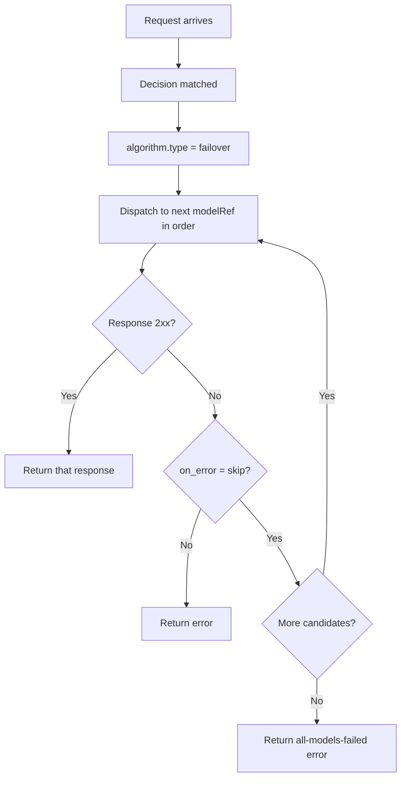

# Failover

## Overview

`failover` is a **looper** algorithm that provides true cross-model /
cross-provider failover. It dispatches the request against each entry in the
decision's `modelRefs` **in the authored order** and returns the first
successful (2xx) response. When a candidate call returns a non-2xx status
(such as `401`, `429`, or `5xx`) or a transport error, the looper
re-dispatches the same request to the **next** `modelRef`.

It aligns to `config/algorithm/looper/failover.yaml`.

Because each candidate is a fully independent dispatch that round-trips back
through the router, the target model name, request-body `model` field, auth
header, and provider profile are all resolved per candidate. This is failover
that Envoy retry policies cannot express: Envoy can only retry within a single
cluster (same model name, body, and auth), whereas `failover` can move a
request from a premium hosted provider to a completely different local
datacenter model.

## Key Advantages

- Survives hard upstream failures (`401`/`429`/`5xx`, transport errors) by
  moving to the next candidate instead of returning the error to the client.
- Crosses provider boundaries — premium hosted API first, local datacenter
  model second — which Envoy cluster-level `retry_policy` and
  `outlier_detection` cannot do.
- Preserves the authored `modelRefs` order; it never reorders candidates by
  cost or parameter size.
- Makes the failure-handling behavior explicit via a single `on_error` knob.

## Algorithm Principle

`failover` walks the candidate list once, in order:

1. **Dispatch**: call candidate *i* with the original request.
2. **Inspect**: a 2xx response is a success; a non-2xx status or transport
   error is a failure.
3. **Decide**: on success, return immediately. On failure, apply the
   `on_error` policy.
4. **Advance**: with `on_error: skip`, move to candidate *i+1*; with
   `on_error: fail`, surface the error immediately.
5. **Exhaustion**: if every candidate fails, return an error so the client
   sees an upstream failure rather than a fabricated success.

## Execution Flow



## What Problem Does It Solve?

A premium hosted model (for example, a frontier Anthropic model) can fail for
reasons that a single backend cannot recover from: a missing or revoked API
key (`401`), rate limiting (`429`), or a provider outage (`5xx`). Envoy can
retry inside the same cluster, but it cannot re-issue the request to a
different model with a different name, body, and credentials. `failover`
expresses that graceful degradation as router policy, so a request that the
premium provider rejects is automatically retried against a local datacenter
model.

## When to Use

- A decision has a preferred premium model plus one or more acceptable
  fallbacks.
- Upstream failures (auth, rate limit, outage) should degrade to another model
  instead of erroring to the client.
- The fallback target is a different provider/model than the primary, so
  Envoy-level retries are insufficient.
- Candidate priority is intentional and must be preserved in authored order.

## Known Limitations

- Adds latency on failure: a failed primary must complete (or time out) before
  the fallback is attempted.
- Quality can drop when the request falls through to a weaker fallback model.
- Only end-to-end call failures trigger failover; a 2xx response with a poor
  answer is considered a success (use `confidence` for quality-based cascades).
- Requires at least two `modelRefs`; a single-candidate decision short-circuits
  before the looper runs.

## Configuration

```yaml
algorithm:
  type: failover
  failover:
    on_error: skip               # skip = try next model; fail = surface error
```

### Parameters

| Parameter | Type | Default | Description |
|-----------|------|---------|-------------|
| `on_error` | string | `skip` | Behavior on a candidate failure: `skip` (try the next modelRef) or `fail` (surface the error immediately) |

### Recommended cross-provider wiring

To make a premium legal route degrade from a frontier hosted model to a local
datacenter model, attach `failover` to the decision and order `modelRefs` from
most- to least-preferred:

```yaml
- name: premium_legal
  modelRefs:
    - model: anthropic/claude-opus-4.6   # premium hosted provider, attempted first
      use_reasoning: true
    - model: google/gemini-3.1-pro       # local datacenter fallback
      use_reasoning: true
  algorithm:
    type: failover
    failover:
      on_error: skip
```

With this wiring, a `401` from a missing Anthropic key — or a `429`/`5xx` from
the provider — transparently re-dispatches the request to the local
`google/gemini-3.1-pro` backend instead of returning the failure to the client.
